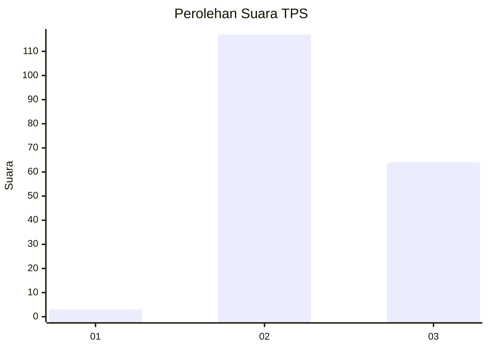
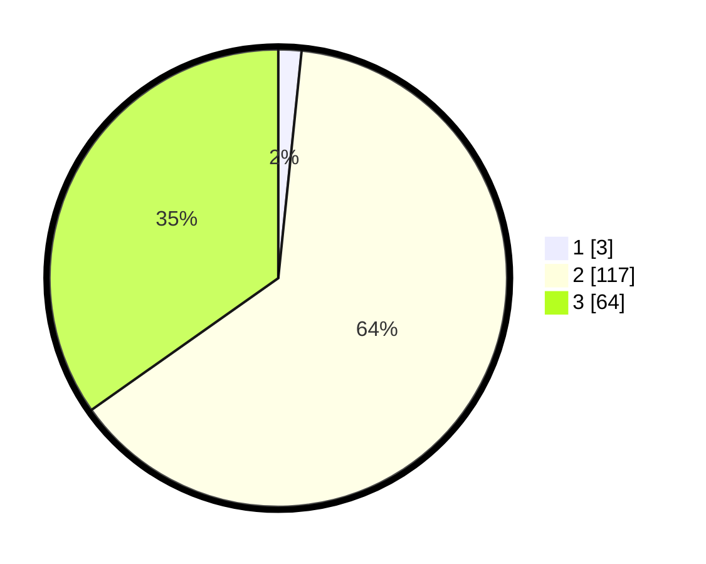

# Hasil

## Grafik

## Tabel

| No. | Nama Paslon    | Suara | Suara (raw) | Persentase |
|:--- |:-------------- | -----:| -----------:| ----------:|
| 1   | ANIES MUHAIMIN | 3     | [3][p-1]    | 1,63       |
| 2   | PRABOWO GIBRAN | 117   | [117][p-2]  | 63,59      |
| 3   | GANJAR MAHFUD  | 64    | [64][p-3]   | 34,78      |

[p-1]: https://github.com/gigit-pemilu/pemilu-2024-12-sumatera-utara/blob/main/pilpres/hitung-suara/sub/12-sumatera-utara/sub/07-deli-serdang/sub/05-pancur-batu/sub/2001-bintang-meriah/sub/002-tps/sub/paslon-1.txt
[p-2]: https://github.com/gigit-pemilu/pemilu-2024-12-sumatera-utara/blob/main/pilpres/hitung-suara/sub/12-sumatera-utara/sub/07-deli-serdang/sub/05-pancur-batu/sub/2001-bintang-meriah/sub/002-tps/sub/paslon-2.txt
[p-3]: https://github.com/gigit-pemilu/pemilu-2024-12-sumatera-utara/blob/main/pilpres/hitung-suara/sub/12-sumatera-utara/sub/07-deli-serdang/sub/05-pancur-batu/sub/2001-bintang-meriah/sub/002-tps/sub/paslon-3.txt

## Foto C Plano

https://sirekap-obj-formc.kpu.go.id/8341/pemilu/ppwp/12/07/05/20/01/1207052001002-20240215-004916--e003021e-5b37-4e67-966a-24bdc2961dcd.jpg

https://sirekap-obj-formc.kpu.go.id/8341/pemilu/ppwp/12/07/05/20/01/1207052001002-20240215-005040--9182cd30-c178-4da6-84b0-5da539a644e0.jpg

https://sirekap-obj-formc.kpu.go.id/8341/pemilu/ppwp/12/07/05/20/01/1207052001002-20240215-005150--aca03674-2697-4a6e-aca1-b50f3fa9014e.jpg

## Metadata

| Key        | Value               |
| ---------- | ------------------- |
| Time Stamp | 2024-02-25 12:00:00 |

