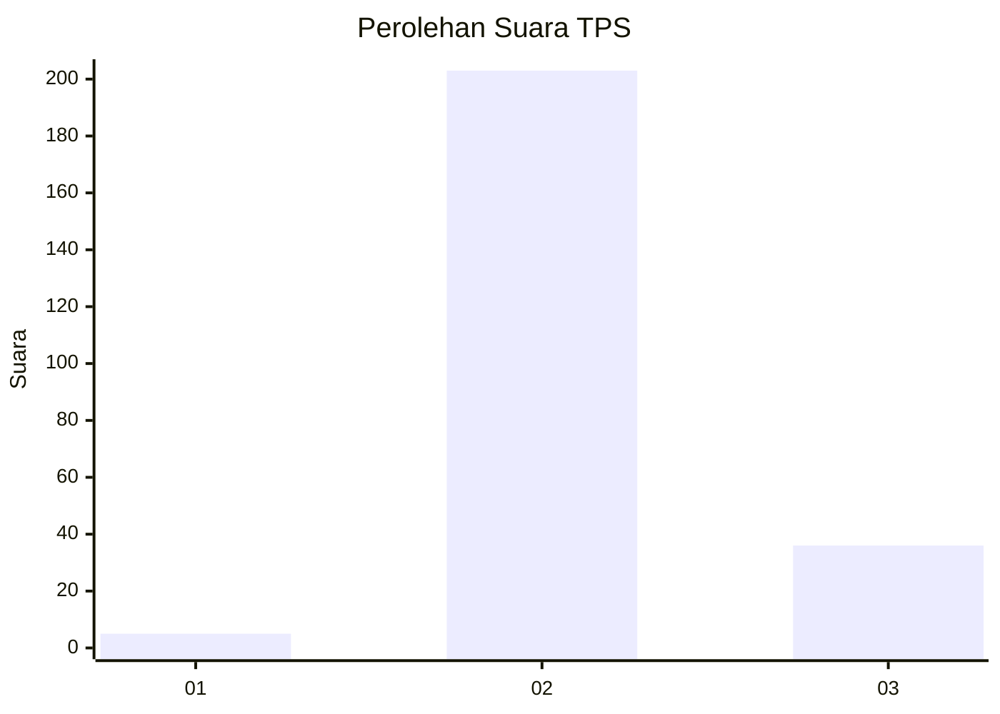
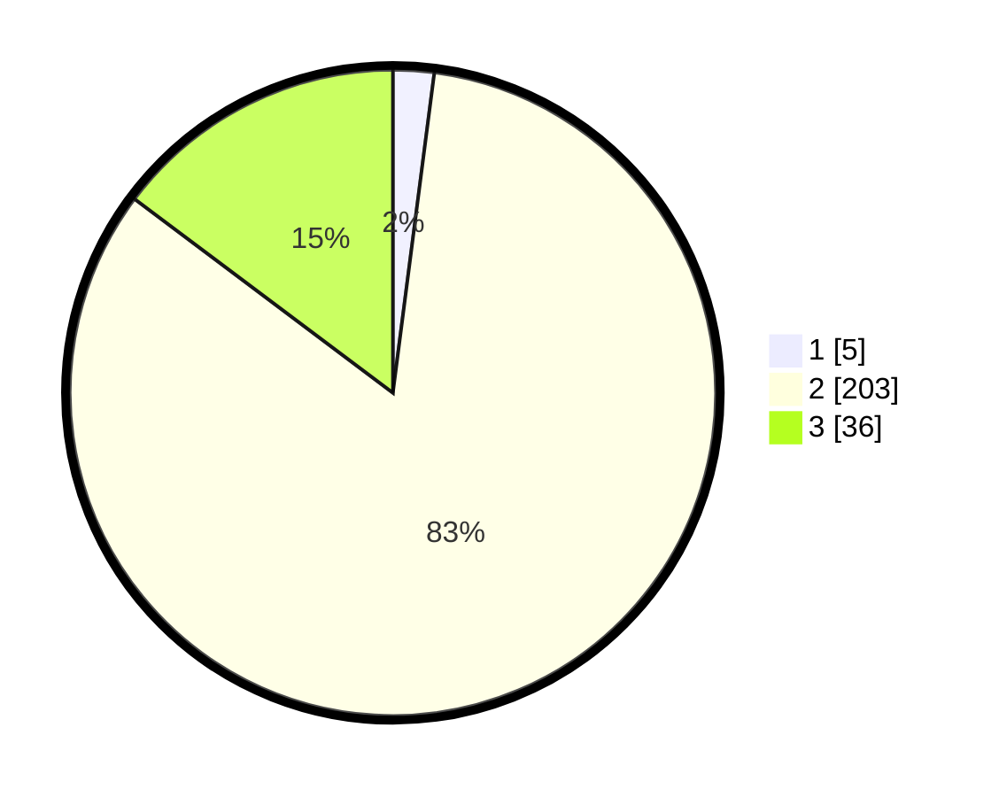

# Hasil

## Grafik

## Tabel

| No. | Nama Paslon    | Suara | Suara (raw) | Persentase |
|:--- |:-------------- | -----:| -----------:| ----------:|
| 1   | ANIES MUHAIMIN | 5     | [5][p-1]    | 2,05       |
| 2   | PRABOWO GIBRAN | 203   | [203][p-2]  | 83,20      |
| 3   | GANJAR MAHFUD  | 36    | [36][p-3]   | 14,75      |

[p-1]: https://github.com/gigit-pemilu/pemilu-2024/blob/main/pilpres/hitung-suara/sub/12-sumatera-utara/sub/07-deli-serdang/sub/05-pancur-batu/sub/2001-bintang-meriah/sub/003-tps/sub/paslon-1.txt
[p-2]: https://github.com/gigit-pemilu/pemilu-2024/blob/main/pilpres/hitung-suara/sub/12-sumatera-utara/sub/07-deli-serdang/sub/05-pancur-batu/sub/2001-bintang-meriah/sub/003-tps/sub/paslon-2.txt
[p-3]: https://github.com/gigit-pemilu/pemilu-2024/blob/main/pilpres/hitung-suara/sub/12-sumatera-utara/sub/07-deli-serdang/sub/05-pancur-batu/sub/2001-bintang-meriah/sub/003-tps/sub/paslon-3.txt

## Foto C Plano

https://sirekap-obj-formc.kpu.go.id/880d/pemilu/ppwp/12/07/05/20/01/1207052001003-20240214-231355--ed81030f-be96-4783-b9a7-ee9904c8e0db.jpg

https://sirekap-obj-formc.kpu.go.id/880d/pemilu/ppwp/12/07/05/20/01/1207052001003-20240214-231313--1d5c27d4-8e26-4f3c-9970-11db620ea33a.jpg

https://sirekap-obj-formc.kpu.go.id/880d/pemilu/ppwp/12/07/05/20/01/1207052001003-20240214-231524--2dd71e51-73a1-4719-a3c2-e419ebe2f69c.jpg

## Metadata

| Key        | Value               |
| ---------- | ------------------- |
| Time Stamp | 2024-02-25 20:00:00 |

