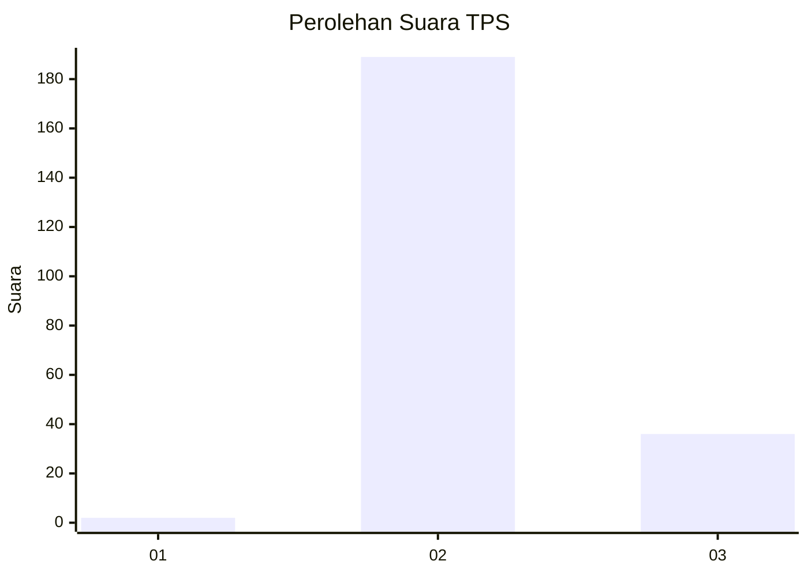
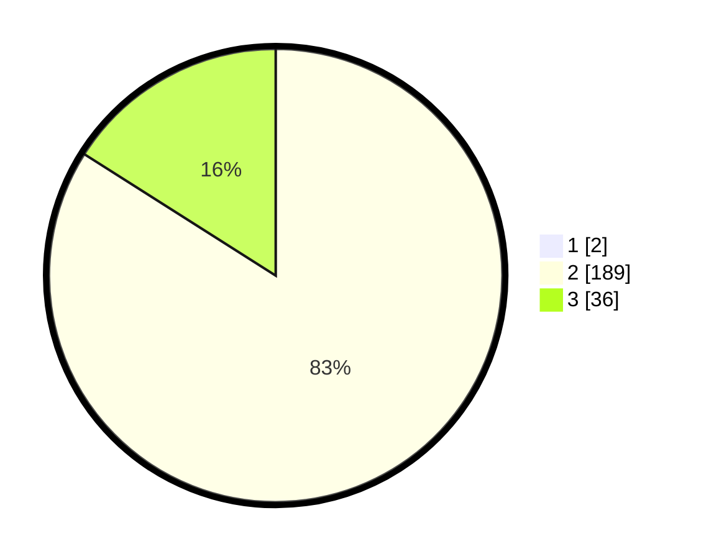

# Hasil

## Grafik

## Tabel

| No. | Nama Paslon    | Suara | Suara (raw) | Persentase |
|:--- |:-------------- | -----:| -----------:| ----------:|
| 1   | ANIES MUHAIMIN | 2     | [2][p-1]    | 0,88       |
| 2   | PRABOWO GIBRAN | 189   | [189][p-2]  | 83,26      |
| 3   | GANJAR MAHFUD  | 36    | [36][p-3]   | 15,86      |

[p-1]: https://github.com/gigit-pemilu/pemilu-2024/blob/main/pilpres/hitung-suara/sub/12-sumatera-utara/sub/07-deli-serdang/sub/05-pancur-batu/sub/2001-bintang-meriah/sub/004-tps/sub/paslon-1.txt
[p-2]: https://github.com/gigit-pemilu/pemilu-2024/blob/main/pilpres/hitung-suara/sub/12-sumatera-utara/sub/07-deli-serdang/sub/05-pancur-batu/sub/2001-bintang-meriah/sub/004-tps/sub/paslon-2.txt
[p-3]: https://github.com/gigit-pemilu/pemilu-2024/blob/main/pilpres/hitung-suara/sub/12-sumatera-utara/sub/07-deli-serdang/sub/05-pancur-batu/sub/2001-bintang-meriah/sub/004-tps/sub/paslon-3.txt

## Foto C Plano

https://sirekap-obj-formc.kpu.go.id/9856/pemilu/ppwp/12/07/05/20/01/1207052001004-20240215-020835--8f373ee7-df0b-4d75-b073-650dc709eb4c.jpg

https://sirekap-obj-formc.kpu.go.id/9856/pemilu/ppwp/12/07/05/20/01/1207052001004-20240215-020931--a7f6ebfd-87f8-4a66-9ecf-9d88182093b3.jpg

https://sirekap-obj-formc.kpu.go.id/9856/pemilu/ppwp/12/07/05/20/01/1207052001004-20240215-021026--1dc315d6-0aee-49e6-8d10-fe366dce15e7.jpg

## Metadata

| Key        | Value               |
| ---------- | ------------------- |
| Time Stamp | 2024-02-26 15:00:00 |

