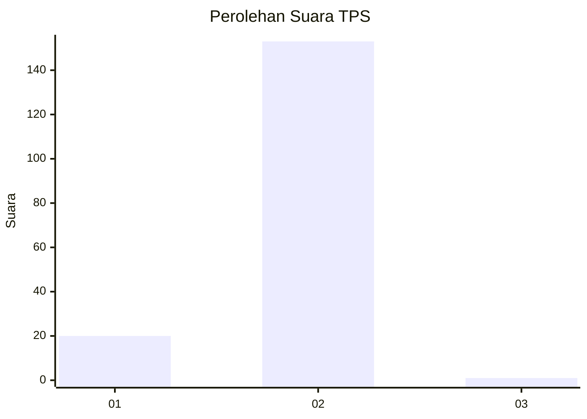
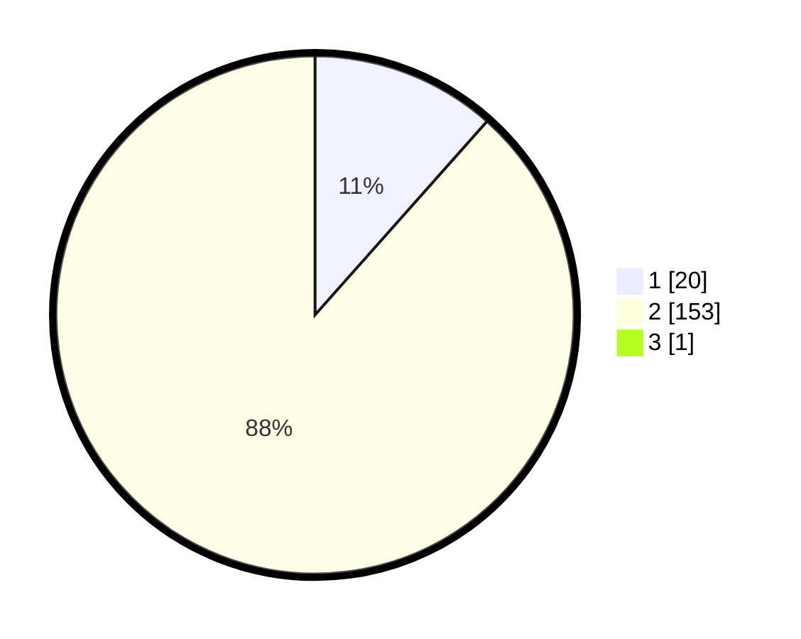

# Hasil

## Grafik

## Tabel

| No. | Nama Paslon    | Suara | Suara (raw) | Persentase |
|:--- |:-------------- | -----:| -----------:| ----------:|
| 1   | ANIES MUHAIMIN | 20    | [20][p-1]   | 11,49      |
| 2   | PRABOWO GIBRAN | 153   | [153][p-2]  | 87,93      |
| 3   | GANJAR MAHFUD  | 1     | [1][p-3]    | 0,57       |

[p-1]: https://github.com/gigit-pemilu/pemilu-2024/blob/main/pilpres/hitung-suara/sub/12-sumatera-utara/sub/07-deli-serdang/sub/05-pancur-batu/sub/2003-tiang-layar/sub/005-tps/sub/paslon-1.txt
[p-2]: https://github.com/gigit-pemilu/pemilu-2024/blob/main/pilpres/hitung-suara/sub/12-sumatera-utara/sub/07-deli-serdang/sub/05-pancur-batu/sub/2003-tiang-layar/sub/005-tps/sub/paslon-2.txt
[p-3]: https://github.com/gigit-pemilu/pemilu-2024/blob/main/pilpres/hitung-suara/sub/12-sumatera-utara/sub/07-deli-serdang/sub/05-pancur-batu/sub/2003-tiang-layar/sub/005-tps/sub/paslon-3.txt

## Foto C Plano

https://sirekap-obj-formc.kpu.go.id/4526/pemilu/ppwp/12/07/05/20/03/1207052003005-20240215-065839--443de219-a658-4ffe-afb7-c1e869bad0d1.jpg

https://sirekap-obj-formc.kpu.go.id/4526/pemilu/ppwp/12/07/05/20/03/1207052003005-20240215-070151--60bf07d6-5e69-4f79-bd80-5c74147ebf5a.jpg

https://sirekap-obj-formc.kpu.go.id/4526/pemilu/ppwp/12/07/05/20/03/1207052003005-20240215-070503--3f9e6ea0-399b-46da-84fd-4f3917783bc2.jpg

## Metadata

| Key        | Value               |
| ---------- | ------------------- |
| Time Stamp | 2024-02-25 00:00:00 |

