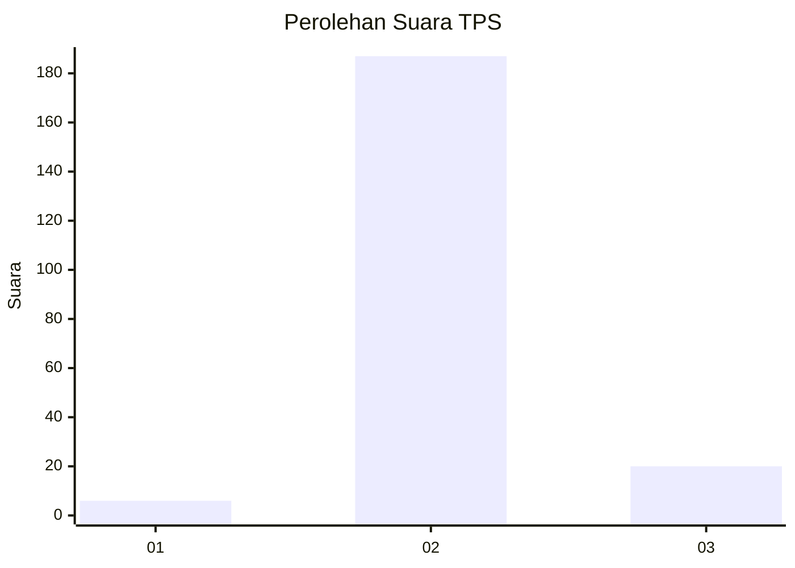
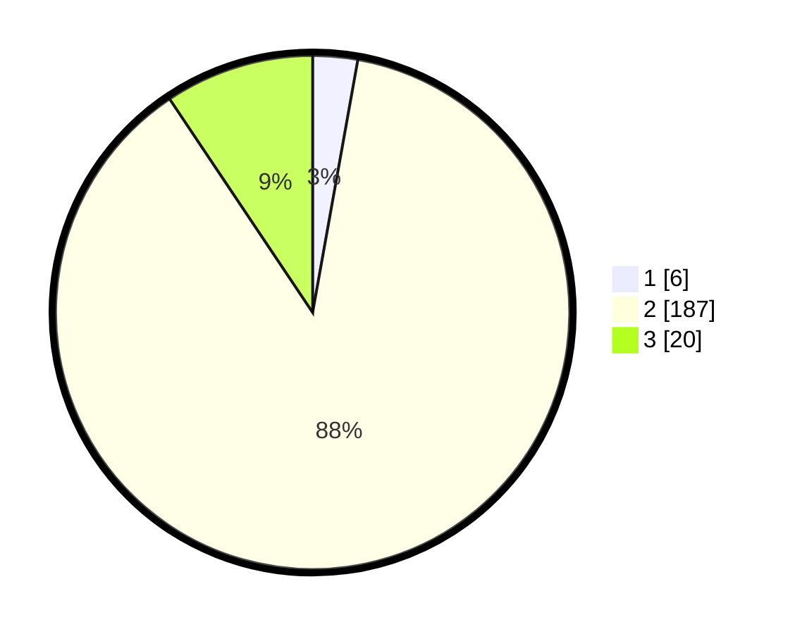

# Hasil

## Grafik

## Tabel

| No. | Nama Paslon    | Suara | Suara (raw) | Persentase |
|:--- |:-------------- | -----:| -----------:| ----------:|
| 1   | ANIES MUHAIMIN | 6     | [6][p-1]    | 2,82       |
| 2   | PRABOWO GIBRAN | 187   | [187][p-2]  | 87,79      |
| 3   | GANJAR MAHFUD  | 20    | [20][p-3]   | 9,39       |

[p-1]: https://github.com/gigit-pemilu/pemilu-2024/blob/main/pilpres/hitung-suara/sub/12-sumatera-utara/sub/07-deli-serdang/sub/05-pancur-batu/sub/2010-tengah/sub/902-tps/sub/paslon-1.txt
[p-2]: https://github.com/gigit-pemilu/pemilu-2024/blob/main/pilpres/hitung-suara/sub/12-sumatera-utara/sub/07-deli-serdang/sub/05-pancur-batu/sub/2010-tengah/sub/902-tps/sub/paslon-2.txt
[p-3]: https://github.com/gigit-pemilu/pemilu-2024/blob/main/pilpres/hitung-suara/sub/12-sumatera-utara/sub/07-deli-serdang/sub/05-pancur-batu/sub/2010-tengah/sub/902-tps/sub/paslon-3.txt

## Foto C Plano

https://sirekap-obj-formc.kpu.go.id/b2ea/pemilu/ppwp/12/07/05/20/10/1207052010902-20240214-214055--e6bb0ee7-d446-4f3c-aab1-1479f91c50c0.jpg

https://sirekap-obj-formc.kpu.go.id/b2ea/pemilu/ppwp/12/07/05/20/10/1207052010902-20240214-213751--b69cb344-5bff-4f97-95d6-040aaa54d158.jpg

https://sirekap-obj-formc.kpu.go.id/b2ea/pemilu/ppwp/12/07/05/20/10/1207052010902-20240214-213659--06324d29-9e32-490a-af08-afecae87a26c.jpg

## Metadata

| Key        | Value               |
| ---------- | ------------------- |
| Time Stamp | 2024-02-24 22:31:28 |

