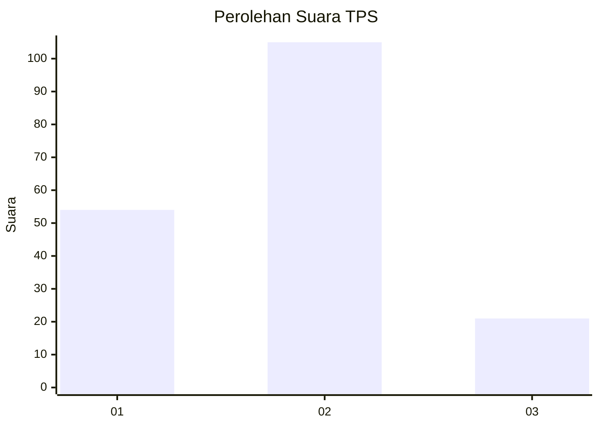
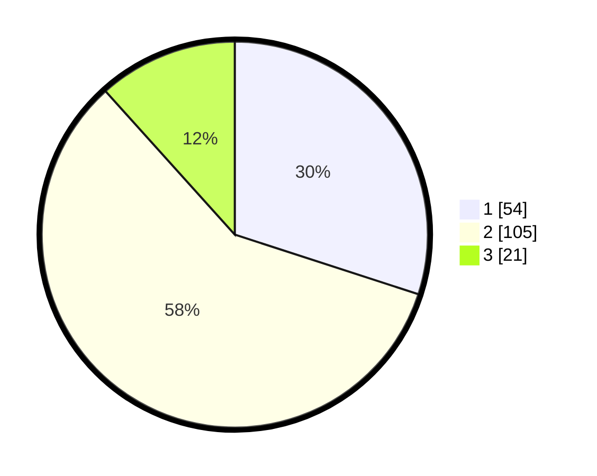

# Hasil

## Grafik

## Tabel

| No. | Nama Paslon    | Suara | Suara (raw) | Persentase |
|:--- |:-------------- | -----:| -----------:| ----------:|
| 1   | ANIES MUHAIMIN | 54    | [54][p-1]   | 30,00      |
| 2   | PRABOWO GIBRAN | 105   | [105][p-2]  | 58,33      |
| 3   | GANJAR MAHFUD  | 21    | [21][p-3]   | 11,67      |

[p-1]: https://github.com/gigit-pemilu/pemilu-2024/blob/main/pilpres/hitung-suara/sub/12-sumatera-utara/sub/07-deli-serdang/sub/05-pancur-batu/sub/2021-tanjung-anom/sub/018-tps/sub/paslon-1.txt
[p-2]: https://github.com/gigit-pemilu/pemilu-2024/blob/main/pilpres/hitung-suara/sub/12-sumatera-utara/sub/07-deli-serdang/sub/05-pancur-batu/sub/2021-tanjung-anom/sub/018-tps/sub/paslon-2.txt
[p-3]: https://github.com/gigit-pemilu/pemilu-2024/blob/main/pilpres/hitung-suara/sub/12-sumatera-utara/sub/07-deli-serdang/sub/05-pancur-batu/sub/2021-tanjung-anom/sub/018-tps/sub/paslon-3.txt

## Foto C Plano

https://sirekap-obj-formc.kpu.go.id/7b5e/pemilu/ppwp/12/07/05/20/21/1207052021018-20240214-155622--8bce37f2-c91d-4111-8ecb-59f06a539f42.jpg

https://sirekap-obj-formc.kpu.go.id/7b5e/pemilu/ppwp/12/07/05/20/21/1207052021018-20240214-155657--f44a1b84-374c-43d2-b3d6-7f3d42a8194b.jpg

https://sirekap-obj-formc.kpu.go.id/7b5e/pemilu/ppwp/12/07/05/20/21/1207052021018-20240214-160055--4f6273f5-559e-4422-8e48-934f203c6061.jpg

## Metadata

| Key        | Value               |
| ---------- | ------------------- |
| Time Stamp | 2024-02-25 13:00:00 |

