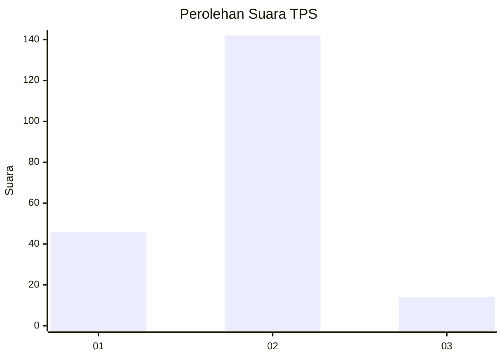
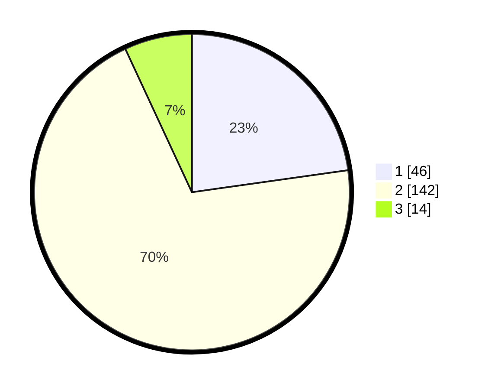

# Hasil

## Grafik

## Tabel

| No. | Nama Paslon    | Suara | Suara (raw) | Persentase |
|:--- |:-------------- | -----:| -----------:| ----------:|
| 1   | ANIES MUHAIMIN | 46    | [46][p-1]   | 22,77      |
| 2   | PRABOWO GIBRAN | 142   | [142][p-2]  | 70,30      |
| 3   | GANJAR MAHFUD  | 14    | [14][p-3]   | 6,93       |

[p-1]: https://github.com/gigit-pemilu/pemilu-2024/blob/main/pilpres/hitung-suara/sub/12-sumatera-utara/sub/07-deli-serdang/sub/05-pancur-batu/sub/2022-sei-glugur/sub/006-tps/sub/paslon-1.txt
[p-2]: https://github.com/gigit-pemilu/pemilu-2024/blob/main/pilpres/hitung-suara/sub/12-sumatera-utara/sub/07-deli-serdang/sub/05-pancur-batu/sub/2022-sei-glugur/sub/006-tps/sub/paslon-2.txt
[p-3]: https://github.com/gigit-pemilu/pemilu-2024/blob/main/pilpres/hitung-suara/sub/12-sumatera-utara/sub/07-deli-serdang/sub/05-pancur-batu/sub/2022-sei-glugur/sub/006-tps/sub/paslon-3.txt

## Foto C Plano

https://sirekap-obj-formc.kpu.go.id/b8cd/pemilu/ppwp/12/07/05/20/22/1207052022006-20240215-000929--bb7a1d20-5362-41d6-be3e-5de4b5e01311.jpg

https://sirekap-obj-formc.kpu.go.id/b8cd/pemilu/ppwp/12/07/05/20/22/1207052022006-20240215-001239--e38a12b5-85a1-4f4f-82d8-d259a6a8fc85.jpg

https://sirekap-obj-formc.kpu.go.id/b8cd/pemilu/ppwp/12/07/05/20/22/1207052022006-20240215-015225--785c39c2-3cd7-4af3-8f27-d2332f6afe06.jpg

## Metadata

| Key        | Value               |
| ---------- | ------------------- |
| Time Stamp | 2024-02-25 19:00:00 |

