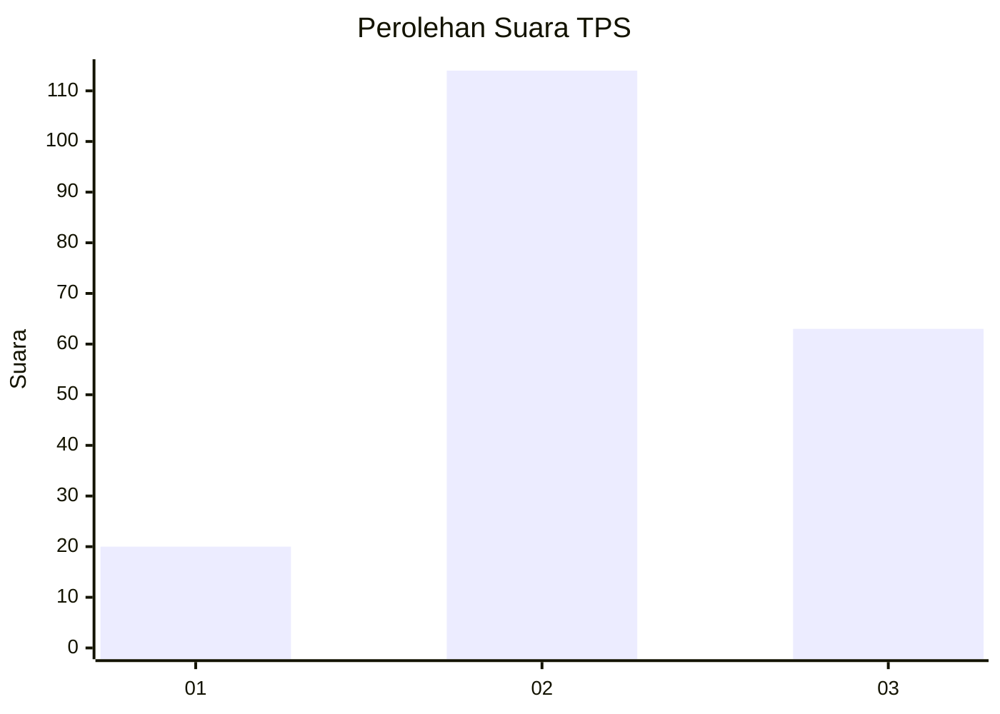
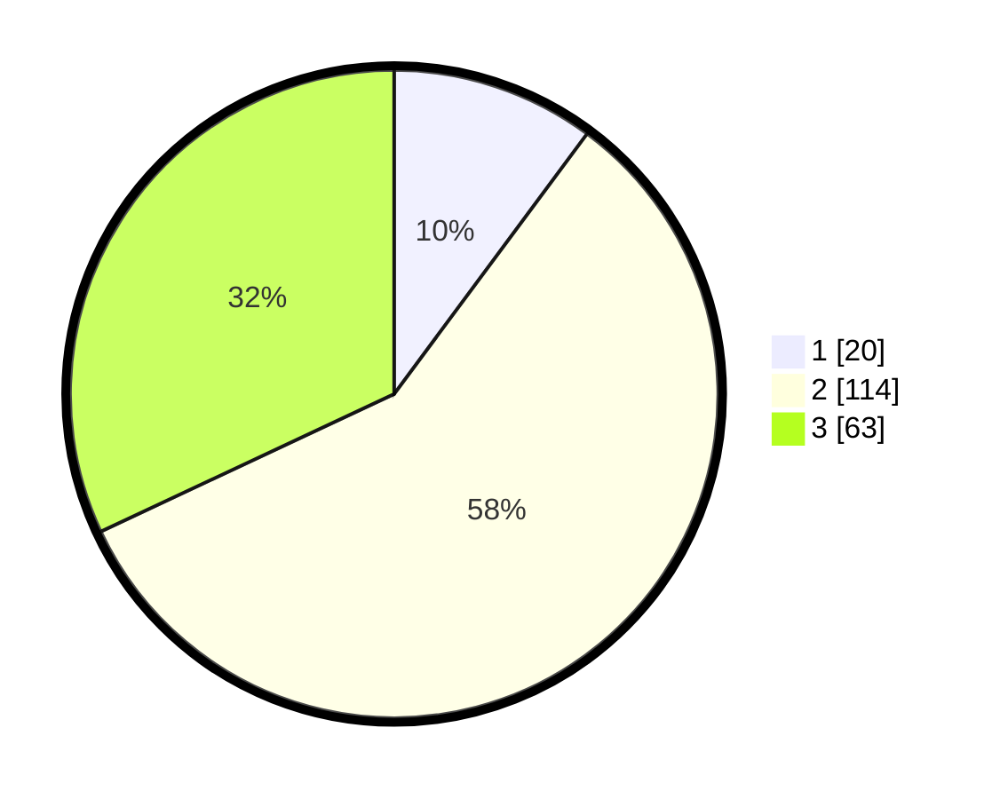

# Hasil

## Grafik

## Tabel

| No. | Nama Paslon    | Suara | Suara (raw) | Persentase |
|:--- |:-------------- | -----:| -----------:| ----------:|
| 1   | ANIES MUHAIMIN | 20    | [20][p-1]   | 10,15      |
| 2   | PRABOWO GIBRAN | 114   | [114][p-2]  | 57,87      |
| 3   | GANJAR MAHFUD  | 63    | [63][p-3]   | 31,98      |

[p-1]: https://github.com/gigit-pemilu/pemilu-2024/blob/main/pilpres/hitung-suara/sub/12-sumatera-utara/sub/07-deli-serdang/sub/05-pancur-batu/sub/2025-perumnas-simalingkar/sub/001-tps/sub/paslon-1.txt
[p-2]: https://github.com/gigit-pemilu/pemilu-2024/blob/main/pilpres/hitung-suara/sub/12-sumatera-utara/sub/07-deli-serdang/sub/05-pancur-batu/sub/2025-perumnas-simalingkar/sub/001-tps/sub/paslon-2.txt
[p-3]: https://github.com/gigit-pemilu/pemilu-2024/blob/main/pilpres/hitung-suara/sub/12-sumatera-utara/sub/07-deli-serdang/sub/05-pancur-batu/sub/2025-perumnas-simalingkar/sub/001-tps/sub/paslon-3.txt

## Foto C Plano

https://sirekap-obj-formc.kpu.go.id/f568/pemilu/ppwp/12/07/05/20/25/1207052025001-20240214-223826--8b88fb81-089b-4ed5-82c7-ef1fefb2b82a.jpg

https://sirekap-obj-formc.kpu.go.id/f568/pemilu/ppwp/12/07/05/20/25/1207052025001-20240214-224305--da48fe40-bbe9-4658-b4c4-41df8e69d56c.jpg

https://sirekap-obj-formc.kpu.go.id/f568/pemilu/ppwp/12/07/05/20/25/1207052025001-20240214-224409--a25f6fc9-d7c6-425e-aef8-2e3c90053789.jpg

## Metadata

| Key        | Value               |
| ---------- | ------------------- |
| Time Stamp | 2024-02-26 16:00:00 |

