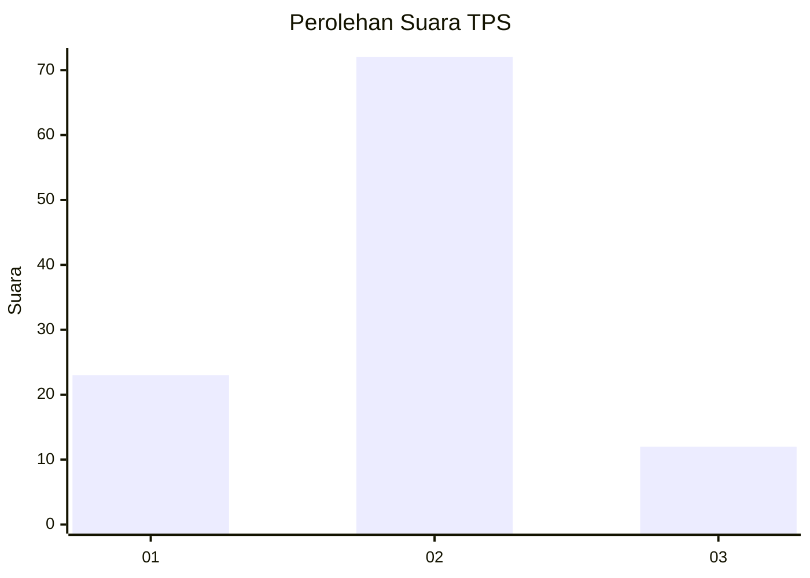
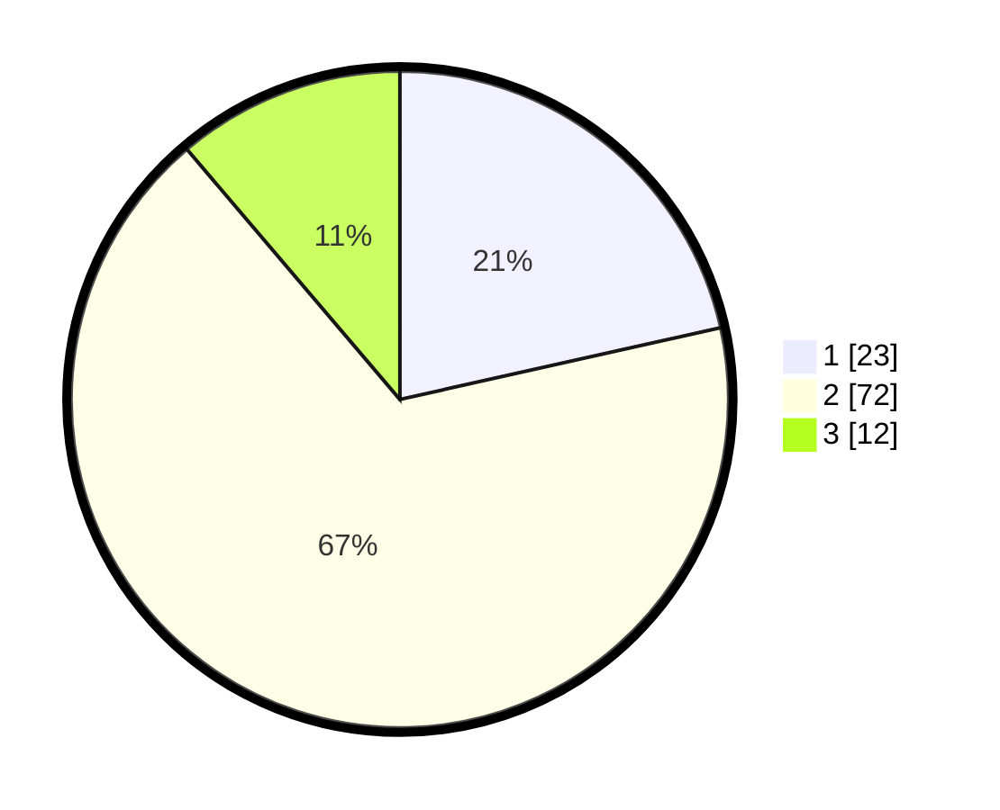

# Hasil

## Grafik

## Tabel

| No. | Nama Paslon    | Suara | Suara (raw) | Persentase |
|:--- |:-------------- | -----:| -----------:| ----------:|
| 1   | ANIES MUHAIMIN | 23    | [23][p-1]   | 21,50      |
| 2   | PRABOWO GIBRAN | 72    | [72][p-2]   | 67,29      |
| 3   | GANJAR MAHFUD  | 12    | [12][p-3]   | 11,21      |

[p-1]: https://github.com/gigit-pemilu/pemilu-2024/blob/main/pilpres/hitung-suara/sub/12-sumatera-utara/sub/07-deli-serdang/sub/06-namo-rambe/sub/2001-deli-tua/sub/003-tps/sub/paslon-1.txt
[p-2]: https://github.com/gigit-pemilu/pemilu-2024/blob/main/pilpres/hitung-suara/sub/12-sumatera-utara/sub/07-deli-serdang/sub/06-namo-rambe/sub/2001-deli-tua/sub/003-tps/sub/paslon-2.txt
[p-3]: https://github.com/gigit-pemilu/pemilu-2024/blob/main/pilpres/hitung-suara/sub/12-sumatera-utara/sub/07-deli-serdang/sub/06-namo-rambe/sub/2001-deli-tua/sub/003-tps/sub/paslon-3.txt

## Foto C Plano

https://sirekap-obj-formc.kpu.go.id/8c00/pemilu/ppwp/12/07/06/20/01/1207062001003-20240214-204959--c51d7e44-d33a-41c3-a24d-622e97073d25.jpg

https://sirekap-obj-formc.kpu.go.id/8c00/pemilu/ppwp/12/07/06/20/01/1207062001003-20240214-205129--edbb4fa3-2017-4d7e-9d45-699a84ee3f62.jpg

https://sirekap-obj-formc.kpu.go.id/8c00/pemilu/ppwp/12/07/06/20/01/1207062001003-20240214-205335--206ea0b9-3235-4f99-8867-12ae54324f62.jpg

## Metadata

| Key        | Value               |
| ---------- | ------------------- |
| Time Stamp | 2024-02-25 17:00:00 |

