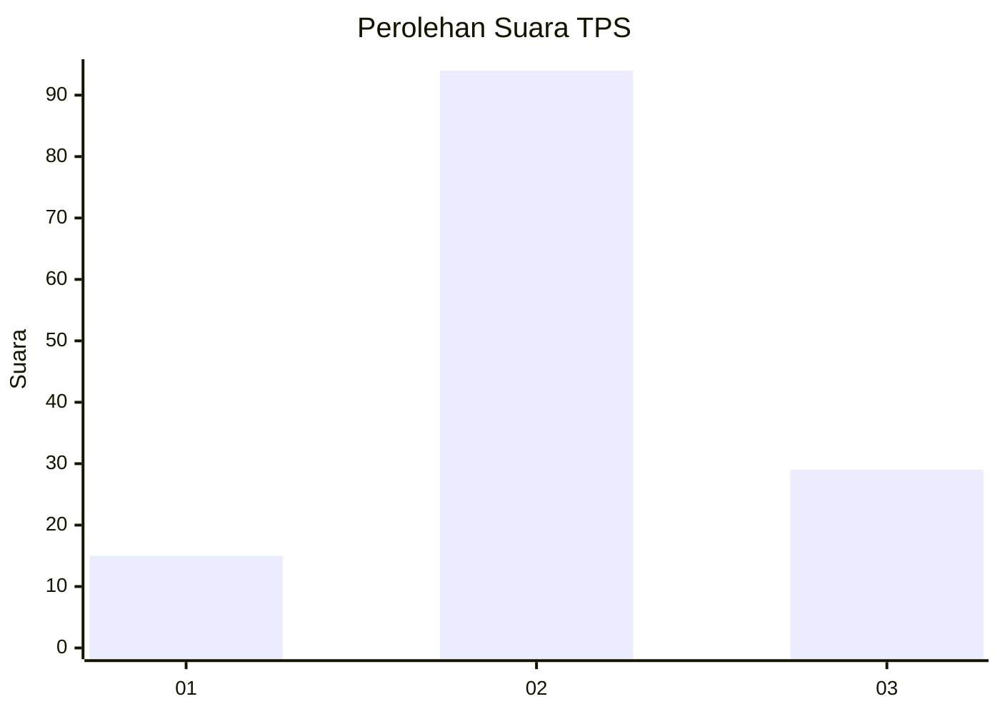
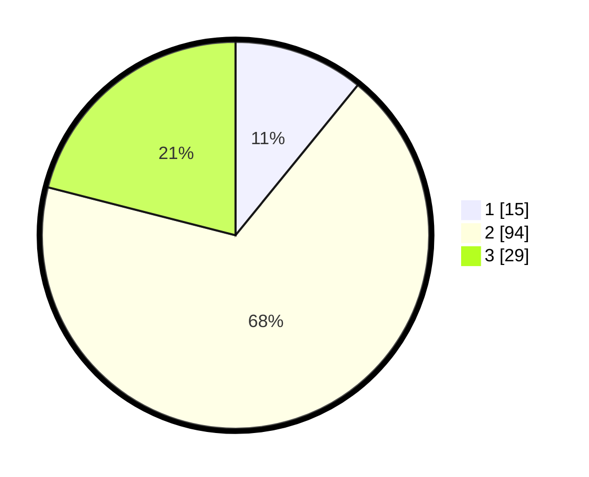

# Hasil

## Grafik

## Tabel

| No. | Nama Paslon    | Suara | Suara (raw) | Persentase |
|:--- |:-------------- | -----:| -----------:| ----------:|
| 1   | ANIES MUHAIMIN | 15    | [15][p-1]   | 10,87      |
| 2   | PRABOWO GIBRAN | 94    | [94][p-2]   | 68,12      |
| 3   | GANJAR MAHFUD  | 29    | [29][p-3]   | 21,01      |

[p-1]: https://github.com/gigit-pemilu/pemilu-2024-12-sumatera-utara/blob/main/pilpres/hitung-suara/sub/12-sumatera-utara/sub/07-deli-serdang/sub/06-namo-rambe/sub/2001-deli-tua/sub/006-tps/sub/paslon-1.txt
[p-2]: https://github.com/gigit-pemilu/pemilu-2024-12-sumatera-utara/blob/main/pilpres/hitung-suara/sub/12-sumatera-utara/sub/07-deli-serdang/sub/06-namo-rambe/sub/2001-deli-tua/sub/006-tps/sub/paslon-2.txt
[p-3]: https://github.com/gigit-pemilu/pemilu-2024-12-sumatera-utara/blob/main/pilpres/hitung-suara/sub/12-sumatera-utara/sub/07-deli-serdang/sub/06-namo-rambe/sub/2001-deli-tua/sub/006-tps/sub/paslon-3.txt

## Foto C Plano

https://sirekap-obj-formc.kpu.go.id/832b/pemilu/ppwp/12/07/06/20/01/1207062001006-20240215-010639--1152cd51-a779-4f9d-ba42-865cf8aa7c13.jpg

https://sirekap-obj-formc.kpu.go.id/832b/pemilu/ppwp/12/07/06/20/01/1207062001006-20240215-010748--29e3e6ad-27b8-4a7d-a4d2-3622138f1a7d.jpg

https://sirekap-obj-formc.kpu.go.id/832b/pemilu/ppwp/12/07/06/20/01/1207062001006-20240215-010846--e18dfa79-969d-4cb0-b5da-869a8ca2838b.jpg

## Metadata

| Key        | Value               |
| ---------- | ------------------- |
| Time Stamp | 2024-02-25 11:00:00 |

