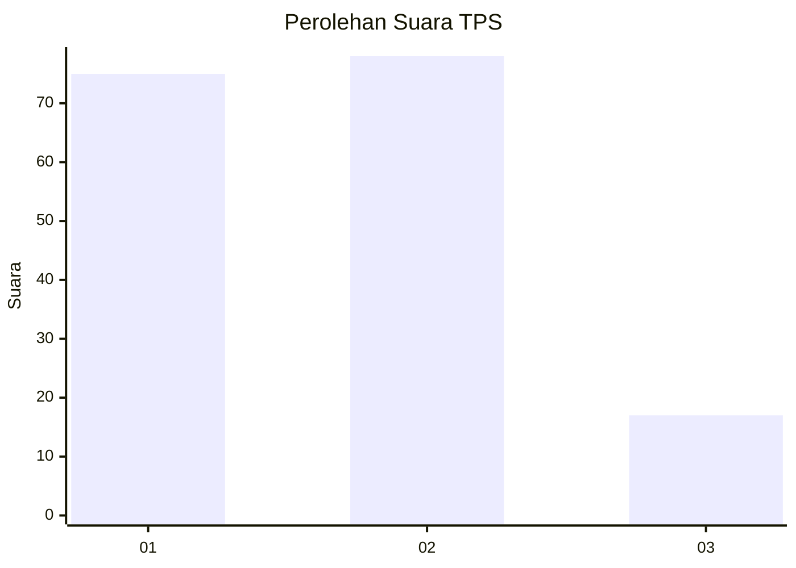
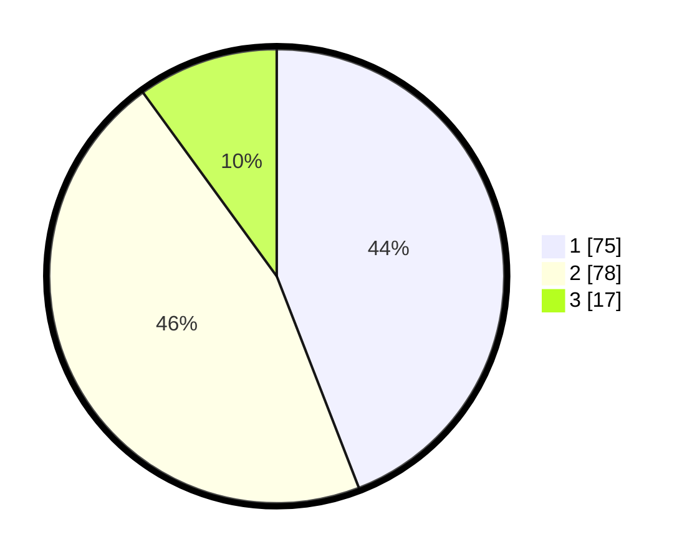

# Hasil

## Grafik

## Tabel

| No. | Nama Paslon    | Suara | Suara (raw) | Persentase |
|:--- |:-------------- | -----:| -----------:| ----------:|
| 1   | ANIES MUHAIMIN | 75    | [75][p-1]   | 44,12      |
| 2   | PRABOWO GIBRAN | 78    | [78][p-2]   | 45,88      |
| 3   | GANJAR MAHFUD  | 17    | [17][p-3]   | 10,00      |

[p-1]: https://github.com/gigit-pemilu/pemilu-2024/blob/main/pilpres/hitung-suara/sub/12-sumatera-utara/sub/07-deli-serdang/sub/06-namo-rambe/sub/2001-deli-tua/sub/013-tps/sub/paslon-1.txt
[p-2]: https://github.com/gigit-pemilu/pemilu-2024/blob/main/pilpres/hitung-suara/sub/12-sumatera-utara/sub/07-deli-serdang/sub/06-namo-rambe/sub/2001-deli-tua/sub/013-tps/sub/paslon-2.txt
[p-3]: https://github.com/gigit-pemilu/pemilu-2024/blob/main/pilpres/hitung-suara/sub/12-sumatera-utara/sub/07-deli-serdang/sub/06-namo-rambe/sub/2001-deli-tua/sub/013-tps/sub/paslon-3.txt

## Foto C Plano

https://sirekap-obj-formc.kpu.go.id/a6e4/pemilu/ppwp/12/07/06/20/01/1207062001013-20240214-211336--fcbaeb4a-3ac9-431c-8347-99c78eaf7abb.jpg

https://sirekap-obj-formc.kpu.go.id/a6e4/pemilu/ppwp/12/07/06/20/01/1207062001013-20240214-211346--82dc82b0-73b8-41b7-85a6-d7640e574363.jpg

https://sirekap-obj-formc.kpu.go.id/a6e4/pemilu/ppwp/12/07/06/20/01/1207062001013-20240214-211352--9761766b-bbe4-40bb-98db-d59670d895df.jpg

## Metadata

| Key        | Value               |
| ---------- | ------------------- |
| Time Stamp | 2024-02-25 21:00:00 |

