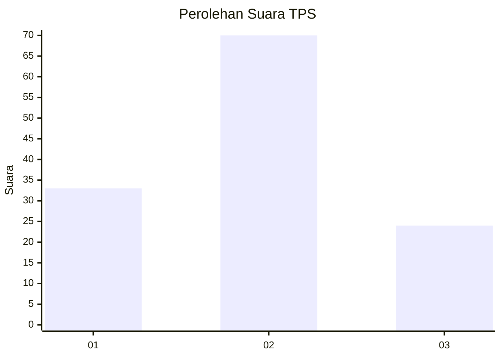
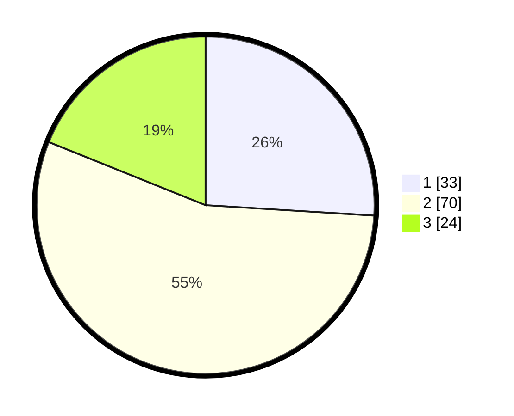

# Hasil

## Grafik

## Tabel

| No. | Nama Paslon    | Suara | Suara (raw) | Persentase |
|:--- |:-------------- | -----:| -----------:| ----------:|
| 1   | ANIES MUHAIMIN | 33    | [33][p-1]   | 25,98      |
| 2   | PRABOWO GIBRAN | 70    | [70][p-2]   | 55,12      |
| 3   | GANJAR MAHFUD  | 24    | [24][p-3]   | 18,90      |

[p-1]: https://github.com/gigit-pemilu/pemilu-2024-12-sumatera-utara/blob/main/pilpres/hitung-suara/sub/12-sumatera-utara/sub/07-deli-serdang/sub/06-namo-rambe/sub/2001-deli-tua/sub/016-tps/sub/paslon-1.txt
[p-2]: https://github.com/gigit-pemilu/pemilu-2024-12-sumatera-utara/blob/main/pilpres/hitung-suara/sub/12-sumatera-utara/sub/07-deli-serdang/sub/06-namo-rambe/sub/2001-deli-tua/sub/016-tps/sub/paslon-2.txt
[p-3]: https://github.com/gigit-pemilu/pemilu-2024-12-sumatera-utara/blob/main/pilpres/hitung-suara/sub/12-sumatera-utara/sub/07-deli-serdang/sub/06-namo-rambe/sub/2001-deli-tua/sub/016-tps/sub/paslon-3.txt

## Foto C Plano

https://sirekap-obj-formc.kpu.go.id/6bc4/pemilu/ppwp/12/07/06/20/01/1207062001016-20240214-155653--161368bb-2992-496b-9ae6-8e31891307e7.jpg

https://sirekap-obj-formc.kpu.go.id/6bc4/pemilu/ppwp/12/07/06/20/01/1207062001016-20240214-155333--861f5e64-36d8-4639-9aba-a8b387c9bfba.jpg

https://sirekap-obj-formc.kpu.go.id/6bc4/pemilu/ppwp/12/07/06/20/01/1207062001016-20240214-155606--4999059d-ef09-4d7f-b885-5b14558fbce6.jpg

## Metadata

| Key        | Value               |
| ---------- | ------------------- |
| Time Stamp | 2024-02-25 12:00:00 |

