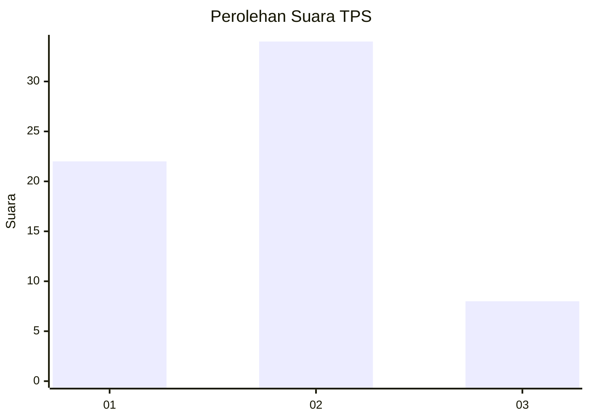
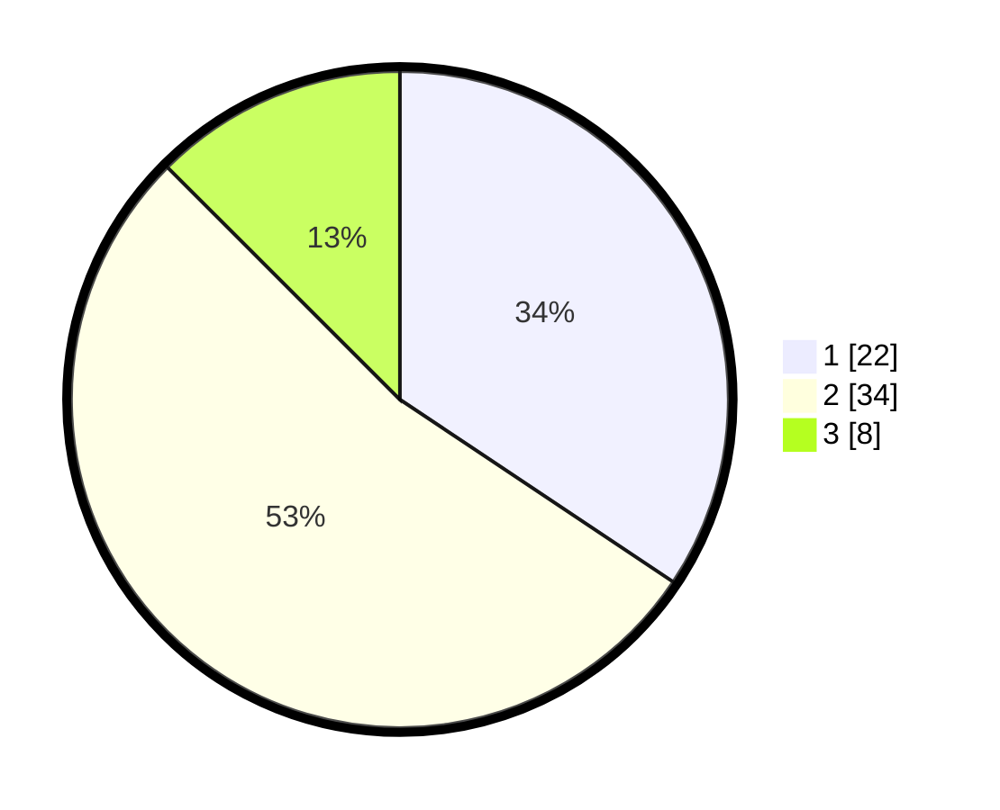

# Hasil

## Grafik

## Tabel

| No. | Nama Paslon    | Suara | Suara (raw) | Persentase |
|:--- |:-------------- | -----:| -----------:| ----------:|
| 1   | ANIES MUHAIMIN | 22    | [22][p-1]   | 34,38      |
| 2   | PRABOWO GIBRAN | 34    | [34][p-2]   | 53,13      |
| 3   | GANJAR MAHFUD  | 8     | [8][p-3]    | 12,50      |

[p-1]: https://github.com/gigit-pemilu/pemilu-2024-12-sumatera-utara/blob/main/pilpres/hitung-suara/sub/12-sumatera-utara/sub/07-deli-serdang/sub/06-namo-rambe/sub/2001-deli-tua/sub/039-tps/sub/paslon-1.txt
[p-2]: https://github.com/gigit-pemilu/pemilu-2024-12-sumatera-utara/blob/main/pilpres/hitung-suara/sub/12-sumatera-utara/sub/07-deli-serdang/sub/06-namo-rambe/sub/2001-deli-tua/sub/039-tps/sub/paslon-2.txt
[p-3]: https://github.com/gigit-pemilu/pemilu-2024-12-sumatera-utara/blob/main/pilpres/hitung-suara/sub/12-sumatera-utara/sub/07-deli-serdang/sub/06-namo-rambe/sub/2001-deli-tua/sub/039-tps/sub/paslon-3.txt

## Foto C Plano

https://sirekap-obj-formc.kpu.go.id/de88/pemilu/ppwp/12/07/06/20/01/1207062001039-20240214-190503--8e1f2d33-6d54-424e-8c11-bbf444020efa.jpg

https://sirekap-obj-formc.kpu.go.id/de88/pemilu/ppwp/12/07/06/20/01/1207062001039-20240216-123401--f258518d-c167-4cfc-8fca-c5fba9dced9a.jpg

https://sirekap-obj-formc.kpu.go.id/de88/pemilu/ppwp/12/07/06/20/01/1207062001039-20240216-123405--c43f34a5-9b12-4109-a795-bb74f4eec503.jpg

## Metadata

| Key        | Value               |
| ---------- | ------------------- |
| Time Stamp | 2024-02-16 14:30:33 |

