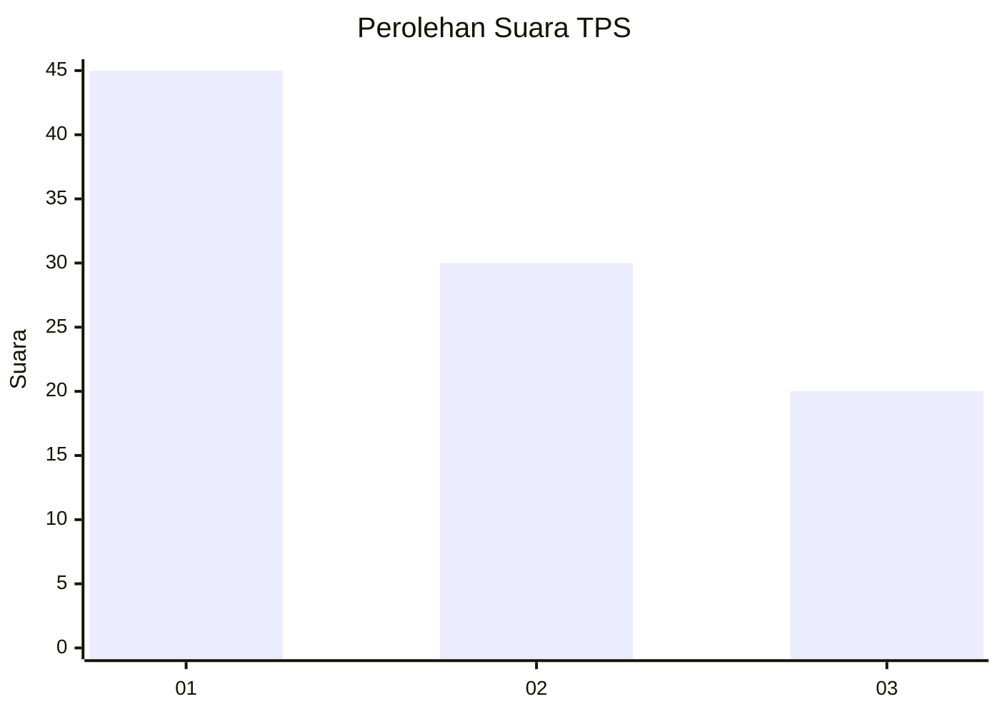
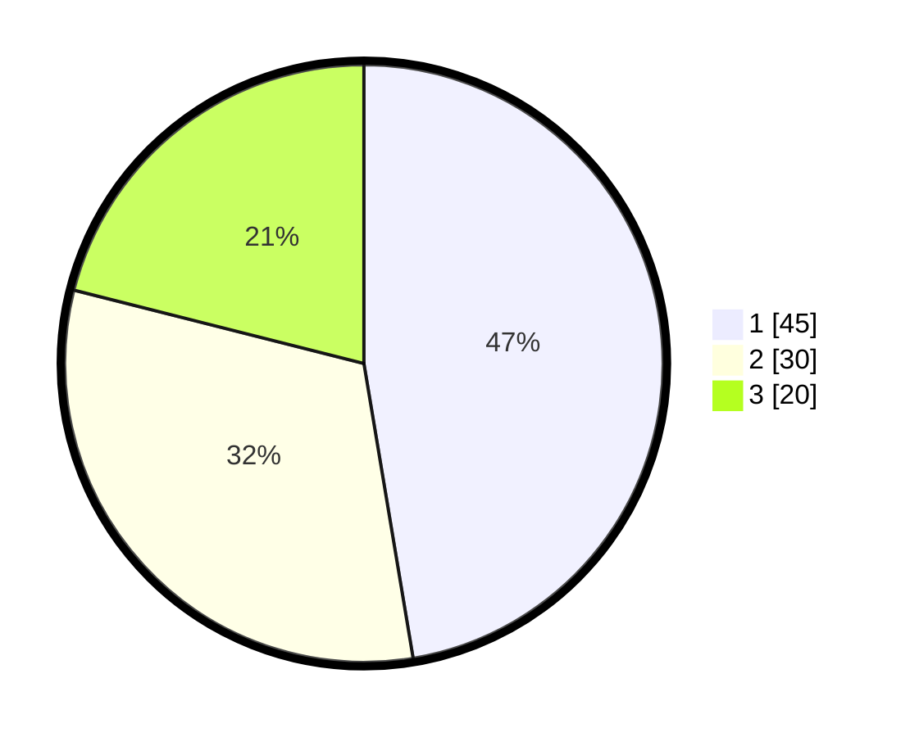

# Hasil

## Grafik

## Tabel

| No. | Nama Paslon    | Suara | Suara (raw) | Persentase |
|:--- |:-------------- | -----:| -----------:| ----------:|
| 1   | ANIES MUHAIMIN | 45    | [45][p-1]   | 47,37      |
| 2   | PRABOWO GIBRAN | 30    | [30][p-2]   | 31,58      |
| 3   | GANJAR MAHFUD  | 20    | [20][p-3]   | 21,05      |

[p-1]: https://github.com/gigit-pemilu/pemilu-2024/blob/main/pilpres/hitung-suara/sub/12-sumatera-utara/sub/07-deli-serdang/sub/06-namo-rambe/sub/2001-deli-tua/sub/040-tps/sub/paslon-1.txt
[p-2]: https://github.com/gigit-pemilu/pemilu-2024/blob/main/pilpres/hitung-suara/sub/12-sumatera-utara/sub/07-deli-serdang/sub/06-namo-rambe/sub/2001-deli-tua/sub/040-tps/sub/paslon-2.txt
[p-3]: https://github.com/gigit-pemilu/pemilu-2024/blob/main/pilpres/hitung-suara/sub/12-sumatera-utara/sub/07-deli-serdang/sub/06-namo-rambe/sub/2001-deli-tua/sub/040-tps/sub/paslon-3.txt

## Foto C Plano

https://sirekap-obj-formc.kpu.go.id/bcba/pemilu/ppwp/12/07/06/20/01/1207062001040-20240214-235447--2d93ca45-3feb-49aa-b6d1-02f043075acf.jpg

https://sirekap-obj-formc.kpu.go.id/bcba/pemilu/ppwp/12/07/06/20/01/1207062001040-20240214-235730--ef418a2a-feaa-4c9b-a07b-cc7fb2ceb891.jpg

https://sirekap-obj-formc.kpu.go.id/bcba/pemilu/ppwp/12/07/06/20/01/1207062001040-20240215-000157--b5823c7a-da04-4c5d-999f-d6b5755c1bfe.jpg

## Metadata

| Key        | Value               |
| ---------- | ------------------- |
| Time Stamp | 2024-02-25 18:00:00 |

