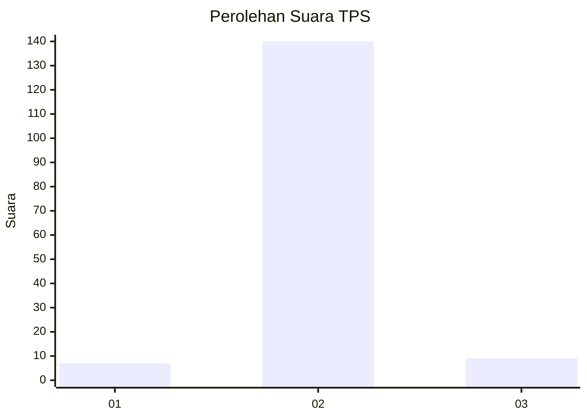
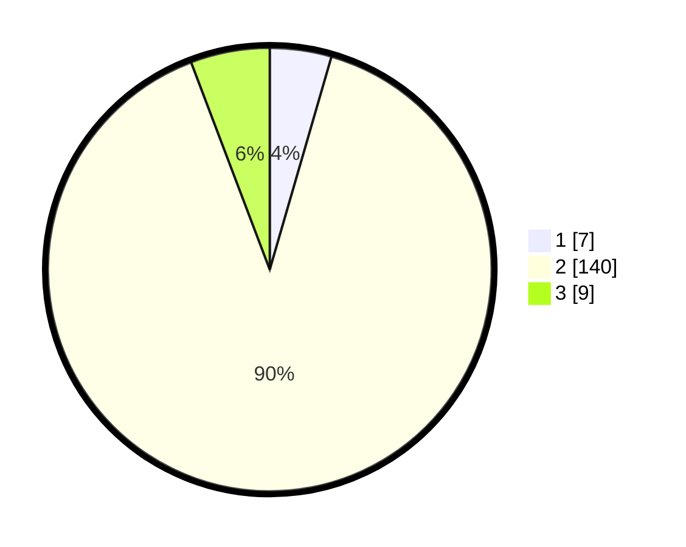

# Hasil

## Grafik

## Tabel

| No. | Nama Paslon    | Suara | Suara (raw) | Persentase |
|:--- |:-------------- | -----:| -----------:| ----------:|
| 1   | ANIES MUHAIMIN | 7     | [7][p-1]    | 4,49       |
| 2   | PRABOWO GIBRAN | 140   | [140][p-2]  | 89,74      |
| 3   | GANJAR MAHFUD  | 9     | [9][p-3]    | 5,77       |

[p-1]: https://github.com/gigit-pemilu/pemilu-2024/blob/main/pilpres/hitung-suara/sub/12-sumatera-utara/sub/07-deli-serdang/sub/06-namo-rambe/sub/2008-timbang-lawan/sub/001-tps/sub/paslon-1.txt
[p-2]: https://github.com/gigit-pemilu/pemilu-2024/blob/main/pilpres/hitung-suara/sub/12-sumatera-utara/sub/07-deli-serdang/sub/06-namo-rambe/sub/2008-timbang-lawan/sub/001-tps/sub/paslon-2.txt
[p-3]: https://github.com/gigit-pemilu/pemilu-2024/blob/main/pilpres/hitung-suara/sub/12-sumatera-utara/sub/07-deli-serdang/sub/06-namo-rambe/sub/2008-timbang-lawan/sub/001-tps/sub/paslon-3.txt

## Foto C Plano

https://sirekap-obj-formc.kpu.go.id/26f4/pemilu/ppwp/12/07/06/20/08/1207062008001-20240214-212256--616b419d-6625-4309-83ec-1c356b6c89d0.jpg

https://sirekap-obj-formc.kpu.go.id/26f4/pemilu/ppwp/12/07/06/20/08/1207062008001-20240214-212443--e4e9ffa1-9210-4720-9679-f1155135b2a1.jpg

https://sirekap-obj-formc.kpu.go.id/26f4/pemilu/ppwp/12/07/06/20/08/1207062008001-20240214-212521--73f450b8-0dee-4244-9341-e7d0c8c4c3a8.jpg

## Metadata

| Key        | Value               |
| ---------- | ------------------- |
| Time Stamp | 2024-02-24 22:31:28 |

