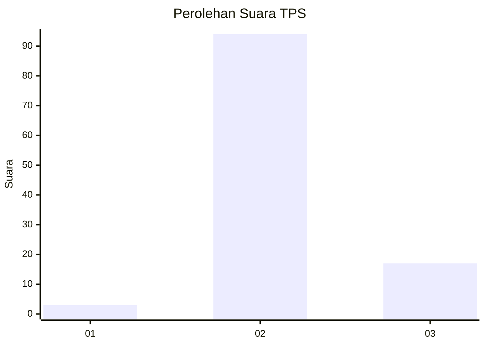
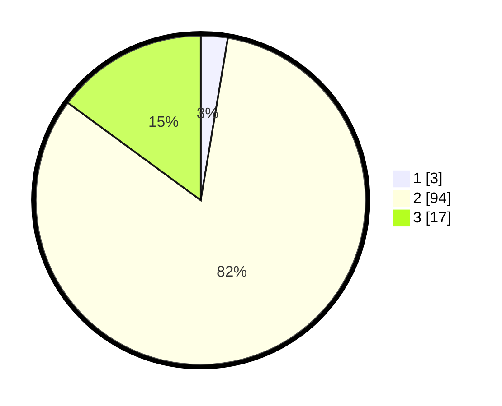

# Hasil

## Grafik

## Tabel

| No. | Nama Paslon    | Suara | Suara (raw) | Persentase |
|:--- |:-------------- | -----:| -----------:| ----------:|
| 1   | ANIES MUHAIMIN | 3     | [3][p-1]    | 2,63       |
| 2   | PRABOWO GIBRAN | 94    | [94][p-2]   | 82,46      |
| 3   | GANJAR MAHFUD  | 17    | [17][p-3]   | 14,91      |

[p-1]: https://github.com/gigit-pemilu/pemilu-2024-12-sumatera-utara/blob/main/pilpres/hitung-suara/sub/12-sumatera-utara/sub/07-deli-serdang/sub/06-namo-rambe/sub/2022-tangkahan/sub/003-tps/sub/paslon-1.txt
[p-2]: https://github.com/gigit-pemilu/pemilu-2024-12-sumatera-utara/blob/main/pilpres/hitung-suara/sub/12-sumatera-utara/sub/07-deli-serdang/sub/06-namo-rambe/sub/2022-tangkahan/sub/003-tps/sub/paslon-2.txt
[p-3]: https://github.com/gigit-pemilu/pemilu-2024-12-sumatera-utara/blob/main/pilpres/hitung-suara/sub/12-sumatera-utara/sub/07-deli-serdang/sub/06-namo-rambe/sub/2022-tangkahan/sub/003-tps/sub/paslon-3.txt

## Foto C Plano

https://sirekap-obj-formc.kpu.go.id/f63b/pemilu/ppwp/12/07/06/20/22/1207062022003-20240214-213606--53564cb9-7cfa-4f86-bbbf-c6ffe164ff00.jpg

https://sirekap-obj-formc.kpu.go.id/f63b/pemilu/ppwp/12/07/06/20/22/1207062022003-20240214-213436--38ecbb10-2863-4d7d-9302-da994fadec27.jpg

https://sirekap-obj-formc.kpu.go.id/f63b/pemilu/ppwp/12/07/06/20/22/1207062022003-20240214-213826--addf17cb-cc44-451a-9cfc-f5b47ff2854f.jpg

## Metadata

| Key        | Value               |
| ---------- | ------------------- |
| Time Stamp | 2024-02-25 11:00:00 |

