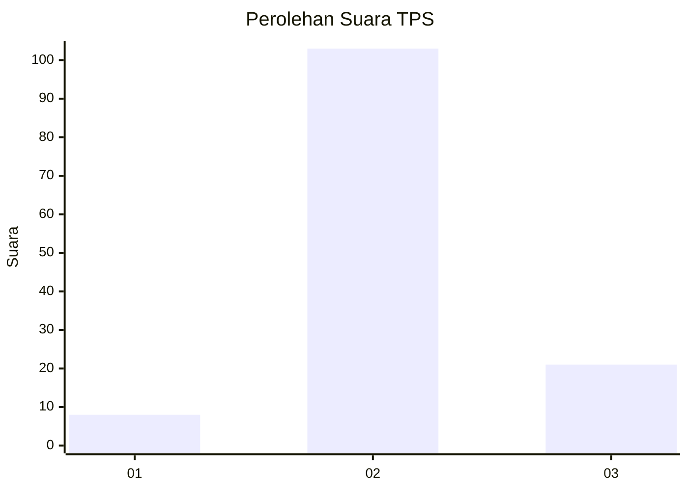
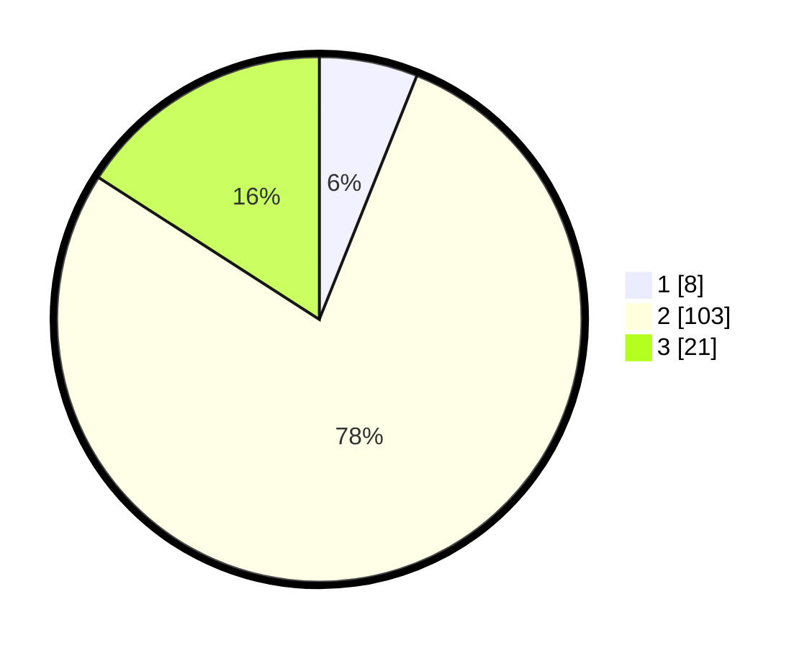

# Hasil

## Grafik

## Tabel

| No. | Nama Paslon    | Suara | Suara (raw) | Persentase |
|:--- |:-------------- | -----:| -----------:| ----------:|
| 1   | ANIES MUHAIMIN | 8     | [8][p-1]    | 6,06       |
| 2   | PRABOWO GIBRAN | 103   | [103][p-2]  | 78,03      |
| 3   | GANJAR MAHFUD  | 21    | [21][p-3]   | 15,91      |

[p-1]: https://github.com/gigit-pemilu/pemilu-2024/blob/main/pilpres/hitung-suara/sub/12-sumatera-utara/sub/07-deli-serdang/sub/06-namo-rambe/sub/2031-lau-mulgap/sub/001-tps/sub/paslon-1.txt
[p-2]: https://github.com/gigit-pemilu/pemilu-2024/blob/main/pilpres/hitung-suara/sub/12-sumatera-utara/sub/07-deli-serdang/sub/06-namo-rambe/sub/2031-lau-mulgap/sub/001-tps/sub/paslon-2.txt
[p-3]: https://github.com/gigit-pemilu/pemilu-2024/blob/main/pilpres/hitung-suara/sub/12-sumatera-utara/sub/07-deli-serdang/sub/06-namo-rambe/sub/2031-lau-mulgap/sub/001-tps/sub/paslon-3.txt

## Foto C Plano

https://sirekap-obj-formc.kpu.go.id/c15d/pemilu/ppwp/12/07/06/20/31/1207062031001-20240215-010323--aa6a13dc-eaa7-42ec-9aaf-5b07752ec474.jpg

https://sirekap-obj-formc.kpu.go.id/c15d/pemilu/ppwp/12/07/06/20/31/1207062031001-20240215-010314--20ad2df3-d14e-4c3d-b951-2c8b2596e32a.jpg

https://sirekap-obj-formc.kpu.go.id/c15d/pemilu/ppwp/12/07/06/20/31/1207062031001-20240215-010444--73276aaf-a00f-4b8e-9f75-9c0f4e4656d7.jpg

## Metadata

| Key        | Value               |
| ---------- | ------------------- |
| Time Stamp | 2024-02-25 15:00:00 |

