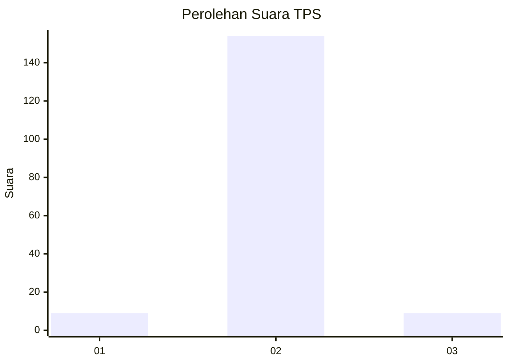
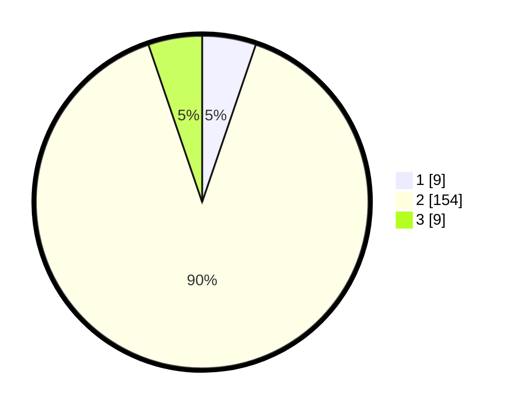

# Hasil

## Grafik

## Tabel

| No. | Nama Paslon    | Suara | Suara (raw) | Persentase |
|:--- |:-------------- | -----:| -----------:| ----------:|
| 1   | ANIES MUHAIMIN | 9     | [9][p-1]    | 5,23       |
| 2   | PRABOWO GIBRAN | 154   | [154][p-2]  | 89,53      |
| 3   | GANJAR MAHFUD  | 9     | [9][p-3]    | 5,23       |

[p-1]: https://github.com/gigit-pemilu/pemilu-2024/blob/main/pilpres/hitung-suara/sub/12-sumatera-utara/sub/07-deli-serdang/sub/07-biru-biru/sub/2009-peria-ria/sub/003-tps/sub/paslon-1.txt
[p-2]: https://github.com/gigit-pemilu/pemilu-2024/blob/main/pilpres/hitung-suara/sub/12-sumatera-utara/sub/07-deli-serdang/sub/07-biru-biru/sub/2009-peria-ria/sub/003-tps/sub/paslon-2.txt
[p-3]: https://github.com/gigit-pemilu/pemilu-2024/blob/main/pilpres/hitung-suara/sub/12-sumatera-utara/sub/07-deli-serdang/sub/07-biru-biru/sub/2009-peria-ria/sub/003-tps/sub/paslon-3.txt

## Foto C Plano

https://sirekap-obj-formc.kpu.go.id/2668/pemilu/ppwp/12/07/07/20/09/1207072009003-20240215-023102--88df1ef2-9dcc-4641-84e3-34a308ef66b2.jpg

https://sirekap-obj-formc.kpu.go.id/2668/pemilu/ppwp/12/07/07/20/09/1207072009003-20240215-022430--b31f6e63-9ea5-4a59-b130-6ed37430b4c0.jpg

https://sirekap-obj-formc.kpu.go.id/2668/pemilu/ppwp/12/07/07/20/09/1207072009003-20240215-022625--f814cb63-8a02-4f57-8096-d2249fd29fda.jpg

## Metadata

| Key        | Value               |
| ---------- | ------------------- |
| Time Stamp | 2024-02-25 17:00:00 |

