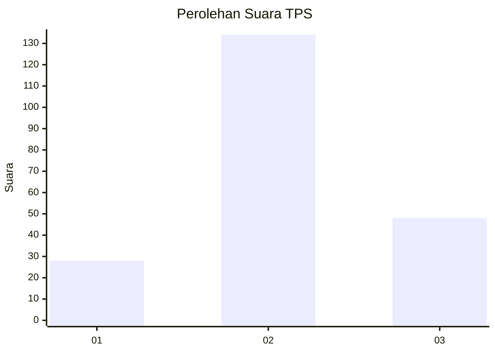
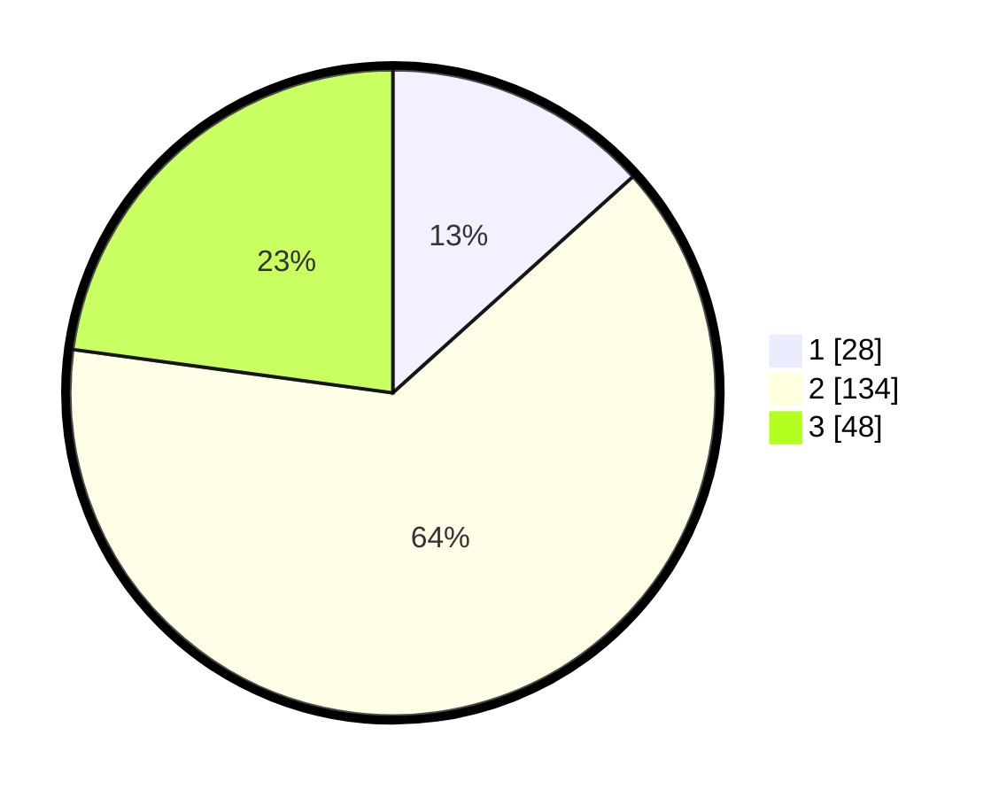

# Hasil

## Grafik

## Tabel

| No. | Nama Paslon    | Suara | Suara (raw) | Persentase |
|:--- |:-------------- | -----:| -----------:| ----------:|
| 1   | ANIES MUHAIMIN | 28    | [28][p-1]   | 13,33      |
| 2   | PRABOWO GIBRAN | 134   | [134][p-2]  | 63,81      |
| 3   | GANJAR MAHFUD  | 48    | [48][p-3]   | 22,86      |

[p-1]: https://github.com/gigit-pemilu/pemilu-2024-12-sumatera-utara/blob/main/pilpres/hitung-suara/sub/12-sumatera-utara/sub/07-deli-serdang/sub/08-stm-hilir/sub/2001-talun-kenas/sub/002-tps/sub/paslon-1.txt
[p-2]: https://github.com/gigit-pemilu/pemilu-2024-12-sumatera-utara/blob/main/pilpres/hitung-suara/sub/12-sumatera-utara/sub/07-deli-serdang/sub/08-stm-hilir/sub/2001-talun-kenas/sub/002-tps/sub/paslon-2.txt
[p-3]: https://github.com/gigit-pemilu/pemilu-2024-12-sumatera-utara/blob/main/pilpres/hitung-suara/sub/12-sumatera-utara/sub/07-deli-serdang/sub/08-stm-hilir/sub/2001-talun-kenas/sub/002-tps/sub/paslon-3.txt

## Foto C Plano

https://sirekap-obj-formc.kpu.go.id/e277/pemilu/ppwp/12/07/08/20/01/1207082001002-20240215-004339--ce3850b4-0486-47d3-94a6-ca0da65e9886.jpg

https://sirekap-obj-formc.kpu.go.id/e277/pemilu/ppwp/12/07/08/20/01/1207082001002-20240215-004840--1c1f8c97-98a9-4d4b-b401-8ce46dd629d3.jpg

https://sirekap-obj-formc.kpu.go.id/e277/pemilu/ppwp/12/07/08/20/01/1207082001002-20240215-005243--8e775d7f-5350-493d-9256-8d534a108ca7.jpg

## Metadata

| Key        | Value               |
| ---------- | ------------------- |
| Time Stamp | 2024-02-24 22:31:28 |

