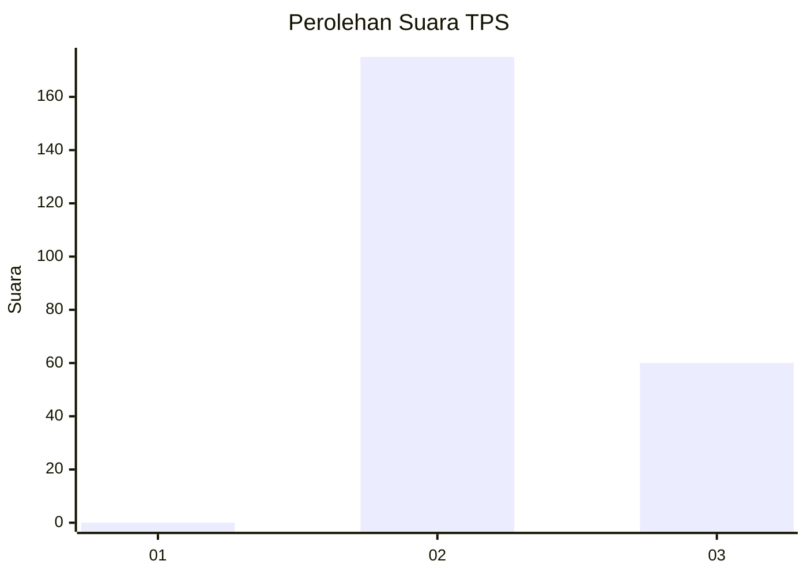
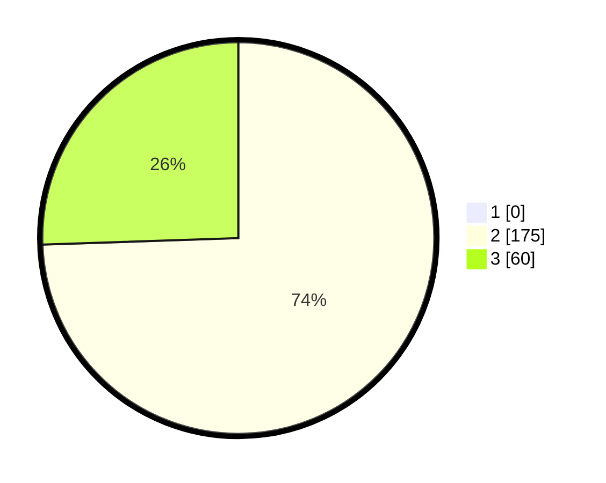

# Hasil

## Grafik

## Tabel

| No. | Nama Paslon    | Suara | Suara (raw) | Persentase |
|:--- |:-------------- | -----:| -----------:| ----------:|
| 1   | ANIES MUHAIMIN | 0     | [0][p-1]    | 0,00       |
| 2   | PRABOWO GIBRAN | 175   | [175][p-2]  | 74,47      |
| 3   | GANJAR MAHFUD  | 60    | [60][p-3]   | 25,53      |

[p-1]: https://github.com/gigit-pemilu/pemilu-2024-12-sumatera-utara/blob/main/pilpres/hitung-suara/sub/12-sumatera-utara/sub/07-deli-serdang/sub/08-stm-hilir/sub/2001-talun-kenas/sub/006-tps/sub/paslon-1.txt
[p-2]: https://github.com/gigit-pemilu/pemilu-2024-12-sumatera-utara/blob/main/pilpres/hitung-suara/sub/12-sumatera-utara/sub/07-deli-serdang/sub/08-stm-hilir/sub/2001-talun-kenas/sub/006-tps/sub/paslon-2.txt
[p-3]: https://github.com/gigit-pemilu/pemilu-2024-12-sumatera-utara/blob/main/pilpres/hitung-suara/sub/12-sumatera-utara/sub/07-deli-serdang/sub/08-stm-hilir/sub/2001-talun-kenas/sub/006-tps/sub/paslon-3.txt

## Foto C Plano

https://sirekap-obj-formc.kpu.go.id/a230/pemilu/ppwp/12/07/08/20/01/1207082001006-20240214-155431--e9a11cf3-5808-4d24-9236-885eee7fdc06.jpg

https://sirekap-obj-formc.kpu.go.id/a230/pemilu/ppwp/12/07/08/20/01/1207082001006-20240214-155656--2475184f-1abf-4e12-ba18-04a04b858678.jpg

https://sirekap-obj-formc.kpu.go.id/a230/pemilu/ppwp/12/07/08/20/01/1207082001006-20240214-155913--7d9f8b6e-5038-48ef-994e-544b3ce92504.jpg

## Metadata

| Key        | Value               |
| ---------- | ------------------- |
| Time Stamp | 2024-02-25 17:00:00 |

