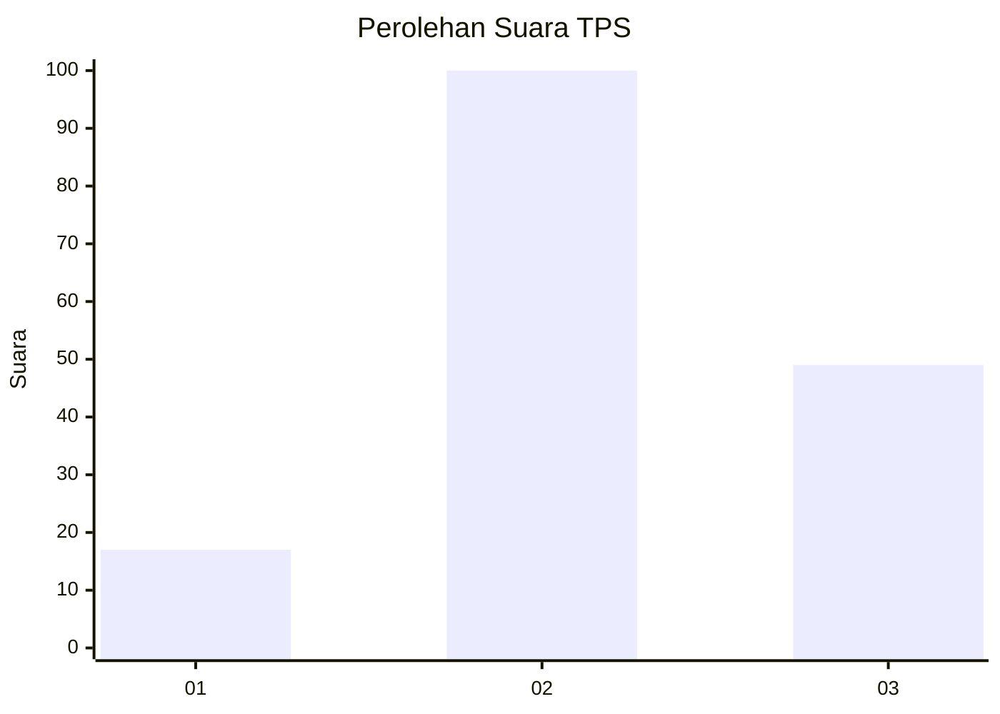
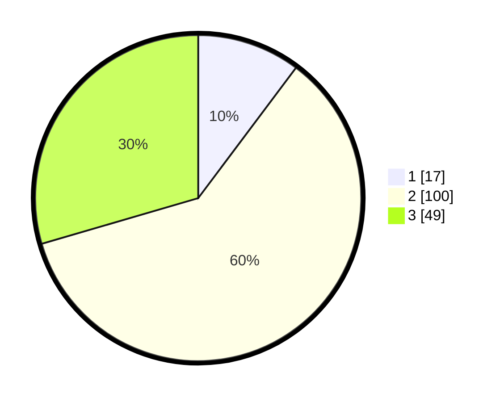

# Hasil

## Grafik

## Tabel

| No. | Nama Paslon    | Suara | Suara (raw) | Persentase |
|:--- |:-------------- | -----:| -----------:| ----------:|
| 1   | ANIES MUHAIMIN | 17    | [17][p-1]   | 10,24      |
| 2   | PRABOWO GIBRAN | 100   | [100][p-2]  | 60,24      |
| 3   | GANJAR MAHFUD  | 49    | [49][p-3]   | 29,52      |

[p-1]: https://github.com/gigit-pemilu/pemilu-2024/blob/main/pilpres/hitung-suara/sub/12-sumatera-utara/sub/07-deli-serdang/sub/08-stm-hilir/sub/2001-talun-kenas/sub/009-tps/sub/paslon-1.txt
[p-2]: https://github.com/gigit-pemilu/pemilu-2024/blob/main/pilpres/hitung-suara/sub/12-sumatera-utara/sub/07-deli-serdang/sub/08-stm-hilir/sub/2001-talun-kenas/sub/009-tps/sub/paslon-2.txt
[p-3]: https://github.com/gigit-pemilu/pemilu-2024/blob/main/pilpres/hitung-suara/sub/12-sumatera-utara/sub/07-deli-serdang/sub/08-stm-hilir/sub/2001-talun-kenas/sub/009-tps/sub/paslon-3.txt

## Foto C Plano

https://sirekap-obj-formc.kpu.go.id/77c7/pemilu/ppwp/12/07/08/20/01/1207082001009-20240215-045628--c4c8a4b4-5f47-43aa-a6f0-b5dc9509ff22.jpg

https://sirekap-obj-formc.kpu.go.id/77c7/pemilu/ppwp/12/07/08/20/01/1207082001009-20240215-045841--fa182c41-8225-4872-a8a6-f92967b6171e.jpg

https://sirekap-obj-formc.kpu.go.id/77c7/pemilu/ppwp/12/07/08/20/01/1207082001009-20240215-050015--10e20ae3-74b1-4172-95ff-f752738eed1d.jpg

## Metadata

| Key        | Value               |
| ---------- | ------------------- |
| Time Stamp | 2024-02-25 18:00:00 |

