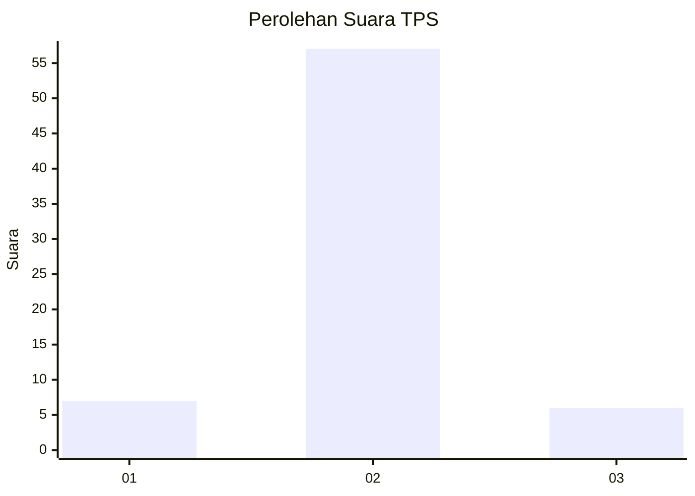
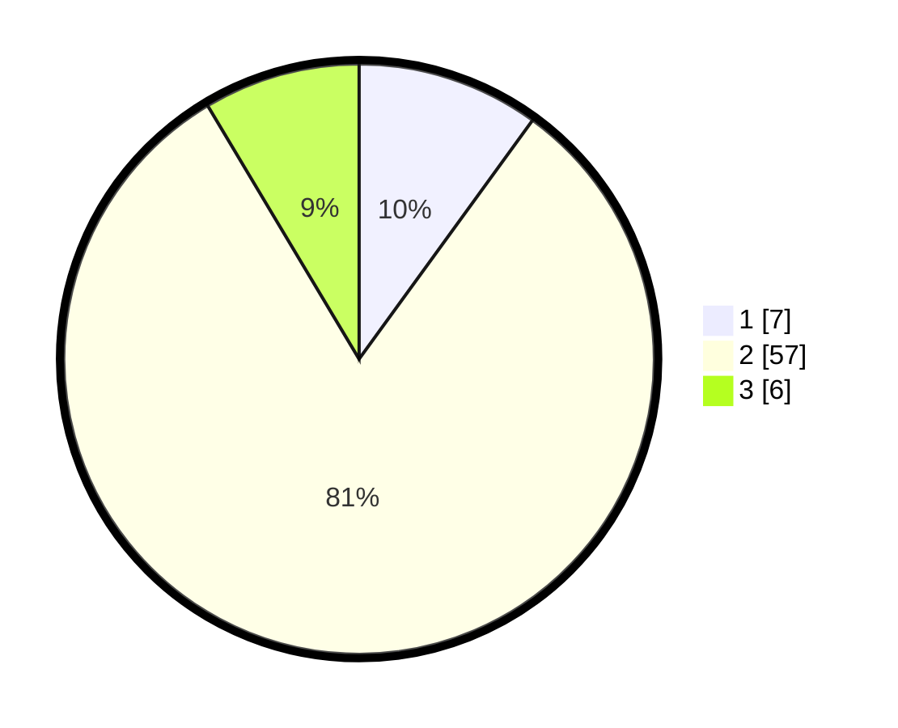

# Hasil

## Grafik

## Tabel

| No. | Nama Paslon    | Suara | Suara (raw) | Persentase |
|:--- |:-------------- | -----:| -----------:| ----------:|
| 1   | ANIES MUHAIMIN | 7     | [7][p-1]    | 10,00      |
| 2   | PRABOWO GIBRAN | 57    | [57][p-2]   | 81,43      |
| 3   | GANJAR MAHFUD  | 6     | [6][p-3]    | 8,57       |

[p-1]: https://github.com/gigit-pemilu/pemilu-2024/blob/main/pilpres/hitung-suara/sub/12-sumatera-utara/sub/07-deli-serdang/sub/08-stm-hilir/sub/2007-lau-barus-baru/sub/001-tps/sub/paslon-1.txt
[p-2]: https://github.com/gigit-pemilu/pemilu-2024/blob/main/pilpres/hitung-suara/sub/12-sumatera-utara/sub/07-deli-serdang/sub/08-stm-hilir/sub/2007-lau-barus-baru/sub/001-tps/sub/paslon-2.txt
[p-3]: https://github.com/gigit-pemilu/pemilu-2024/blob/main/pilpres/hitung-suara/sub/12-sumatera-utara/sub/07-deli-serdang/sub/08-stm-hilir/sub/2007-lau-barus-baru/sub/001-tps/sub/paslon-3.txt

## Foto C Plano

https://sirekap-obj-formc.kpu.go.id/5263/pemilu/ppwp/12/07/08/20/07/1207082007001-20240215-075219--d3a59c72-7275-4520-b83e-ec99b1c86183.jpg

https://sirekap-obj-formc.kpu.go.id/5263/pemilu/ppwp/12/07/08/20/07/1207082007001-20240215-075127--f69f469c-ba22-4b9f-89b6-8f1f725ceef8.jpg

https://sirekap-obj-formc.kpu.go.id/5263/pemilu/ppwp/12/07/08/20/07/1207082007001-20240214-190333--058e2c2d-c8cf-4420-98b8-853a403548d5.jpg

## Metadata

| Key        | Value               |
| ---------- | ------------------- |
| Time Stamp | 2024-02-25 16:00:00 |

