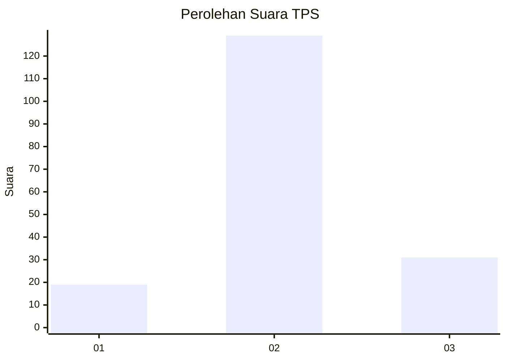
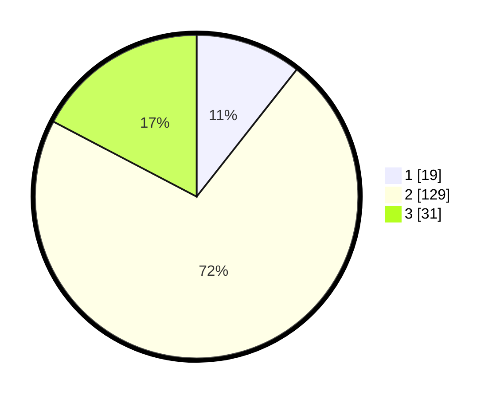

# Hasil

## Grafik

## Tabel

| No. | Nama Paslon    | Suara | Suara (raw) | Persentase |
|:--- |:-------------- | -----:| -----------:| ----------:|
| 1   | ANIES MUHAIMIN | 19    | [19][p-1]   | 10,61      |
| 2   | PRABOWO GIBRAN | 129   | [129][p-2]  | 72,07      |
| 3   | GANJAR MAHFUD  | 31    | [31][p-3]   | 17,32      |

[p-1]: https://github.com/gigit-pemilu/pemilu-2024/blob/main/pilpres/hitung-suara/sub/12-sumatera-utara/sub/07-deli-serdang/sub/09-bangun-purba/sub/2001-bah-perak/sub/002-tps/sub/paslon-1.txt
[p-2]: https://github.com/gigit-pemilu/pemilu-2024/blob/main/pilpres/hitung-suara/sub/12-sumatera-utara/sub/07-deli-serdang/sub/09-bangun-purba/sub/2001-bah-perak/sub/002-tps/sub/paslon-2.txt
[p-3]: https://github.com/gigit-pemilu/pemilu-2024/blob/main/pilpres/hitung-suara/sub/12-sumatera-utara/sub/07-deli-serdang/sub/09-bangun-purba/sub/2001-bah-perak/sub/002-tps/sub/paslon-3.txt

## Foto C Plano

https://sirekap-obj-formc.kpu.go.id/fc26/pemilu/ppwp/12/07/09/20/01/1207092001002-20240214-192807--c019c5bf-35ad-4653-a1cb-441d6c1b207f.jpg

https://sirekap-obj-formc.kpu.go.id/fc26/pemilu/ppwp/12/07/09/20/01/1207092001002-20240215-005140--1bf731c6-4c0e-40ab-a709-7c37b3252228.jpg

https://sirekap-obj-formc.kpu.go.id/fc26/pemilu/ppwp/12/07/09/20/01/1207092001002-20240215-005045--89a86a4f-eb71-4b67-a4ed-c4443b37e93f.jpg

## Metadata

| Key        | Value               |
| ---------- | ------------------- |
| Time Stamp | 2024-02-16 09:00:28 |

