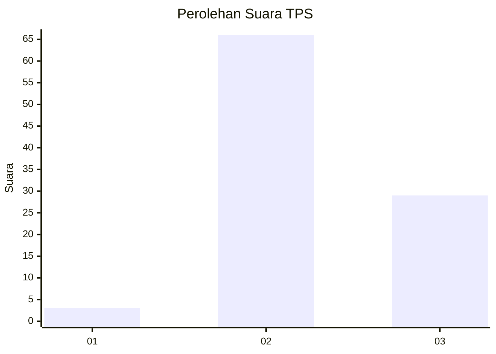
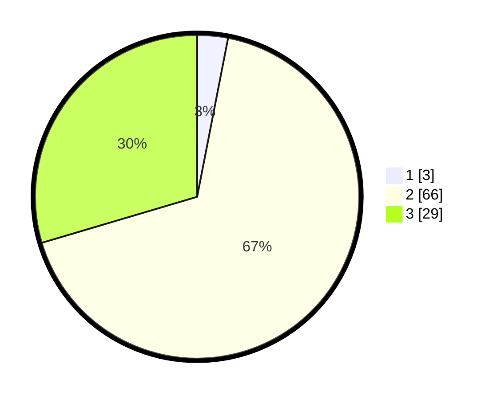

# Hasil

## Grafik

## Tabel

| No. | Nama Paslon    | Suara | Suara (raw) | Persentase |
|:--- |:-------------- | -----:| -----------:| ----------:|
| 1   | ANIES MUHAIMIN | 3     | [3][p-1]    | 3,06       |
| 2   | PRABOWO GIBRAN | 66    | [66][p-2]   | 67,35      |
| 3   | GANJAR MAHFUD  | 29    | [29][p-3]   | 29,59      |

[p-1]: https://github.com/gigit-pemilu/pemilu-2024/blob/main/pilpres/hitung-suara/sub/12-sumatera-utara/sub/07-deli-serdang/sub/09-bangun-purba/sub/2002-bandar-kwala/sub/001-tps/sub/paslon-1.txt
[p-2]: https://github.com/gigit-pemilu/pemilu-2024/blob/main/pilpres/hitung-suara/sub/12-sumatera-utara/sub/07-deli-serdang/sub/09-bangun-purba/sub/2002-bandar-kwala/sub/001-tps/sub/paslon-2.txt
[p-3]: https://github.com/gigit-pemilu/pemilu-2024/blob/main/pilpres/hitung-suara/sub/12-sumatera-utara/sub/07-deli-serdang/sub/09-bangun-purba/sub/2002-bandar-kwala/sub/001-tps/sub/paslon-3.txt

## Foto C Plano

https://sirekap-obj-formc.kpu.go.id/2f3d/pemilu/ppwp/12/07/09/20/02/1207092002001-20240215-075509--b2b3f10f-a3c8-406e-82c3-b96670e1e424.jpg

https://sirekap-obj-formc.kpu.go.id/2f3d/pemilu/ppwp/12/07/09/20/02/1207092002001-20240215-075746--43127919-4f10-4259-85d8-d2a0c1e07bc0.jpg

https://sirekap-obj-formc.kpu.go.id/2f3d/pemilu/ppwp/12/07/09/20/02/1207092002001-20240215-010850--6755b2c1-6703-4761-be1a-6724519b2d26.jpg

## Metadata

| Key        | Value               |
| ---------- | ------------------- |
| Time Stamp | 2024-02-25 17:00:00 |

