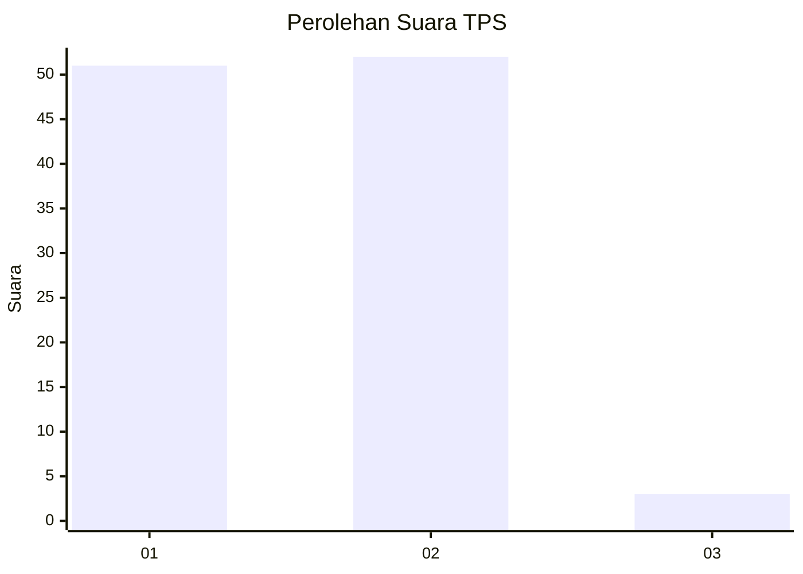
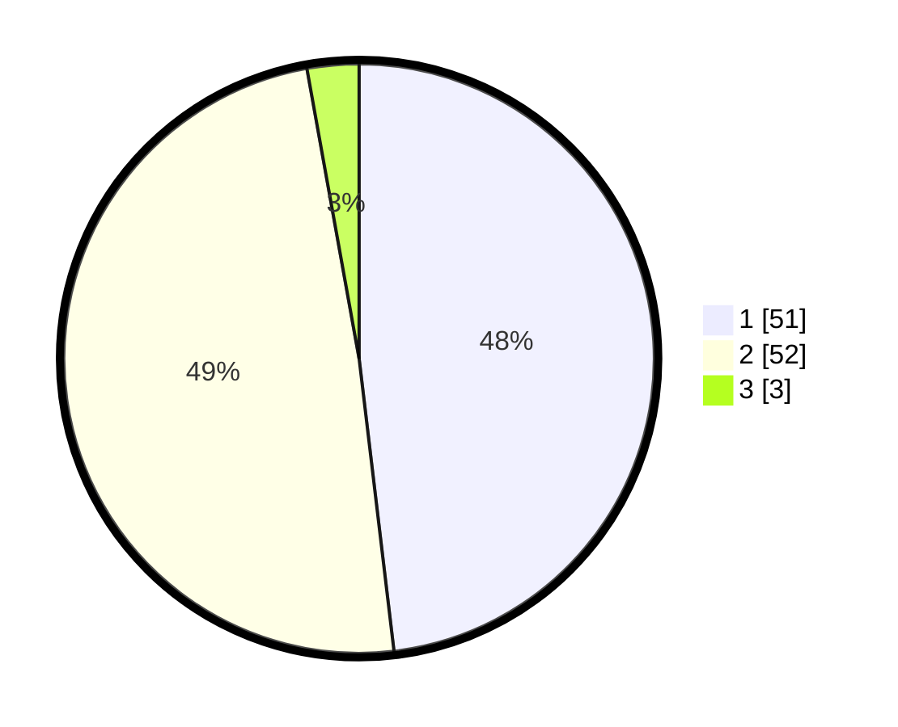

# Hasil

## Grafik

## Tabel

| No. | Nama Paslon    | Suara | Suara (raw) | Persentase |
|:--- |:-------------- | -----:| -----------:| ----------:|
| 1   | ANIES MUHAIMIN | 51    | [51][p-1]   | 48,11      |
| 2   | PRABOWO GIBRAN | 52    | [52][p-2]   | 49,06      |
| 3   | GANJAR MAHFUD  | 3     | [3][p-3]    | 2,83       |

[p-1]: https://github.com/gigit-pemilu/pemilu-2024-12-sumatera-utara/blob/main/pilpres/hitung-suara/sub/12-sumatera-utara/sub/07-deli-serdang/sub/09-bangun-purba/sub/2006-bandar-meriah/sub/003-tps/sub/paslon-1.txt
[p-2]: https://github.com/gigit-pemilu/pemilu-2024-12-sumatera-utara/blob/main/pilpres/hitung-suara/sub/12-sumatera-utara/sub/07-deli-serdang/sub/09-bangun-purba/sub/2006-bandar-meriah/sub/003-tps/sub/paslon-2.txt
[p-3]: https://github.com/gigit-pemilu/pemilu-2024-12-sumatera-utara/blob/main/pilpres/hitung-suara/sub/12-sumatera-utara/sub/07-deli-serdang/sub/09-bangun-purba/sub/2006-bandar-meriah/sub/003-tps/sub/paslon-3.txt

## Foto C Plano

https://sirekap-obj-formc.kpu.go.id/a37e/pemilu/ppwp/12/07/09/20/06/1207092006003-20240215-145650--1b6aa185-0fe1-4fe5-b4d7-e1b1b98fc78f.jpg

https://sirekap-obj-formc.kpu.go.id/a37e/pemilu/ppwp/12/07/09/20/06/1207092006003-20240215-150135--6c427aa2-1255-4bfd-acfa-0df0b69d32ae.jpg

https://sirekap-obj-formc.kpu.go.id/a37e/pemilu/ppwp/12/07/09/20/06/1207092006003-20240215-150151--145a3789-b857-4426-b63a-e7536d2f43c2.jpg

## Metadata

| Key        | Value               |
| ---------- | ------------------- |
| Time Stamp | 2024-02-25 18:00:00 |

