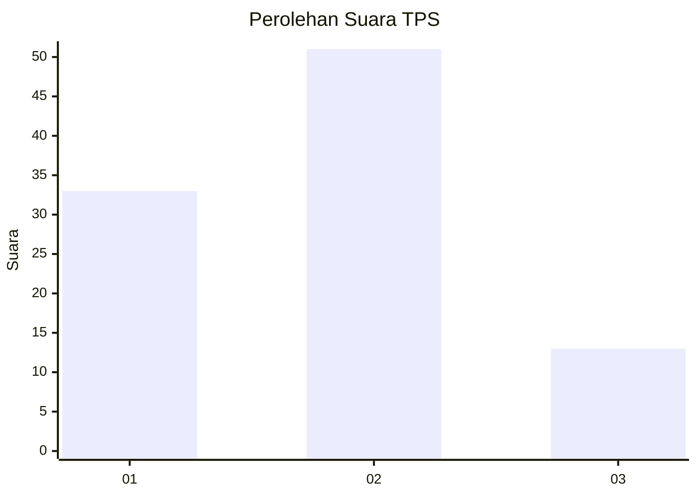
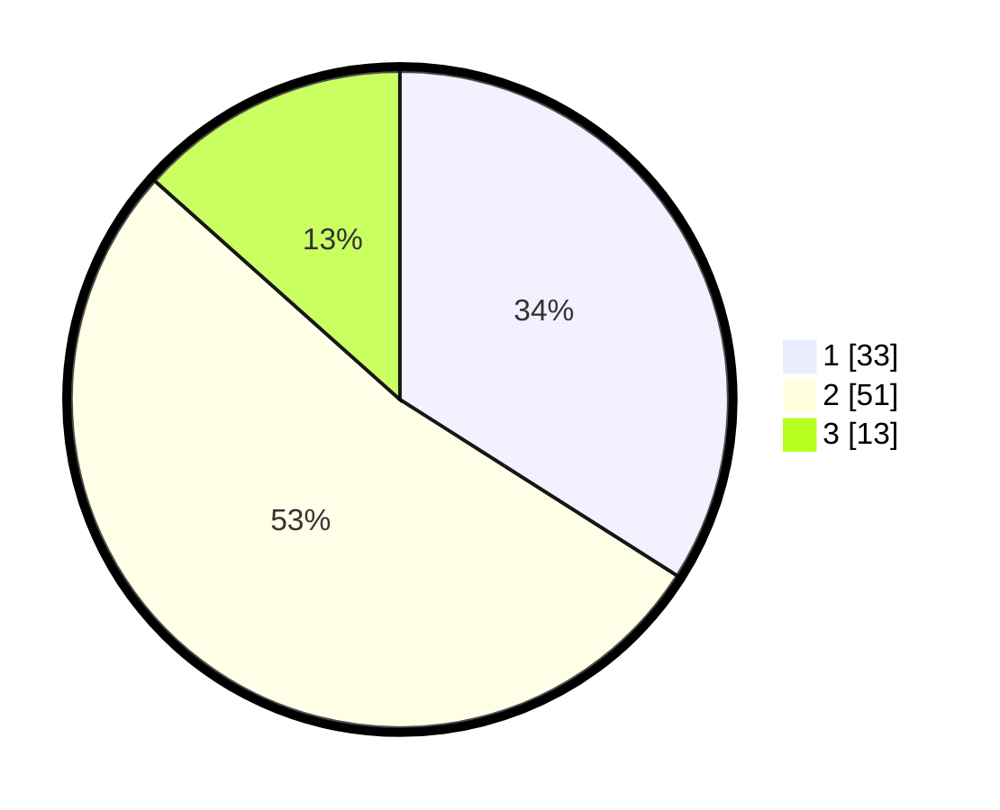

# Hasil

## Grafik

## Tabel

| No. | Nama Paslon    | Suara | Suara (raw) | Persentase |
|:--- |:-------------- | -----:| -----------:| ----------:|
| 1   | ANIES MUHAIMIN | 33    | [33][p-1]   | 34,02      |
| 2   | PRABOWO GIBRAN | 51    | [51][p-2]   | 52,58      |
| 3   | GANJAR MAHFUD  | 13    | [13][p-3]   | 13,40      |

[p-1]: https://github.com/gigit-pemilu/pemilu-2024/blob/main/pilpres/hitung-suara/sub/12-sumatera-utara/sub/07-deli-serdang/sub/09-bangun-purba/sub/2008-bangun-purba/sub/002-tps/sub/paslon-1.txt
[p-2]: https://github.com/gigit-pemilu/pemilu-2024/blob/main/pilpres/hitung-suara/sub/12-sumatera-utara/sub/07-deli-serdang/sub/09-bangun-purba/sub/2008-bangun-purba/sub/002-tps/sub/paslon-2.txt
[p-3]: https://github.com/gigit-pemilu/pemilu-2024/blob/main/pilpres/hitung-suara/sub/12-sumatera-utara/sub/07-deli-serdang/sub/09-bangun-purba/sub/2008-bangun-purba/sub/002-tps/sub/paslon-3.txt

## Foto C Plano

https://sirekap-obj-formc.kpu.go.id/1915/pemilu/ppwp/12/07/09/20/08/1207092008002-20240215-154103--891d1600-a396-44c5-812b-3b672c184228.jpg

https://sirekap-obj-formc.kpu.go.id/1915/pemilu/ppwp/12/07/09/20/08/1207092008002-20240215-154136--6e229de5-b7d0-4153-bd59-f96e7674f5a6.jpg

https://sirekap-obj-formc.kpu.go.id/1915/pemilu/ppwp/12/07/09/20/08/1207092008002-20240215-154156--cad27599-d0be-4e9e-a3d4-f70eb28f161b.jpg

## Metadata

| Key        | Value               |
| ---------- | ------------------- |
| Time Stamp | 2024-02-24 22:31:28 |

