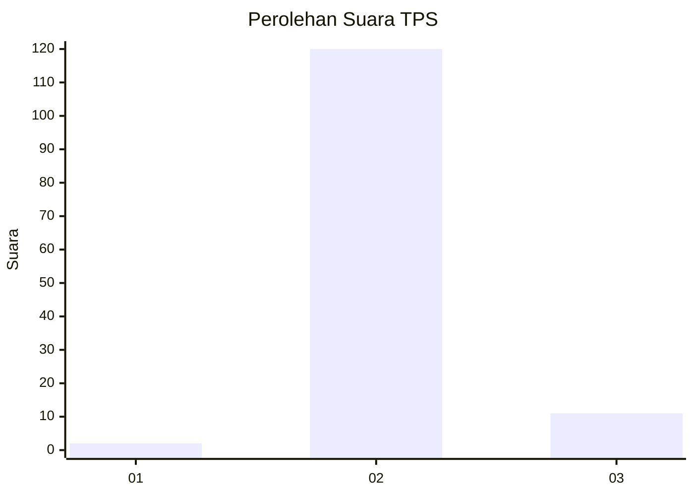
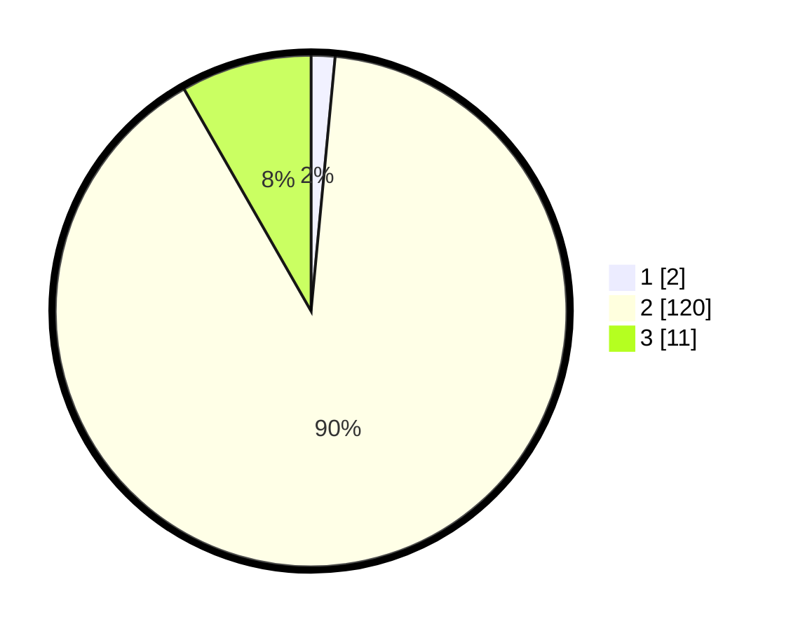

# Hasil

## Grafik

## Tabel

| No. | Nama Paslon    | Suara | Suara (raw) | Persentase |
|:--- |:-------------- | -----:| -----------:| ----------:|
| 1   | ANIES MUHAIMIN | 2     | [2][p-1]    | 1,50       |
| 2   | PRABOWO GIBRAN | 120   | [120][p-2]  | 90,23      |
| 3   | GANJAR MAHFUD  | 11    | [11][p-3]   | 8,27       |

[p-1]: https://github.com/gigit-pemilu/pemilu-2024/blob/main/pilpres/hitung-suara/sub/12-sumatera-utara/sub/07-deli-serdang/sub/09-bangun-purba/sub/2019-mabar/sub/005-tps/sub/paslon-1.txt
[p-2]: https://github.com/gigit-pemilu/pemilu-2024/blob/main/pilpres/hitung-suara/sub/12-sumatera-utara/sub/07-deli-serdang/sub/09-bangun-purba/sub/2019-mabar/sub/005-tps/sub/paslon-2.txt
[p-3]: https://github.com/gigit-pemilu/pemilu-2024/blob/main/pilpres/hitung-suara/sub/12-sumatera-utara/sub/07-deli-serdang/sub/09-bangun-purba/sub/2019-mabar/sub/005-tps/sub/paslon-3.txt

## Foto C Plano

https://sirekap-obj-formc.kpu.go.id/9dff/pemilu/ppwp/12/07/09/20/19/1207092019005-20240215-121953--5fbf5bda-afe6-4094-ad5d-7c4d17e28340.jpg

https://sirekap-obj-formc.kpu.go.id/9dff/pemilu/ppwp/12/07/09/20/19/1207092019005-20240215-122028--cfb5ea65-6f0d-4dbe-8d84-c8327b6b8fde.jpg

https://sirekap-obj-formc.kpu.go.id/9dff/pemilu/ppwp/12/07/09/20/19/1207092019005-20240215-122326--766e1dd0-f390-4d62-8f95-d7cae17f9b11.jpg

## Metadata

| Key        | Value               |
| ---------- | ------------------- |
| Time Stamp | 2024-02-25 17:00:00 |

