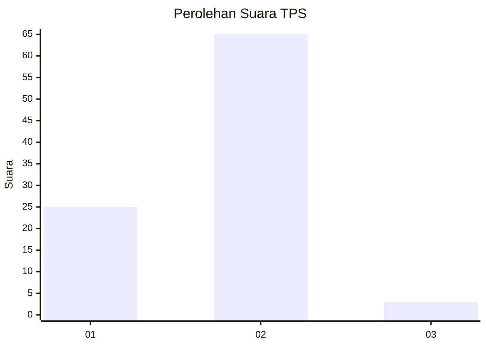
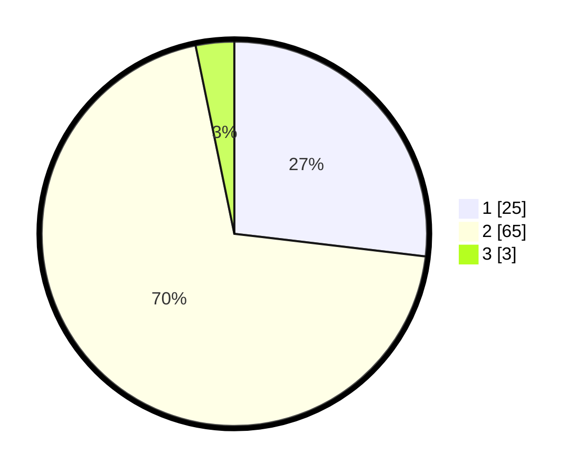

# Hasil

## Grafik

## Tabel

| No. | Nama Paslon    | Suara | Suara (raw) | Persentase |
|:--- |:-------------- | -----:| -----------:| ----------:|
| 1   | ANIES MUHAIMIN | 25    | [25][p-1]   | 26,88      |
| 2   | PRABOWO GIBRAN | 65    | [65][p-2]   | 69,89      |
| 3   | GANJAR MAHFUD  | 3     | [3][p-3]    | 3,23       |

[p-1]: https://github.com/gigit-pemilu/pemilu-2024/blob/main/pilpres/hitung-suara/sub/12-sumatera-utara/sub/07-deli-serdang/sub/09-bangun-purba/sub/2033-ujung-rambe/sub/009-tps/sub/paslon-1.txt
[p-2]: https://github.com/gigit-pemilu/pemilu-2024/blob/main/pilpres/hitung-suara/sub/12-sumatera-utara/sub/07-deli-serdang/sub/09-bangun-purba/sub/2033-ujung-rambe/sub/009-tps/sub/paslon-2.txt
[p-3]: https://github.com/gigit-pemilu/pemilu-2024/blob/main/pilpres/hitung-suara/sub/12-sumatera-utara/sub/07-deli-serdang/sub/09-bangun-purba/sub/2033-ujung-rambe/sub/009-tps/sub/paslon-3.txt

## Foto C Plano

https://sirekap-obj-formc.kpu.go.id/b6d8/pemilu/ppwp/12/07/09/20/33/1207092033009-20240214-222318--620e7003-f84e-40c5-a075-edb4011ab1da.jpg

https://sirekap-obj-formc.kpu.go.id/b6d8/pemilu/ppwp/12/07/09/20/33/1207092033009-20240214-222506--fe7135a5-4ef4-464b-b199-5c5cea1fbad3.jpg

https://sirekap-obj-formc.kpu.go.id/b6d8/pemilu/ppwp/12/07/09/20/33/1207092033009-20240214-222108--5511ed2f-e3ba-4304-a612-948e94683cf0.jpg

## Metadata

| Key        | Value               |
| ---------- | ------------------- |
| Time Stamp | 2024-02-25 16:00:00 |

