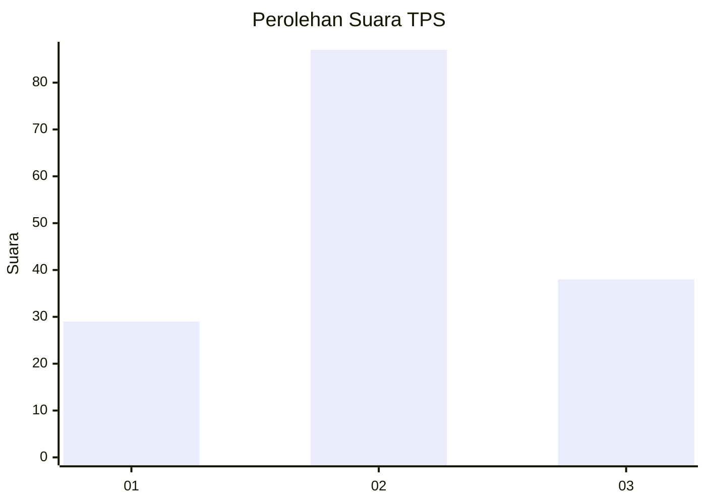
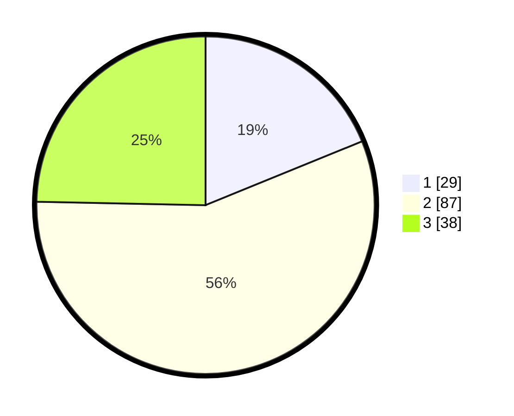

# Hasil

## Grafik

## Tabel

| No. | Nama Paslon    | Suara | Suara (raw) | Persentase |
|:--- |:-------------- | -----:| -----------:| ----------:|
| 1   | ANIES MUHAIMIN | 29    | [29][p-1]   | 18,83      |
| 2   | PRABOWO GIBRAN | 87    | [87][p-2]   | 56,49      |
| 3   | GANJAR MAHFUD  | 38    | [38][p-3]   | 24,68      |

[p-1]: https://github.com/gigit-pemilu/pemilu-2024/blob/main/pilpres/hitung-suara/sub/12-sumatera-utara/sub/07-deli-serdang/sub/19-galang/sub/1038-galang-kota/sub/003-tps/sub/paslon-1.txt
[p-2]: https://github.com/gigit-pemilu/pemilu-2024/blob/main/pilpres/hitung-suara/sub/12-sumatera-utara/sub/07-deli-serdang/sub/19-galang/sub/1038-galang-kota/sub/003-tps/sub/paslon-2.txt
[p-3]: https://github.com/gigit-pemilu/pemilu-2024/blob/main/pilpres/hitung-suara/sub/12-sumatera-utara/sub/07-deli-serdang/sub/19-galang/sub/1038-galang-kota/sub/003-tps/sub/paslon-3.txt

## Foto C Plano

https://sirekap-obj-formc.kpu.go.id/f2af/pemilu/ppwp/12/07/19/10/38/1207191038003-20240215-041651--f4b896bd-2354-45b3-abaf-664059834047.jpg

https://sirekap-obj-formc.kpu.go.id/f2af/pemilu/ppwp/12/07/19/10/38/1207191038003-20240215-041801--e6538569-9d13-4080-96fa-4daa6f229ee3.jpg

https://sirekap-obj-formc.kpu.go.id/f2af/pemilu/ppwp/12/07/19/10/38/1207191038003-20240215-041848--068581a8-a75a-42e8-b901-5fb40076df1d.jpg

## Metadata

| Key        | Value               |
| ---------- | ------------------- |
| Time Stamp | 2024-02-15 22:00:27 |

