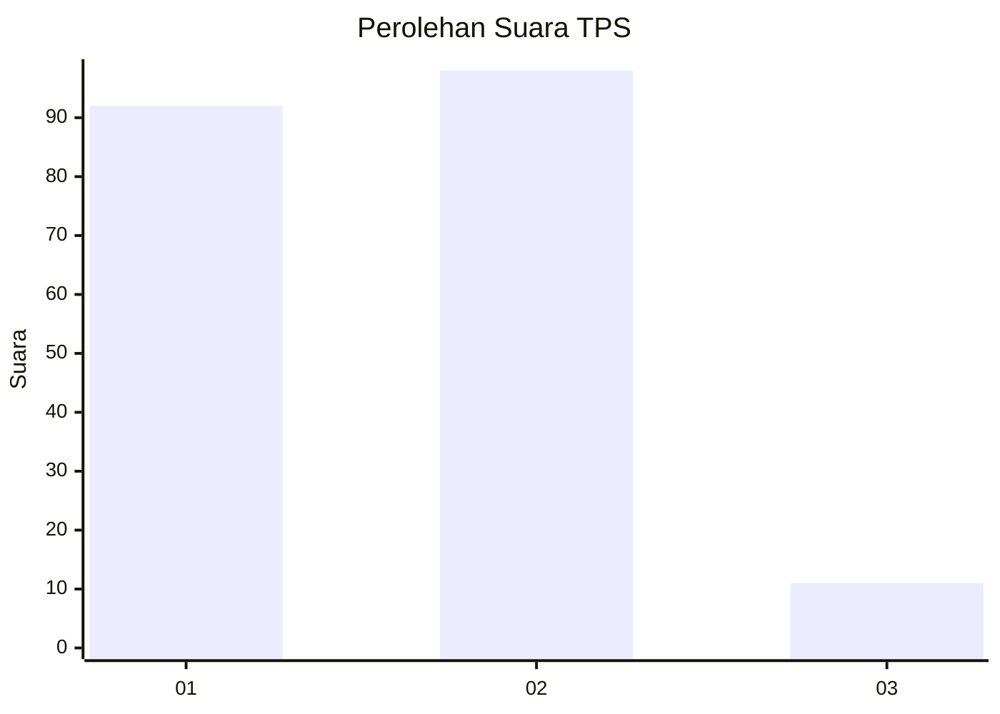
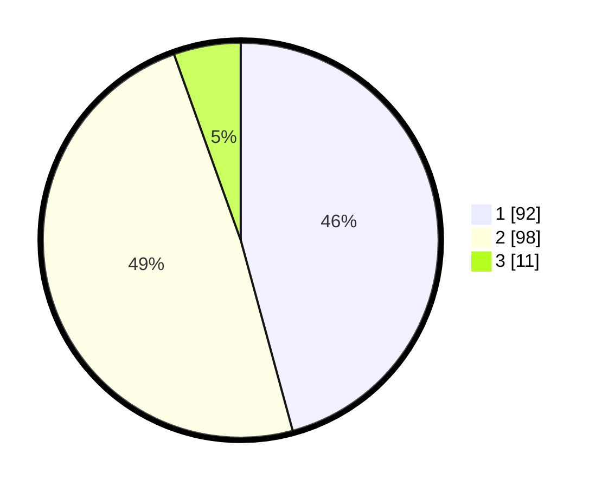

# Hasil

## Grafik

## Tabel

| No. | Nama Paslon    | Suara | Suara (raw) | Persentase |
|:--- |:-------------- | -----:| -----------:| ----------:|
| 1   | ANIES MUHAIMIN | 92    | [92][p-1]   | 45,77      |
| 2   | PRABOWO GIBRAN | 98    | [98][p-2]   | 48,76      |
| 3   | GANJAR MAHFUD  | 11    | [11][p-3]   | 5,47       |

[p-1]: https://github.com/gigit-pemilu/pemilu-2024/blob/main/pilpres/hitung-suara/sub/12-sumatera-utara/sub/07-deli-serdang/sub/19-galang/sub/1038-galang-kota/sub/004-tps/sub/paslon-1.txt
[p-2]: https://github.com/gigit-pemilu/pemilu-2024/blob/main/pilpres/hitung-suara/sub/12-sumatera-utara/sub/07-deli-serdang/sub/19-galang/sub/1038-galang-kota/sub/004-tps/sub/paslon-2.txt
[p-3]: https://github.com/gigit-pemilu/pemilu-2024/blob/main/pilpres/hitung-suara/sub/12-sumatera-utara/sub/07-deli-serdang/sub/19-galang/sub/1038-galang-kota/sub/004-tps/sub/paslon-3.txt

## Foto C Plano

https://sirekap-obj-formc.kpu.go.id/c665/pemilu/ppwp/12/07/19/10/38/1207191038004-20240214-221808--c166445c-62b6-453e-8d51-5c920400e247.jpg

https://sirekap-obj-formc.kpu.go.id/c665/pemilu/ppwp/12/07/19/10/38/1207191038004-20240214-221944--75c82b40-9194-4152-be4f-094a2b282ecd.jpg

https://sirekap-obj-formc.kpu.go.id/c665/pemilu/ppwp/12/07/19/10/38/1207191038004-20240214-222118--43f525b5-b8b5-46b0-8e07-493a8d055b52.jpg

## Metadata

| Key        | Value               |
| ---------- | ------------------- |
| Time Stamp | 2024-02-25 22:00:00 |

