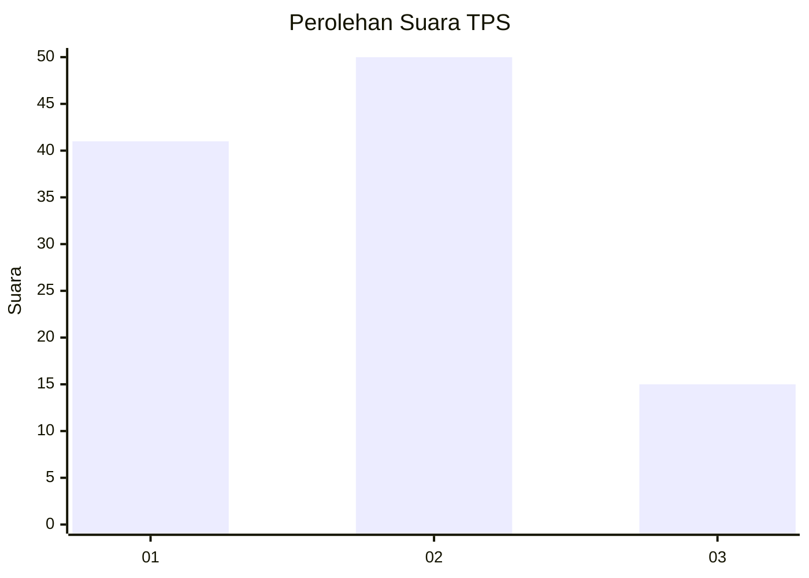
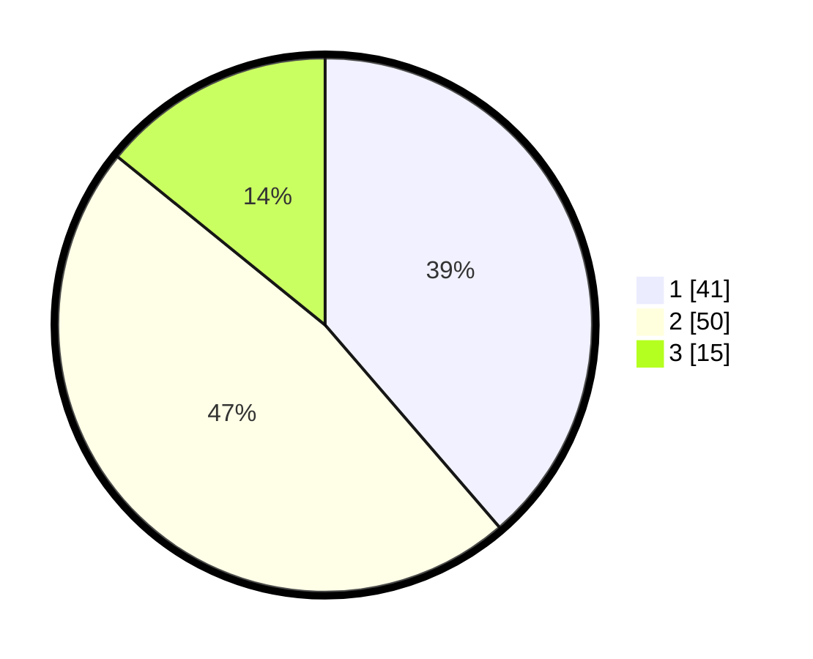

# Hasil

## Grafik

## Tabel

| No. | Nama Paslon    | Suara | Suara (raw) | Persentase |
|:--- |:-------------- | -----:| -----------:| ----------:|
| 1   | ANIES MUHAIMIN | 41    | [41][p-1]   | 38,68      |
| 2   | PRABOWO GIBRAN | 50    | [50][p-2]   | 47,17      |
| 3   | GANJAR MAHFUD  | 15    | [15][p-3]   | 14,15      |

[p-1]: https://github.com/gigit-pemilu/pemilu-2024/blob/main/pilpres/hitung-suara/sub/12-sumatera-utara/sub/07-deli-serdang/sub/19-galang/sub/1038-galang-kota/sub/014-tps/sub/paslon-1.txt
[p-2]: https://github.com/gigit-pemilu/pemilu-2024/blob/main/pilpres/hitung-suara/sub/12-sumatera-utara/sub/07-deli-serdang/sub/19-galang/sub/1038-galang-kota/sub/014-tps/sub/paslon-2.txt
[p-3]: https://github.com/gigit-pemilu/pemilu-2024/blob/main/pilpres/hitung-suara/sub/12-sumatera-utara/sub/07-deli-serdang/sub/19-galang/sub/1038-galang-kota/sub/014-tps/sub/paslon-3.txt

## Foto C Plano

https://sirekap-obj-formc.kpu.go.id/6547/pemilu/ppwp/12/07/19/10/38/1207191038014-20240215-003034--eb7c1d7d-abb0-4e32-ad8e-c71c44d16c27.jpg

https://sirekap-obj-formc.kpu.go.id/6547/pemilu/ppwp/12/07/19/10/38/1207191038014-20240215-003214--18bc4638-00d3-487b-a271-91090ec41d1d.jpg

https://sirekap-obj-formc.kpu.go.id/6547/pemilu/ppwp/12/07/19/10/38/1207191038014-20240215-003349--797def14-7b49-4329-8fc6-12b47b5fe0bf.jpg

## Metadata

| Key        | Value               |
| ---------- | ------------------- |
| Time Stamp | 2024-02-25 20:00:00 |

