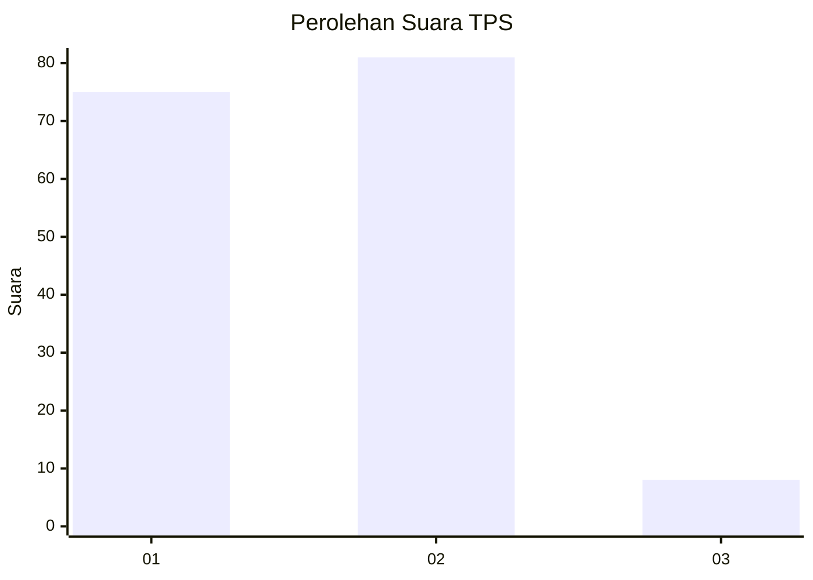
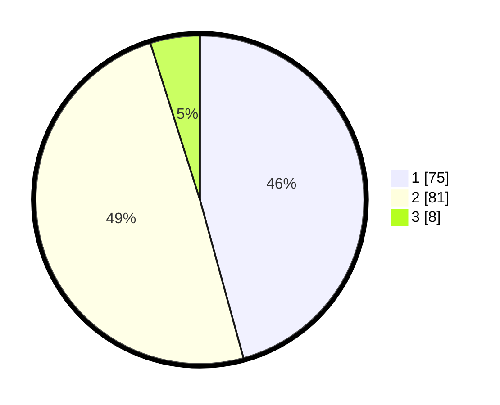

# Hasil

## Grafik

## Tabel

| No. | Nama Paslon    | Suara | Suara (raw) | Persentase |
|:--- |:-------------- | -----:| -----------:| ----------:|
| 1   | ANIES MUHAIMIN | 75    | [75][p-1]   | 45,73      |
| 2   | PRABOWO GIBRAN | 81    | [81][p-2]   | 49,39      |
| 3   | GANJAR MAHFUD  | 8     | [8][p-3]    | 4,88       |

[p-1]: https://github.com/gigit-pemilu/pemilu-2024/blob/main/pilpres/hitung-suara/sub/12-sumatera-utara/sub/07-deli-serdang/sub/19-galang/sub/2005-galang-suka/sub/005-tps/sub/paslon-1.txt
[p-2]: https://github.com/gigit-pemilu/pemilu-2024/blob/main/pilpres/hitung-suara/sub/12-sumatera-utara/sub/07-deli-serdang/sub/19-galang/sub/2005-galang-suka/sub/005-tps/sub/paslon-2.txt
[p-3]: https://github.com/gigit-pemilu/pemilu-2024/blob/main/pilpres/hitung-suara/sub/12-sumatera-utara/sub/07-deli-serdang/sub/19-galang/sub/2005-galang-suka/sub/005-tps/sub/paslon-3.txt

## Foto C Plano

https://sirekap-obj-formc.kpu.go.id/ca30/pemilu/ppwp/12/07/19/20/05/1207192005005-20240215-012550--b34908b1-1d22-40d3-a4fd-7622fd3c6eae.jpg

https://sirekap-obj-formc.kpu.go.id/ca30/pemilu/ppwp/12/07/19/20/05/1207192005005-20240215-013910--738c7d6c-c695-4604-a764-4611bce3cb1a.jpg

https://sirekap-obj-formc.kpu.go.id/ca30/pemilu/ppwp/12/07/19/20/05/1207192005005-20240215-022551--7c5bdff1-b5e9-4935-8582-0e056caa67f1.jpg

## Metadata

| Key        | Value               |
| ---------- | ------------------- |
| Time Stamp | 2024-02-15 22:30:27 |

