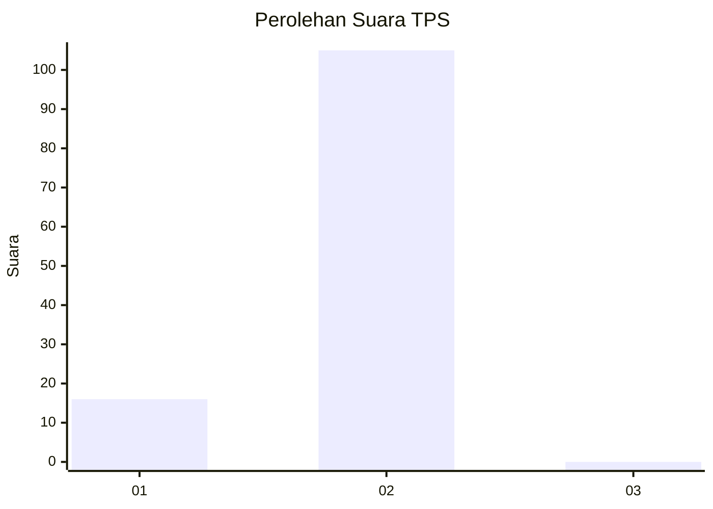
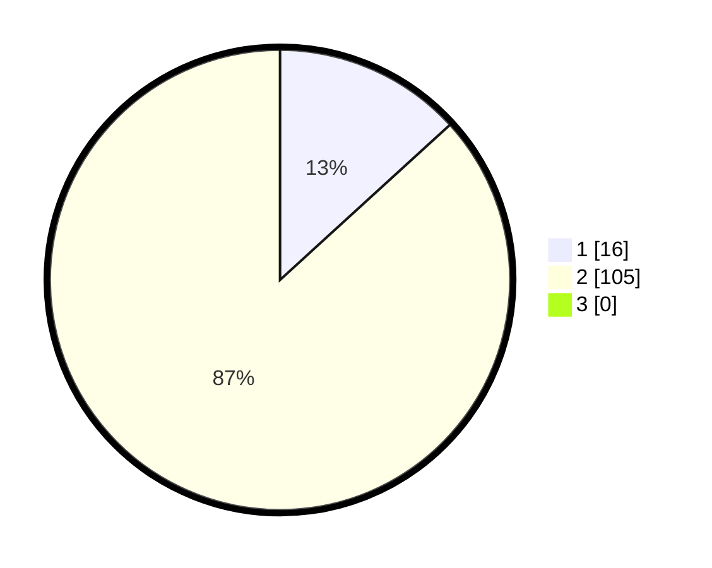

# Hasil

## Grafik

## Tabel

| No. | Nama Paslon    | Suara | Suara (raw) | Persentase |
|:--- |:-------------- | -----:| -----------:| ----------:|
| 1   | ANIES MUHAIMIN | 16    | [16][p-1]   | 13,22      |
| 2   | PRABOWO GIBRAN | 105   | [105][p-2]  | 86,78      |
| 3   | GANJAR MAHFUD  | 0     | [0][p-3]    | 0,00       |

[p-1]: https://github.com/gigit-pemilu/pemilu-2024/blob/main/pilpres/hitung-suara/sub/12-sumatera-utara/sub/07-deli-serdang/sub/19-galang/sub/2006-galang-barat/sub/003-tps/sub/paslon-1.txt
[p-2]: https://github.com/gigit-pemilu/pemilu-2024/blob/main/pilpres/hitung-suara/sub/12-sumatera-utara/sub/07-deli-serdang/sub/19-galang/sub/2006-galang-barat/sub/003-tps/sub/paslon-2.txt
[p-3]: https://github.com/gigit-pemilu/pemilu-2024/blob/main/pilpres/hitung-suara/sub/12-sumatera-utara/sub/07-deli-serdang/sub/19-galang/sub/2006-galang-barat/sub/003-tps/sub/paslon-3.txt

## Foto C Plano

https://sirekap-obj-formc.kpu.go.id/6e04/pemilu/ppwp/12/07/19/20/06/1207192006003-20240215-095601--39057ed6-0bfd-4fb3-8f85-cf41cf57ae8a.jpg

https://sirekap-obj-formc.kpu.go.id/6e04/pemilu/ppwp/12/07/19/20/06/1207192006003-20240215-095618--54357130-3b6b-47ec-bbb8-6511e484d4cf.jpg

https://sirekap-obj-formc.kpu.go.id/6e04/pemilu/ppwp/12/07/19/20/06/1207192006003-20240215-095641--8ee8da10-1c0b-4ccf-aaf0-c01467758719.jpg

## Metadata

| Key        | Value               |
| ---------- | ------------------- |
| Time Stamp | 2024-02-24 22:31:28 |

