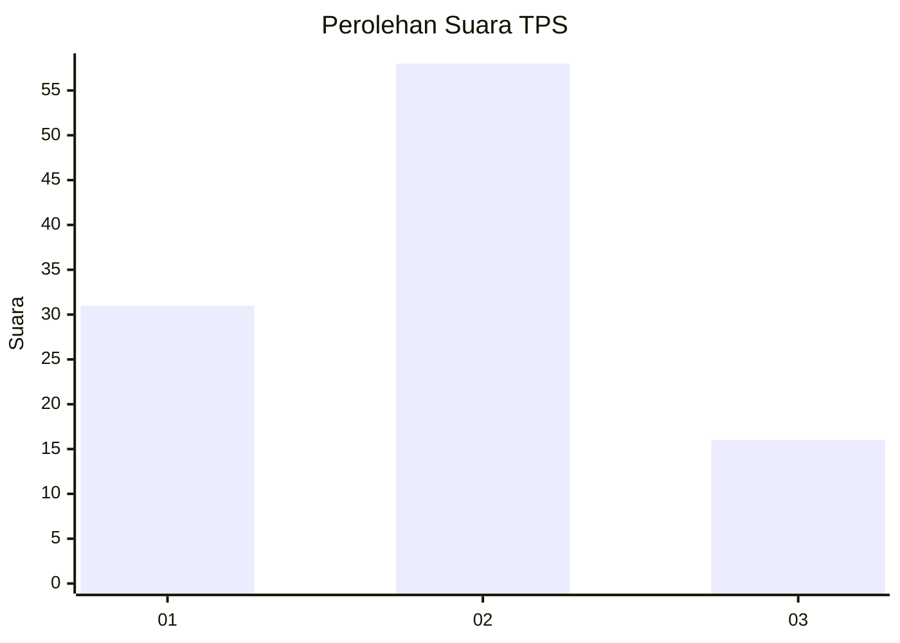
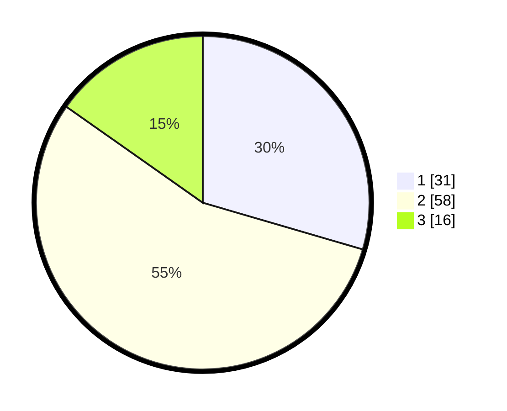

# Hasil

## Grafik

## Tabel

| No. | Nama Paslon    | Suara | Suara (raw) | Persentase |
|:--- |:-------------- | -----:| -----------:| ----------:|
| 1   | ANIES MUHAIMIN | 31    | [31][p-1]   | 29,52      |
| 2   | PRABOWO GIBRAN | 58    | [58][p-2]   | 55,24      |
| 3   | GANJAR MAHFUD  | 16    | [16][p-3]   | 15,24      |

[p-1]: https://github.com/gigit-pemilu/pemilu-2024/blob/main/pilpres/hitung-suara/sub/12-sumatera-utara/sub/07-deli-serdang/sub/19-galang/sub/2007-jaharun-a/sub/014-tps/sub/paslon-1.txt
[p-2]: https://github.com/gigit-pemilu/pemilu-2024/blob/main/pilpres/hitung-suara/sub/12-sumatera-utara/sub/07-deli-serdang/sub/19-galang/sub/2007-jaharun-a/sub/014-tps/sub/paslon-2.txt
[p-3]: https://github.com/gigit-pemilu/pemilu-2024/blob/main/pilpres/hitung-suara/sub/12-sumatera-utara/sub/07-deli-serdang/sub/19-galang/sub/2007-jaharun-a/sub/014-tps/sub/paslon-3.txt

## Foto C Plano

https://sirekap-obj-formc.kpu.go.id/b77c/pemilu/ppwp/12/07/19/20/07/1207192007014-20240215-014840--f3470132-441e-4c0b-ae8b-ec3c93d906a1.jpg

https://sirekap-obj-formc.kpu.go.id/b77c/pemilu/ppwp/12/07/19/20/07/1207192007014-20240215-014927--2f3ca09f-639e-4566-83f0-2f05f7eb24a9.jpg

https://sirekap-obj-formc.kpu.go.id/b77c/pemilu/ppwp/12/07/19/20/07/1207192007014-20240215-015024--60724684-c33b-4c37-bd99-cfb950e736a6.jpg

## Metadata

| Key        | Value               |
| ---------- | ------------------- |
| Time Stamp | 2024-02-24 22:31:28 |

