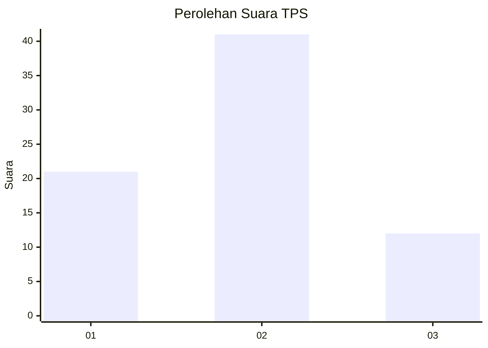
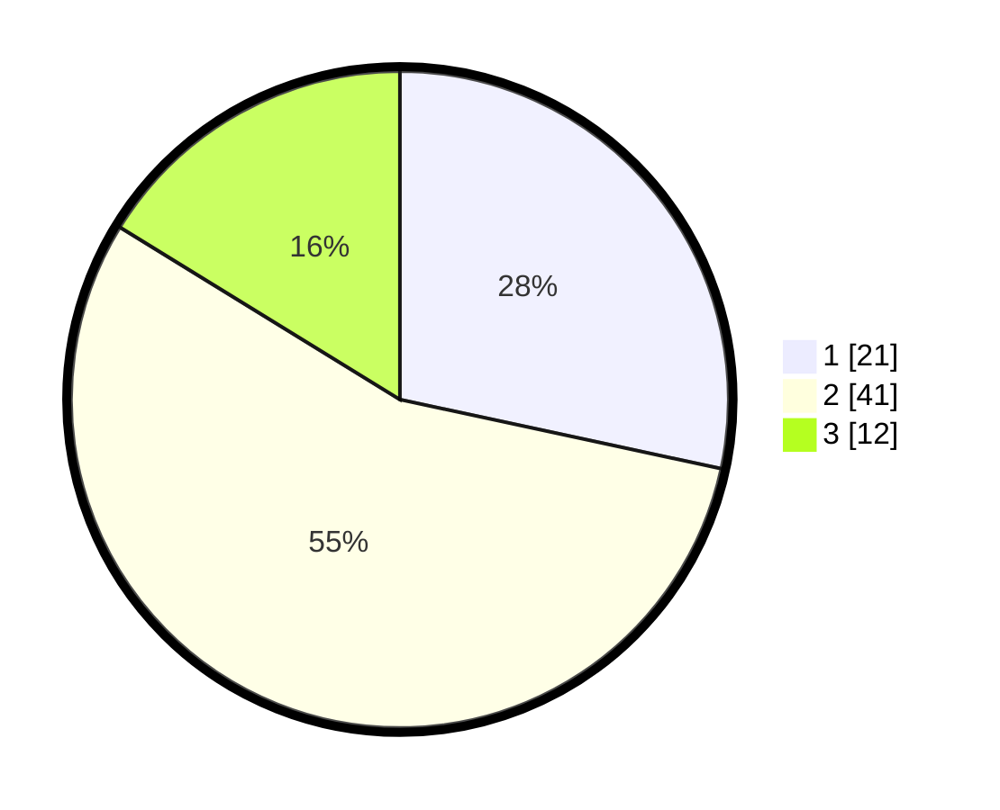

# Hasil

## Grafik

## Tabel

| No. | Nama Paslon    | Suara | Suara (raw) | Persentase |
|:--- |:-------------- | -----:| -----------:| ----------:|
| 1   | ANIES MUHAIMIN | 21    | [21][p-1]   | 28,38      |
| 2   | PRABOWO GIBRAN | 41    | [41][p-2]   | 55,41      |
| 3   | GANJAR MAHFUD  | 12    | [12][p-3]   | 16,22      |

[p-1]: https://github.com/gigit-pemilu/pemilu-2024/blob/main/pilpres/hitung-suara/sub/12-sumatera-utara/sub/07-deli-serdang/sub/19-galang/sub/2007-jaharun-a/sub/017-tps/sub/paslon-1.txt
[p-2]: https://github.com/gigit-pemilu/pemilu-2024/blob/main/pilpres/hitung-suara/sub/12-sumatera-utara/sub/07-deli-serdang/sub/19-galang/sub/2007-jaharun-a/sub/017-tps/sub/paslon-2.txt
[p-3]: https://github.com/gigit-pemilu/pemilu-2024/blob/main/pilpres/hitung-suara/sub/12-sumatera-utara/sub/07-deli-serdang/sub/19-galang/sub/2007-jaharun-a/sub/017-tps/sub/paslon-3.txt

## Foto C Plano

https://sirekap-obj-formc.kpu.go.id/7608/pemilu/ppwp/12/07/19/20/07/1207192007017-20240214-155814--9eef114b-4326-4cc3-8cda-dc0becd8e610.jpg

https://sirekap-obj-formc.kpu.go.id/7608/pemilu/ppwp/12/07/19/20/07/1207192007017-20240214-192505--05ca88e8-5910-4543-8626-78660ec7e0fa.jpg

https://sirekap-obj-formc.kpu.go.id/7608/pemilu/ppwp/12/07/19/20/07/1207192007017-20240214-192521--6a172cc2-7103-40af-a0ed-6f413e763317.jpg

## Metadata

| Key        | Value               |
| ---------- | ------------------- |
| Time Stamp | 2024-02-15 22:30:27 |

