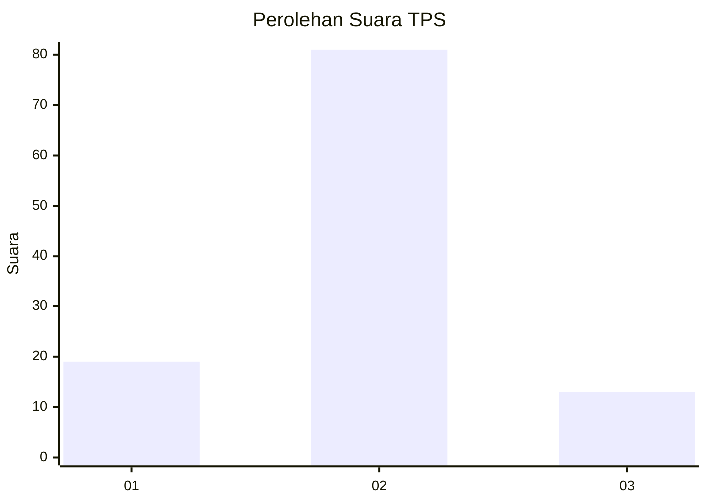
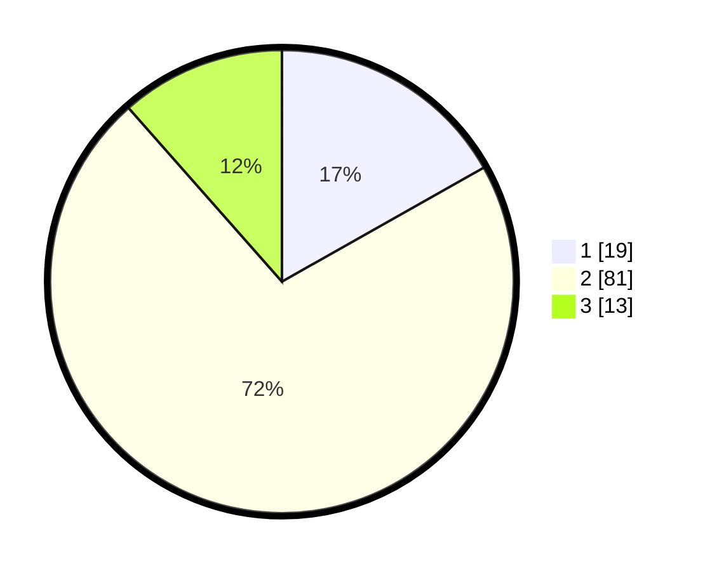

# Hasil

## Grafik

## Tabel

| No. | Nama Paslon    | Suara | Suara (raw) | Persentase |
|:--- |:-------------- | -----:| -----------:| ----------:|
| 1   | ANIES MUHAIMIN | 19    | [19][p-1]   | 16,81      |
| 2   | PRABOWO GIBRAN | 81    | [81][p-2]   | 71,68      |
| 3   | GANJAR MAHFUD  | 13    | [13][p-3]   | 11,50      |

[p-1]: https://github.com/gigit-pemilu/pemilu-2024-12-sumatera-utara/blob/main/pilpres/hitung-suara/sub/12-sumatera-utara/sub/07-deli-serdang/sub/19-galang/sub/2008-jaharun-b/sub/015-tps/sub/paslon-1.txt
[p-2]: https://github.com/gigit-pemilu/pemilu-2024-12-sumatera-utara/blob/main/pilpres/hitung-suara/sub/12-sumatera-utara/sub/07-deli-serdang/sub/19-galang/sub/2008-jaharun-b/sub/015-tps/sub/paslon-2.txt
[p-3]: https://github.com/gigit-pemilu/pemilu-2024-12-sumatera-utara/blob/main/pilpres/hitung-suara/sub/12-sumatera-utara/sub/07-deli-serdang/sub/19-galang/sub/2008-jaharun-b/sub/015-tps/sub/paslon-3.txt

## Foto C Plano

https://sirekap-obj-formc.kpu.go.id/341d/pemilu/ppwp/12/07/19/20/08/1207192008015-20240215-012110--ebcdf0bd-9b6d-45f4-97c6-9003a81d25d5.jpg

https://sirekap-obj-formc.kpu.go.id/341d/pemilu/ppwp/12/07/19/20/08/1207192008015-20240215-012255--85ca8140-4dc4-4e4c-93df-b4b08a048b30.jpg

https://sirekap-obj-formc.kpu.go.id/341d/pemilu/ppwp/12/07/19/20/08/1207192008015-20240215-012536--39c130e7-f722-46b8-b6ba-92075bebd22c.jpg

## Metadata

| Key        | Value               |
| ---------- | ------------------- |
| Time Stamp | 2024-02-25 01:00:00 |

