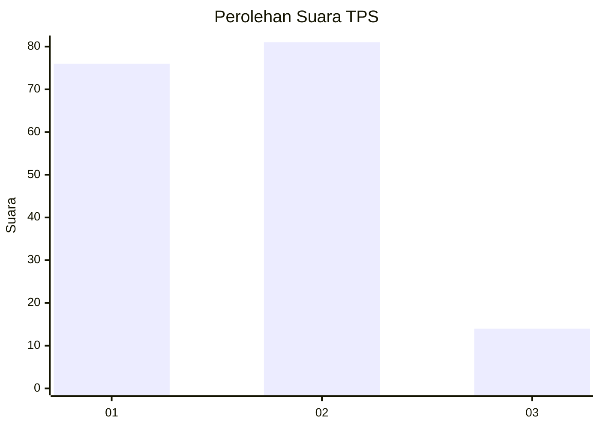
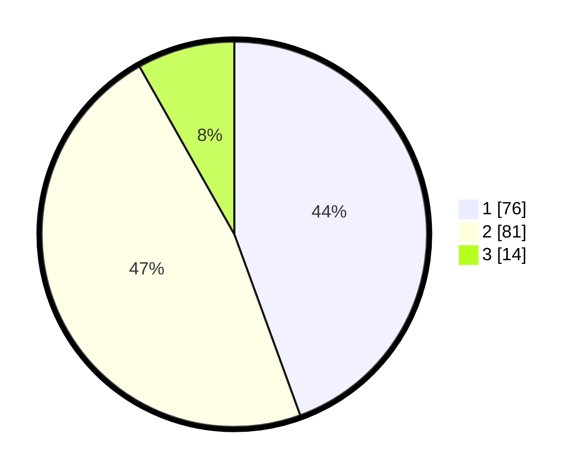

# Hasil

## Grafik

## Tabel

| No. | Nama Paslon    | Suara | Suara (raw) | Persentase |
|:--- |:-------------- | -----:| -----------:| ----------:|
| 1   | ANIES MUHAIMIN | 76    | [76][p-1]   | 44,44      |
| 2   | PRABOWO GIBRAN | 81    | [81][p-2]   | 47,37      |
| 3   | GANJAR MAHFUD  | 14    | [14][p-3]   | 8,19       |

[p-1]: https://github.com/gigit-pemilu/pemilu-2024/blob/main/pilpres/hitung-suara/sub/12-sumatera-utara/sub/07-deli-serdang/sub/19-galang/sub/2025-pisang-pala/sub/006-tps/sub/paslon-1.txt
[p-2]: https://github.com/gigit-pemilu/pemilu-2024/blob/main/pilpres/hitung-suara/sub/12-sumatera-utara/sub/07-deli-serdang/sub/19-galang/sub/2025-pisang-pala/sub/006-tps/sub/paslon-2.txt
[p-3]: https://github.com/gigit-pemilu/pemilu-2024/blob/main/pilpres/hitung-suara/sub/12-sumatera-utara/sub/07-deli-serdang/sub/19-galang/sub/2025-pisang-pala/sub/006-tps/sub/paslon-3.txt

## Foto C Plano

https://sirekap-obj-formc.kpu.go.id/d00b/pemilu/ppwp/12/07/19/20/25/1207192025006-20240214-212556--5f5619a5-00e8-4df9-a6d0-b2f2ebdbde24.jpg

https://sirekap-obj-formc.kpu.go.id/d00b/pemilu/ppwp/12/07/19/20/25/1207192025006-20240214-212802--e908817a-a1a4-45db-9525-d3f104c1d4ea.jpg

https://sirekap-obj-formc.kpu.go.id/d00b/pemilu/ppwp/12/07/19/20/25/1207192025006-20240214-213233--d8d0a6c2-de7a-41b2-97e7-61633c3804dc.jpg

## Metadata

| Key        | Value               |
| ---------- | ------------------- |
| Time Stamp | 2024-02-25 12:00:00 |

