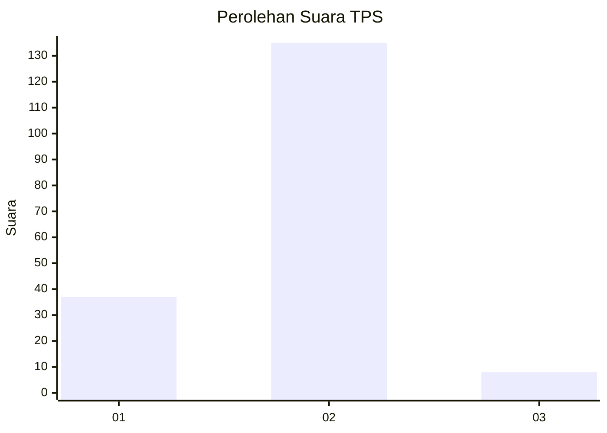
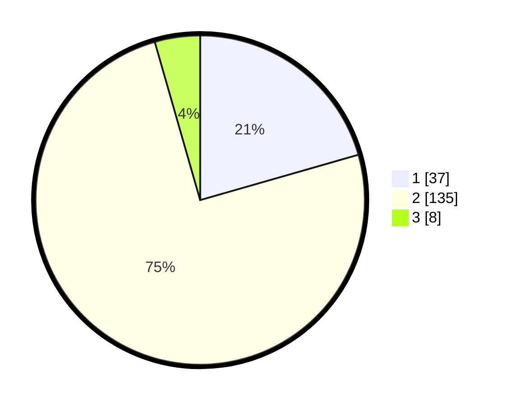

# Hasil

## Grafik

## Tabel

| No. | Nama Paslon    | Suara | Suara (raw) | Persentase |
|:--- |:-------------- | -----:| -----------:| ----------:|
| 1   | ANIES MUHAIMIN | 37    | [37][p-1]   | 20,56      |
| 2   | PRABOWO GIBRAN | 135   | [135][p-2]  | 75,00      |
| 3   | GANJAR MAHFUD  | 8     | [8][p-3]    | 4,44       |

[p-1]: https://github.com/gigit-pemilu/pemilu-2024/blob/main/pilpres/hitung-suara/sub/12-sumatera-utara/sub/07-deli-serdang/sub/19-galang/sub/2027-pulo-tagor-baru/sub/003-tps/sub/paslon-1.txt
[p-2]: https://github.com/gigit-pemilu/pemilu-2024/blob/main/pilpres/hitung-suara/sub/12-sumatera-utara/sub/07-deli-serdang/sub/19-galang/sub/2027-pulo-tagor-baru/sub/003-tps/sub/paslon-2.txt
[p-3]: https://github.com/gigit-pemilu/pemilu-2024/blob/main/pilpres/hitung-suara/sub/12-sumatera-utara/sub/07-deli-serdang/sub/19-galang/sub/2027-pulo-tagor-baru/sub/003-tps/sub/paslon-3.txt

## Foto C Plano

https://sirekap-obj-formc.kpu.go.id/1ccb/pemilu/ppwp/12/07/19/20/27/1207192027003-20240215-031738--3500ac39-d26c-44ce-8592-da35fdb7e261.jpg

https://sirekap-obj-formc.kpu.go.id/1ccb/pemilu/ppwp/12/07/19/20/27/1207192027003-20240215-124356--689072a8-92eb-4534-a86a-e10d09c6f508.jpg

https://sirekap-obj-formc.kpu.go.id/1ccb/pemilu/ppwp/12/07/19/20/27/1207192027003-20240215-031943--1cb3bd9e-74c2-4d1e-83a3-5f19c27cf750.jpg

## Metadata

| Key        | Value               |
| ---------- | ------------------- |
| Time Stamp | 2024-02-25 16:00:00 |

