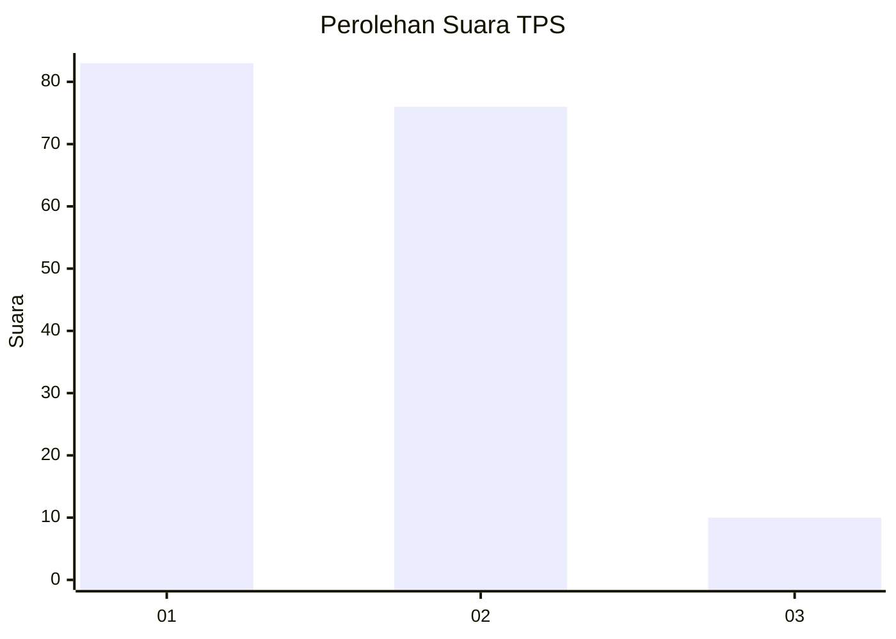
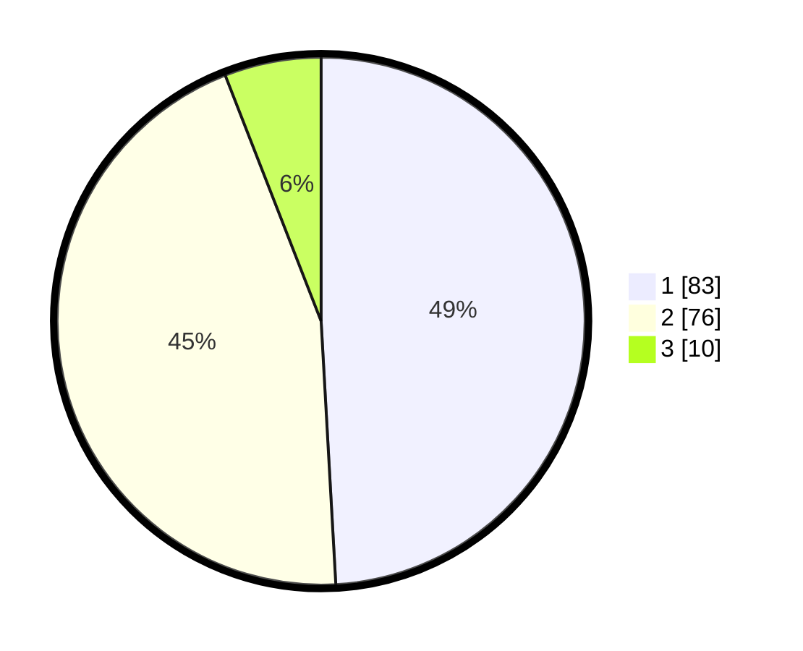

# Hasil

## Grafik

## Tabel

| No. | Nama Paslon    | Suara | Suara (raw) | Persentase |
|:--- |:-------------- | -----:| -----------:| ----------:|
| 1   | ANIES MUHAIMIN | 83    | [83][p-1]   | 49,11      |
| 2   | PRABOWO GIBRAN | 76    | [76][p-2]   | 44,97      |
| 3   | GANJAR MAHFUD  | 10    | [10][p-3]   | 5,92       |

[p-1]: https://github.com/gigit-pemilu/pemilu-2024/blob/main/pilpres/hitung-suara/sub/12-sumatera-utara/sub/07-deli-serdang/sub/19-galang/sub/2037-tanjung-siporkis/sub/002-tps/sub/paslon-1.txt
[p-2]: https://github.com/gigit-pemilu/pemilu-2024/blob/main/pilpres/hitung-suara/sub/12-sumatera-utara/sub/07-deli-serdang/sub/19-galang/sub/2037-tanjung-siporkis/sub/002-tps/sub/paslon-2.txt
[p-3]: https://github.com/gigit-pemilu/pemilu-2024/blob/main/pilpres/hitung-suara/sub/12-sumatera-utara/sub/07-deli-serdang/sub/19-galang/sub/2037-tanjung-siporkis/sub/002-tps/sub/paslon-3.txt

## Foto C Plano

https://sirekap-obj-formc.kpu.go.id/92e0/pemilu/ppwp/12/07/19/20/37/1207192037002-20240215-092430--e8ccbec1-dd9e-4f0b-9406-382c8d07003b.jpg

https://sirekap-obj-formc.kpu.go.id/92e0/pemilu/ppwp/12/07/19/20/37/1207192037002-20240214-160101--3b572c9b-3c30-4bd5-b9a9-4144cbfff235.jpg

https://sirekap-obj-formc.kpu.go.id/92e0/pemilu/ppwp/12/07/19/20/37/1207192037002-20240215-025006--302a11c8-ec66-4e7d-8bcb-ca41dd457c37.jpg

## Metadata

| Key        | Value               |
| ---------- | ------------------- |
| Time Stamp | 2024-02-15 15:00:29 |

