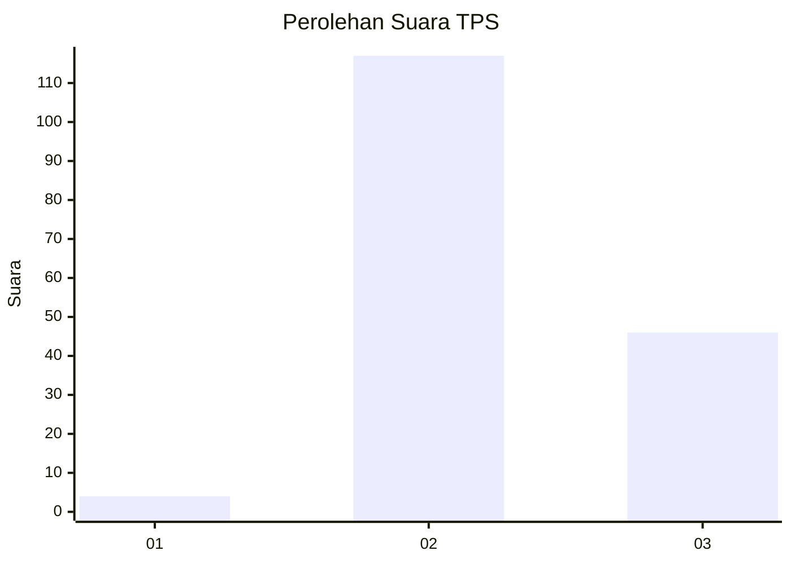
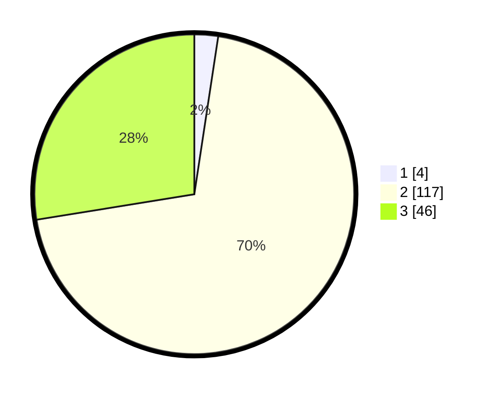

# Hasil

## Grafik

## Tabel

| No. | Nama Paslon    | Suara | Suara (raw) | Persentase |
|:--- |:-------------- | -----:| -----------:| ----------:|
| 1   | ANIES MUHAIMIN | 4     | [4][p-1]    | 2,40       |
| 2   | PRABOWO GIBRAN | 117   | [117][p-2]  | 70,06      |
| 3   | GANJAR MAHFUD  | 46    | [46][p-3]   | 27,54      |

[p-1]: https://github.com/gigit-pemilu/pemilu-2024-12-sumatera-utara/blob/main/pilpres/hitung-suara/sub/12-sumatera-utara/sub/07-deli-serdang/sub/20-stm-hulu/sub/2003-rumah-rih/sub/003-tps/sub/paslon-1.txt
[p-2]: https://github.com/gigit-pemilu/pemilu-2024-12-sumatera-utara/blob/main/pilpres/hitung-suara/sub/12-sumatera-utara/sub/07-deli-serdang/sub/20-stm-hulu/sub/2003-rumah-rih/sub/003-tps/sub/paslon-2.txt
[p-3]: https://github.com/gigit-pemilu/pemilu-2024-12-sumatera-utara/blob/main/pilpres/hitung-suara/sub/12-sumatera-utara/sub/07-deli-serdang/sub/20-stm-hulu/sub/2003-rumah-rih/sub/003-tps/sub/paslon-3.txt

## Foto C Plano

https://sirekap-obj-formc.kpu.go.id/050d/pemilu/ppwp/12/07/20/20/03/1207202003003-20240214-155501--0b1e69da-7547-418b-ad67-0106a5f3fe17.jpg

https://sirekap-obj-formc.kpu.go.id/050d/pemilu/ppwp/12/07/20/20/03/1207202003003-20240214-155527--ad3c2366-fd30-4d74-8e5b-6641843ae3f9.jpg

https://sirekap-obj-formc.kpu.go.id/050d/pemilu/ppwp/12/07/20/20/03/1207202003003-20240214-155628--ec4e534b-e414-4b5a-b2cd-1d460fdaddbe.jpg

## Metadata

| Key        | Value               |
| ---------- | ------------------- |
| Time Stamp | 2024-02-16 21:01:00 |

