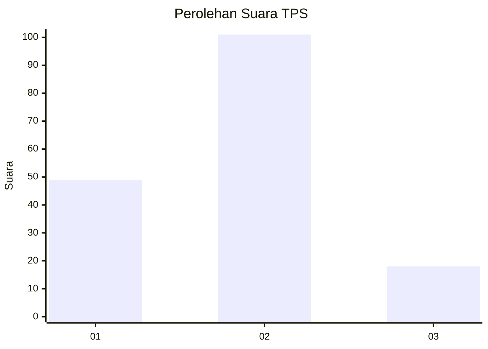
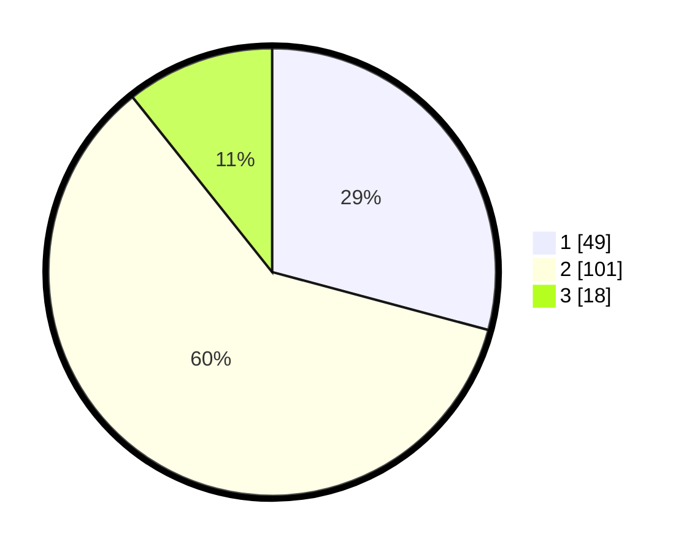

# Hasil

## Grafik

## Tabel

| No. | Nama Paslon    | Suara | Suara (raw) | Persentase |
|:--- |:-------------- | -----:| -----------:| ----------:|
| 1   | ANIES MUHAIMIN | 49    | [49][p-1]   | 29,17      |
| 2   | PRABOWO GIBRAN | 101   | [101][p-2]  | 60,12      |
| 3   | GANJAR MAHFUD  | 18    | [18][p-3]   | 10,71      |

[p-1]: https://github.com/gigit-pemilu/pemilu-2024-12-sumatera-utara/blob/main/pilpres/hitung-suara/sub/12-sumatera-utara/sub/07-deli-serdang/sub/20-stm-hulu/sub/2012-rumah-sumbul/sub/005-tps/sub/paslon-1.txt
[p-2]: https://github.com/gigit-pemilu/pemilu-2024-12-sumatera-utara/blob/main/pilpres/hitung-suara/sub/12-sumatera-utara/sub/07-deli-serdang/sub/20-stm-hulu/sub/2012-rumah-sumbul/sub/005-tps/sub/paslon-2.txt
[p-3]: https://github.com/gigit-pemilu/pemilu-2024-12-sumatera-utara/blob/main/pilpres/hitung-suara/sub/12-sumatera-utara/sub/07-deli-serdang/sub/20-stm-hulu/sub/2012-rumah-sumbul/sub/005-tps/sub/paslon-3.txt

## Foto C Plano

https://sirekap-obj-formc.kpu.go.id/a3ea/pemilu/ppwp/12/07/20/20/12/1207202012005-20240214-155128--0c6e7432-5a2a-48c2-9aa5-91eec0e55fcf.jpg

https://sirekap-obj-formc.kpu.go.id/a3ea/pemilu/ppwp/12/07/20/20/12/1207202012005-20240214-155641--3c54b6c7-10c6-4c08-8938-7b248866c83b.jpg

https://sirekap-obj-formc.kpu.go.id/a3ea/pemilu/ppwp/12/07/20/20/12/1207202012005-20240214-155843--0c24f25a-f24d-47a8-b9b6-da467ae20070.jpg

## Metadata

| Key        | Value               |
| ---------- | ------------------- |
| Time Stamp | 2024-02-16 21:01:00 |

