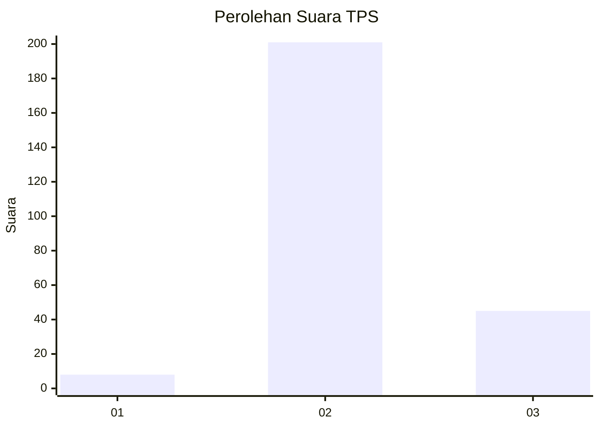

# Hasil

## Grafik

## Tabel

| No. | Nama Paslon    | Suara | Suara (raw) | Persentase |
|:--- |:-------------- | -----:| -----------:| ----------:|
| 1   | ANIES MUHAIMIN | 8     | [8][p-1]    | 3,15       |
| 2   | PRABOWO GIBRAN | 201   | [201][p-2]  | 79,13      |
| 3   | GANJAR MAHFUD  | 45    | [45][p-3]   | 17,72      |

[p-1]: https://github.com/gigit-pemilu/pemilu-2024/blob/main/pilpres/hitung-suara/sub/12-sumatera-utara/sub/07-deli-serdang/sub/20-stm-hulu/sub/2016-rumah-lengo/sub/001-tps/sub/paslon-1.txt
[p-2]: https://github.com/gigit-pemilu/pemilu-2024/blob/main/pilpres/hitung-suara/sub/12-sumatera-utara/sub/07-deli-serdang/sub/20-stm-hulu/sub/2016-rumah-lengo/sub/001-tps/sub/paslon-2.txt
[p-3]: https://github.com/gigit-pemilu/pemilu-2024/blob/main/pilpres/hitung-suara/sub/12-sumatera-utara/sub/07-deli-serdang/sub/20-stm-hulu/sub/2016-rumah-lengo/sub/001-tps/sub/paslon-3.txt

## Foto C Plano

https://sirekap-obj-formc.kpu.go.id/b3f4/pemilu/ppwp/12/07/20/20/16/1207202016001-20240215-135910--f584990e-12e2-4ab2-9d72-7e130c5954af.jpg

https://sirekap-obj-formc.kpu.go.id/b3f4/pemilu/ppwp/12/07/20/20/16/1207202016001-20240215-140128--3a767ee8-1b1b-49d1-8e95-ece7bf143898.jpg

https://sirekap-obj-formc.kpu.go.id/b3f4/pemilu/ppwp/12/07/20/20/16/1207202016001-20240215-140353--5fca56cd-c7dd-479f-bc9e-4127e38e6313.jpg

## Metadata

| Key        | Value               |
| ---------- | ------------------- |
| Time Stamp | 2024-02-25 14:00:00 |

