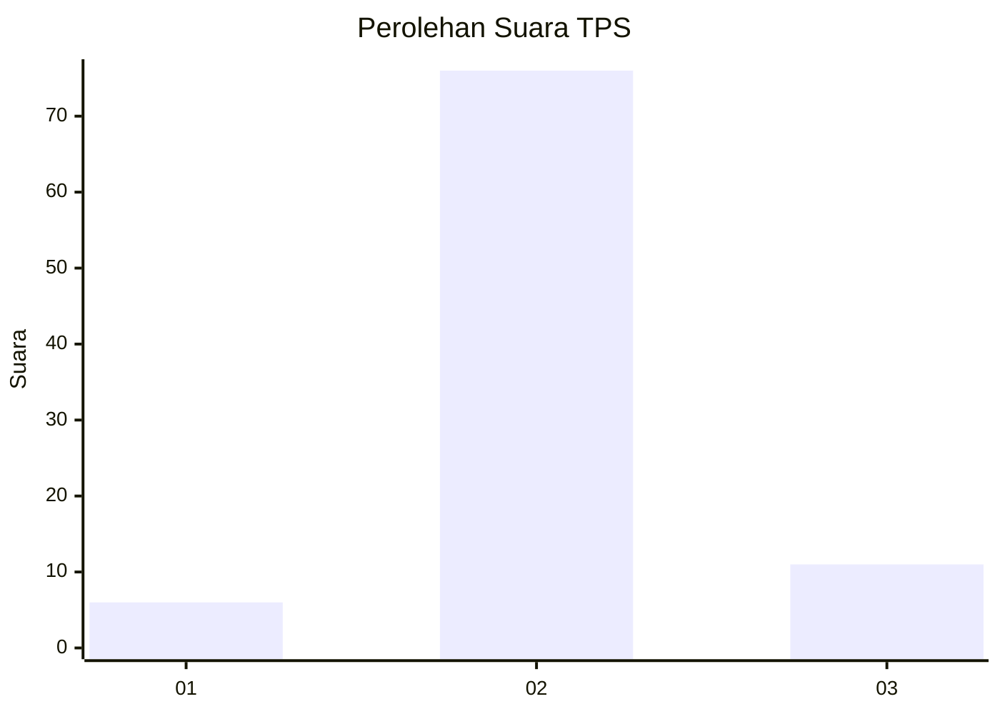
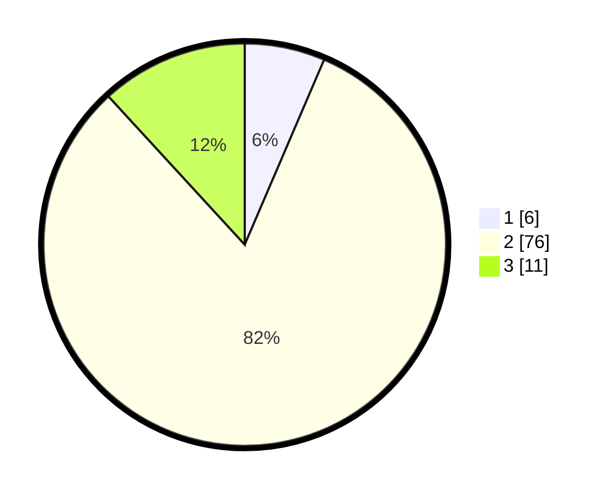

# Hasil

## Grafik

## Tabel

| No. | Nama Paslon    | Suara | Suara (raw) | Persentase |
|:--- |:-------------- | -----:| -----------:| ----------:|
| 1   | ANIES MUHAIMIN | 6     | [6][p-1]    | 6,45       |
| 2   | PRABOWO GIBRAN | 76    | [76][p-2]   | 81,72      |
| 3   | GANJAR MAHFUD  | 11    | [11][p-3]   | 11,83      |

[p-1]: https://github.com/gigit-pemilu/pemilu-2024/blob/main/pilpres/hitung-suara/sub/12-sumatera-utara/sub/07-deli-serdang/sub/20-stm-hulu/sub/2017-sipinggan/sub/003-tps/sub/paslon-1.txt
[p-2]: https://github.com/gigit-pemilu/pemilu-2024/blob/main/pilpres/hitung-suara/sub/12-sumatera-utara/sub/07-deli-serdang/sub/20-stm-hulu/sub/2017-sipinggan/sub/003-tps/sub/paslon-2.txt
[p-3]: https://github.com/gigit-pemilu/pemilu-2024/blob/main/pilpres/hitung-suara/sub/12-sumatera-utara/sub/07-deli-serdang/sub/20-stm-hulu/sub/2017-sipinggan/sub/003-tps/sub/paslon-3.txt

## Foto C Plano

https://sirekap-obj-formc.kpu.go.id/753e/pemilu/ppwp/12/07/20/20/17/1207202017003-20240214-234132--f7e1f0fe-45b2-476a-ad43-e7d00016dae4.jpg

https://sirekap-obj-formc.kpu.go.id/753e/pemilu/ppwp/12/07/20/20/17/1207202017003-20240214-234236--14c68d2e-6a3d-4fd5-b770-aa9b1b413ee6.jpg

https://sirekap-obj-formc.kpu.go.id/753e/pemilu/ppwp/12/07/20/20/17/1207202017003-20240214-234433--dd770d4f-15d1-4fcc-b426-ea9754349b8b.jpg

## Metadata

| Key        | Value               |
| ---------- | ------------------- |
| Time Stamp | 2024-02-25 14:00:00 |

