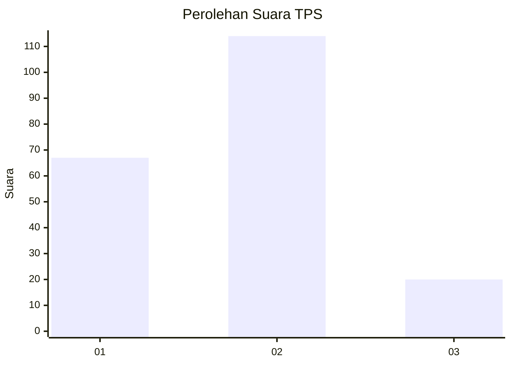
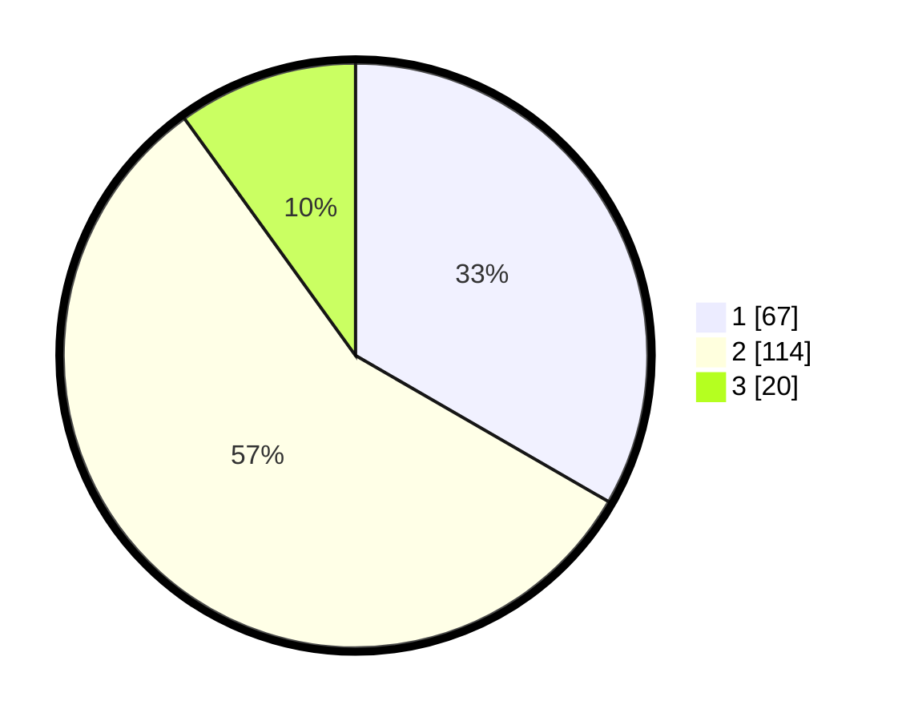

# Hasil

## Grafik

## Tabel

| No. | Nama Paslon    | Suara | Suara (raw) | Persentase |
|:--- |:-------------- | -----:| -----------:| ----------:|
| 1   | ANIES MUHAIMIN | 67    | [67][p-1]   | 33,33      |
| 2   | PRABOWO GIBRAN | 114   | [114][p-2]  | 56,72      |
| 3   | GANJAR MAHFUD  | 20    | [20][p-3]   | 9,95       |

[p-1]: https://github.com/gigit-pemilu/pemilu-2024-12-sumatera-utara/blob/main/pilpres/hitung-suara/sub/12-sumatera-utara/sub/07-deli-serdang/sub/21-patumbak/sub/2001-lantasan-baru/sub/006-tps/sub/paslon-1.txt
[p-2]: https://github.com/gigit-pemilu/pemilu-2024-12-sumatera-utara/blob/main/pilpres/hitung-suara/sub/12-sumatera-utara/sub/07-deli-serdang/sub/21-patumbak/sub/2001-lantasan-baru/sub/006-tps/sub/paslon-2.txt
[p-3]: https://github.com/gigit-pemilu/pemilu-2024-12-sumatera-utara/blob/main/pilpres/hitung-suara/sub/12-sumatera-utara/sub/07-deli-serdang/sub/21-patumbak/sub/2001-lantasan-baru/sub/006-tps/sub/paslon-3.txt

## Foto C Plano

https://sirekap-obj-formc.kpu.go.id/b41a/pemilu/ppwp/12/07/21/20/01/1207212001006-20240215-002015--843b8e3e-cd3d-4f17-844f-4042ca07f2a9.jpg

https://sirekap-obj-formc.kpu.go.id/b41a/pemilu/ppwp/12/07/21/20/01/1207212001006-20240215-002138--8252957f-9eb7-4d15-91f4-2dbdfa3dc33b.jpg

https://sirekap-obj-formc.kpu.go.id/b41a/pemilu/ppwp/12/07/21/20/01/1207212001006-20240215-002208--e7cbfc2c-a9b4-4c7e-bf1b-5cb40a292645.jpg

## Metadata

| Key        | Value               |
| ---------- | ------------------- |
| Time Stamp | 2024-02-25 13:00:00 |

