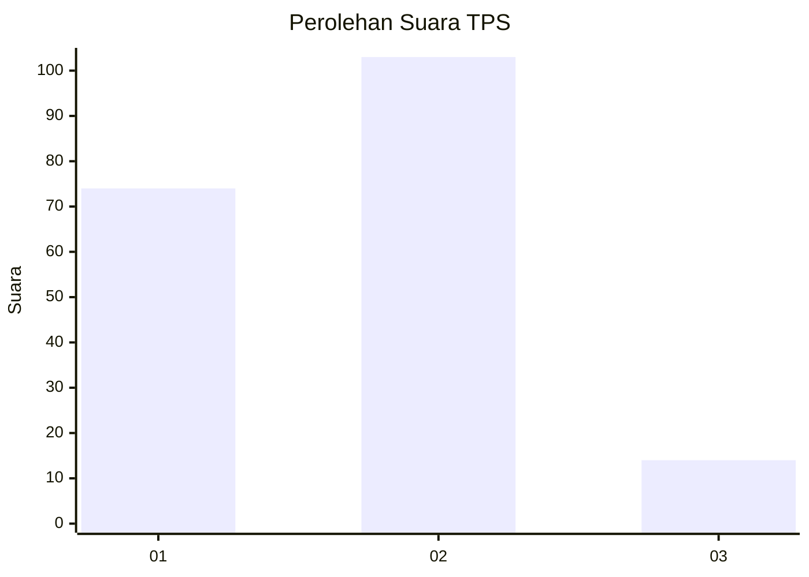

# Hasil

## Grafik

## Tabel

| No. | Nama Paslon    | Suara | Suara (raw) | Persentase |
|:--- |:-------------- | -----:| -----------:| ----------:|
| 1   | ANIES MUHAIMIN | 74    | [74][p-1]   | 38,74      |
| 2   | PRABOWO GIBRAN | 103   | [103][p-2]  | 53,93      |
| 3   | GANJAR MAHFUD  | 14    | [14][p-3]   | 7,33       |

[p-1]: https://github.com/gigit-pemilu/pemilu-2024/blob/main/pilpres/hitung-suara/sub/12-sumatera-utara/sub/07-deli-serdang/sub/21-patumbak/sub/2002-patumbak-i/sub/003-tps/sub/paslon-1.txt
[p-2]: https://github.com/gigit-pemilu/pemilu-2024/blob/main/pilpres/hitung-suara/sub/12-sumatera-utara/sub/07-deli-serdang/sub/21-patumbak/sub/2002-patumbak-i/sub/003-tps/sub/paslon-2.txt
[p-3]: https://github.com/gigit-pemilu/pemilu-2024/blob/main/pilpres/hitung-suara/sub/12-sumatera-utara/sub/07-deli-serdang/sub/21-patumbak/sub/2002-patumbak-i/sub/003-tps/sub/paslon-3.txt

## Foto C Plano

https://sirekap-obj-formc.kpu.go.id/1890/pemilu/ppwp/12/07/21/20/02/1207212002003-20240214-222515--a0a62b42-7dd8-4cc5-806a-a82d521fc14a.jpg

https://sirekap-obj-formc.kpu.go.id/1890/pemilu/ppwp/12/07/21/20/02/1207212002003-20240214-222112--ff334855-ddd7-474a-a9ef-1c3c392c10b8.jpg

https://sirekap-obj-formc.kpu.go.id/1890/pemilu/ppwp/12/07/21/20/02/1207212002003-20240214-222256--756fff3f-4e9c-4c4e-9f00-e96b38b7e11f.jpg

## Metadata

| Key        | Value               |
| ---------- | ------------------- |
| Time Stamp | 2024-02-26 16:00:00 |

