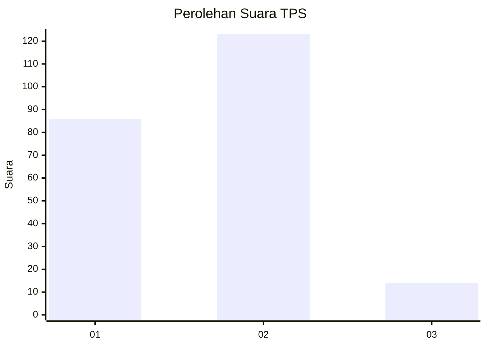

# Hasil

## Grafik

## Tabel

| No. | Nama Paslon    | Suara | Suara (raw) | Persentase |
|:--- |:-------------- | -----:| -----------:| ----------:|
| 1   | ANIES MUHAIMIN | 86    | [86][p-1]   | 38,57      |
| 2   | PRABOWO GIBRAN | 123   | [123][p-2]  | 55,16      |
| 3   | GANJAR MAHFUD  | 14    | [14][p-3]   | 6,28       |

[p-1]: https://github.com/gigit-pemilu/pemilu-2024/blob/main/pilpres/hitung-suara/sub/12-sumatera-utara/sub/07-deli-serdang/sub/21-patumbak/sub/2002-patumbak-i/sub/006-tps/sub/paslon-1.txt
[p-2]: https://github.com/gigit-pemilu/pemilu-2024/blob/main/pilpres/hitung-suara/sub/12-sumatera-utara/sub/07-deli-serdang/sub/21-patumbak/sub/2002-patumbak-i/sub/006-tps/sub/paslon-2.txt
[p-3]: https://github.com/gigit-pemilu/pemilu-2024/blob/main/pilpres/hitung-suara/sub/12-sumatera-utara/sub/07-deli-serdang/sub/21-patumbak/sub/2002-patumbak-i/sub/006-tps/sub/paslon-3.txt

## Foto C Plano

https://sirekap-obj-formc.kpu.go.id/b0d8/pemilu/ppwp/12/07/21/20/02/1207212002006-20240214-233454--b88b04ed-ded7-4cf6-83ba-7b4d43e1d791.jpg

https://sirekap-obj-formc.kpu.go.id/b0d8/pemilu/ppwp/12/07/21/20/02/1207212002006-20240214-233705--b05a5887-75ae-4b9d-9583-7a631036847e.jpg

https://sirekap-obj-formc.kpu.go.id/b0d8/pemilu/ppwp/12/07/21/20/02/1207212002006-20240214-233827--6181dfae-6267-43cf-b7e7-c817dcc34f14.jpg

## Metadata

| Key        | Value               |
| ---------- | ------------------- |
| Time Stamp | 2024-02-25 18:00:00 |

