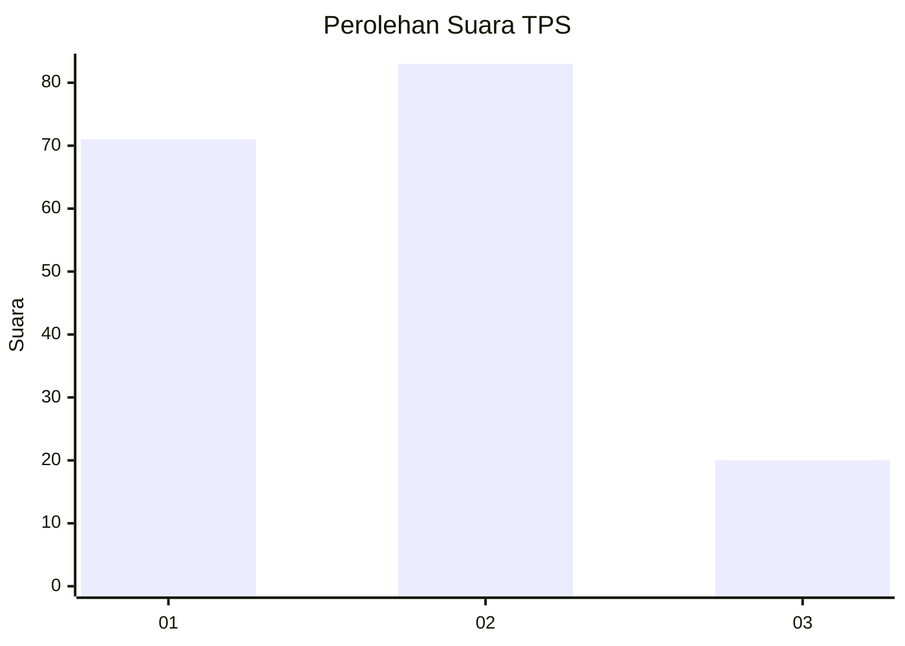
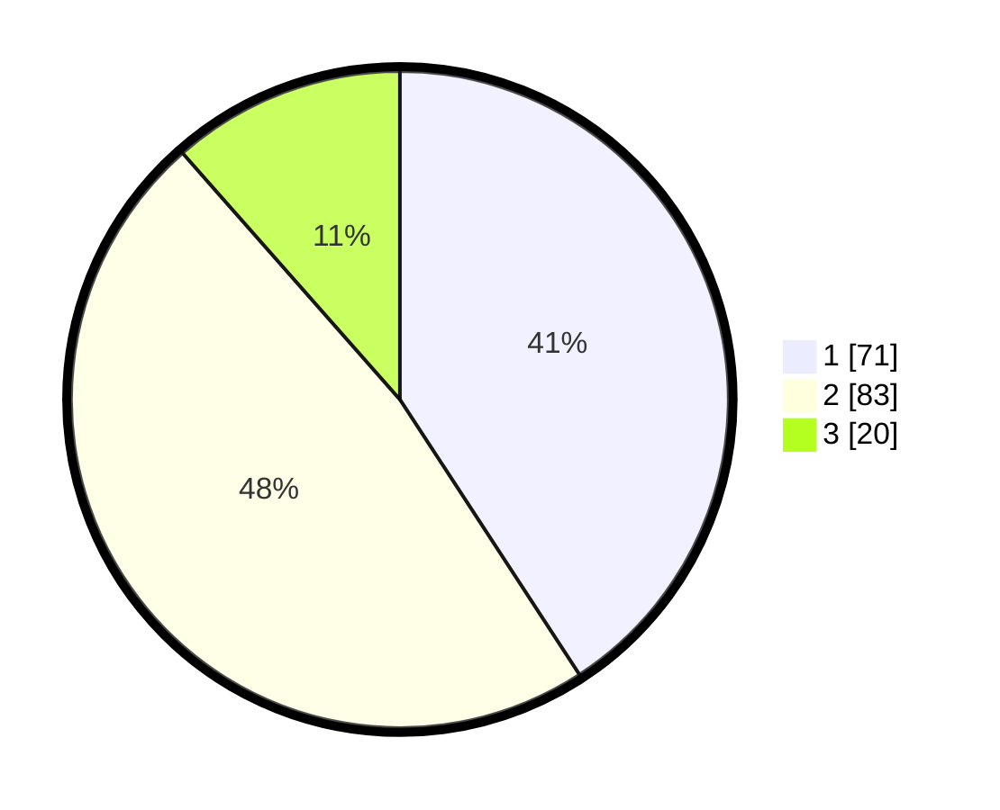

# Hasil

## Grafik

## Tabel

| No. | Nama Paslon    | Suara | Suara (raw) | Persentase |
|:--- |:-------------- | -----:| -----------:| ----------:|
| 1   | ANIES MUHAIMIN | 71    | [71][p-1]   | 40,80      |
| 2   | PRABOWO GIBRAN | 83    | [83][p-2]   | 47,70      |
| 3   | GANJAR MAHFUD  | 20    | [20][p-3]   | 11,49      |

[p-1]: https://github.com/gigit-pemilu/pemilu-2024/blob/main/pilpres/hitung-suara/sub/12-sumatera-utara/sub/07-deli-serdang/sub/21-patumbak/sub/2005-sigara-gara/sub/013-tps/sub/paslon-1.txt
[p-2]: https://github.com/gigit-pemilu/pemilu-2024/blob/main/pilpres/hitung-suara/sub/12-sumatera-utara/sub/07-deli-serdang/sub/21-patumbak/sub/2005-sigara-gara/sub/013-tps/sub/paslon-2.txt
[p-3]: https://github.com/gigit-pemilu/pemilu-2024/blob/main/pilpres/hitung-suara/sub/12-sumatera-utara/sub/07-deli-serdang/sub/21-patumbak/sub/2005-sigara-gara/sub/013-tps/sub/paslon-3.txt

## Foto C Plano

https://sirekap-obj-formc.kpu.go.id/e85d/pemilu/ppwp/12/07/21/20/05/1207212005013-20240214-224346--586ffd17-d7c3-4065-90c9-1604acf4cf32.jpg

https://sirekap-obj-formc.kpu.go.id/e85d/pemilu/ppwp/12/07/21/20/05/1207212005013-20240214-224536--e4a4f6dd-db01-4a0c-bdb6-4e3278b55e4c.jpg

https://sirekap-obj-formc.kpu.go.id/e85d/pemilu/ppwp/12/07/21/20/05/1207212005013-20240214-224652--b0aefd3f-0712-4c7c-a47c-adec0e716a26.jpg

## Metadata

| Key        | Value               |
| ---------- | ------------------- |
| Time Stamp | 2024-02-25 11:00:00 |

