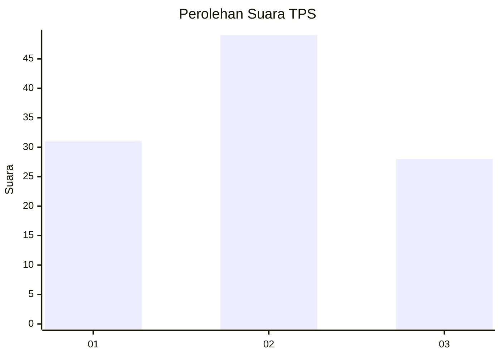
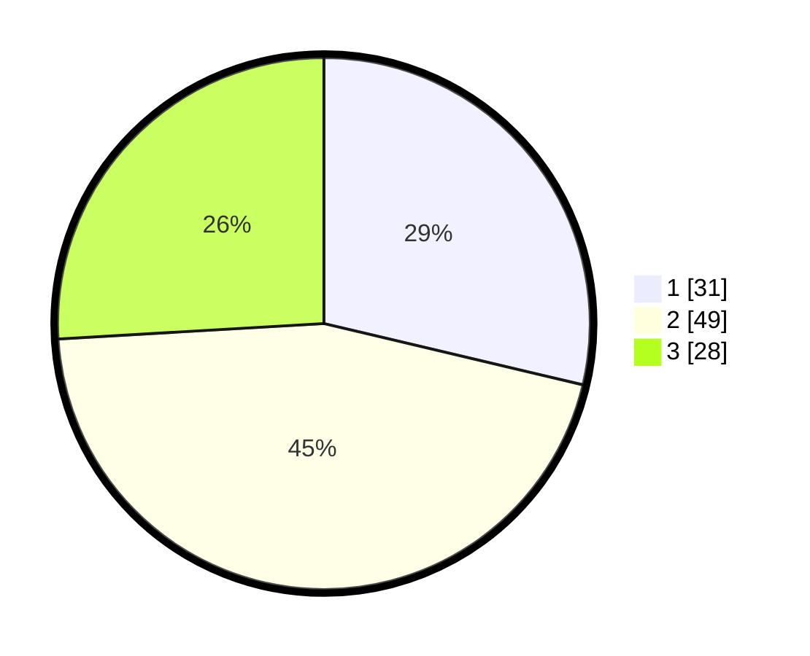

# Hasil

## Grafik

## Tabel

| No. | Nama Paslon    | Suara | Suara (raw) | Persentase |
|:--- |:-------------- | -----:| -----------:| ----------:|
| 1   | ANIES MUHAIMIN | 31    | [31][p-1]   | 28,70      |
| 2   | PRABOWO GIBRAN | 49    | [49][p-2]   | 45,37      |
| 3   | GANJAR MAHFUD  | 28    | [28][p-3]   | 25,93      |

[p-1]: https://github.com/gigit-pemilu/pemilu-2024/blob/main/pilpres/hitung-suara/sub/12-sumatera-utara/sub/07-deli-serdang/sub/21-patumbak/sub/2005-sigara-gara/sub/025-tps/sub/paslon-1.txt
[p-2]: https://github.com/gigit-pemilu/pemilu-2024/blob/main/pilpres/hitung-suara/sub/12-sumatera-utara/sub/07-deli-serdang/sub/21-patumbak/sub/2005-sigara-gara/sub/025-tps/sub/paslon-2.txt
[p-3]: https://github.com/gigit-pemilu/pemilu-2024/blob/main/pilpres/hitung-suara/sub/12-sumatera-utara/sub/07-deli-serdang/sub/21-patumbak/sub/2005-sigara-gara/sub/025-tps/sub/paslon-3.txt

## Foto C Plano

https://sirekap-obj-formc.kpu.go.id/3af0/pemilu/ppwp/12/07/21/20/05/1207212005025-20240214-221403--405a2541-94ba-4b10-b267-08014c07aff8.jpg

https://sirekap-obj-formc.kpu.go.id/3af0/pemilu/ppwp/12/07/21/20/05/1207212005025-20240214-230705--7e4e40cc-125b-4bbe-8e23-b4f86dbe876b.jpg

https://sirekap-obj-formc.kpu.go.id/3af0/pemilu/ppwp/12/07/21/20/05/1207212005025-20240214-221906--4a8f228b-7b26-429b-8b73-9aa4296ab71e.jpg

## Metadata

| Key        | Value               |
| ---------- | ------------------- |
| Time Stamp | 2024-02-25 20:00:00 |

