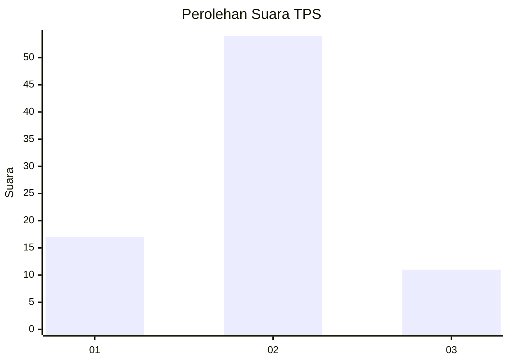
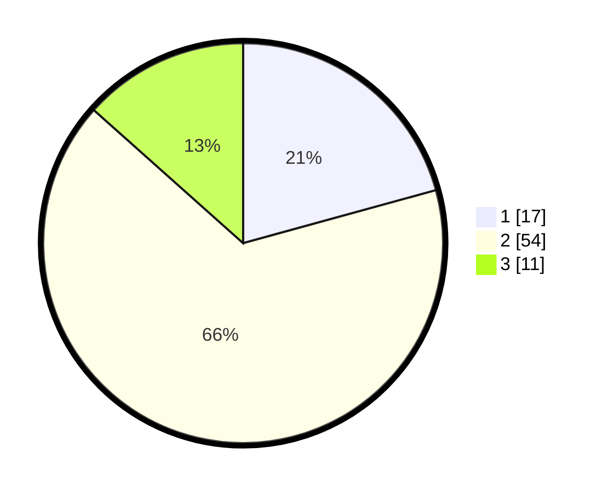

# Hasil

## Grafik

## Tabel

| No. | Nama Paslon    | Suara | Suara (raw) | Persentase |
|:--- |:-------------- | -----:| -----------:| ----------:|
| 1   | ANIES MUHAIMIN | 17    | [17][p-1]   | 20,73      |
| 2   | PRABOWO GIBRAN | 54    | [54][p-2]   | 65,85      |
| 3   | GANJAR MAHFUD  | 11    | [11][p-3]   | 13,41      |

[p-1]: https://github.com/gigit-pemilu/pemilu-2024-12-sumatera-utara/blob/main/pilpres/hitung-suara/sub/12-sumatera-utara/sub/07-deli-serdang/sub/21-patumbak/sub/2005-sigara-gara/sub/026-tps/sub/paslon-1.txt
[p-2]: https://github.com/gigit-pemilu/pemilu-2024-12-sumatera-utara/blob/main/pilpres/hitung-suara/sub/12-sumatera-utara/sub/07-deli-serdang/sub/21-patumbak/sub/2005-sigara-gara/sub/026-tps/sub/paslon-2.txt
[p-3]: https://github.com/gigit-pemilu/pemilu-2024-12-sumatera-utara/blob/main/pilpres/hitung-suara/sub/12-sumatera-utara/sub/07-deli-serdang/sub/21-patumbak/sub/2005-sigara-gara/sub/026-tps/sub/paslon-3.txt

## Foto C Plano

https://sirekap-obj-formc.kpu.go.id/8ed2/pemilu/ppwp/12/07/21/20/05/1207212005026-20240214-222153--13256752-6612-4d8c-95fa-7b61e7a4fa08.jpg

https://sirekap-obj-formc.kpu.go.id/8ed2/pemilu/ppwp/12/07/21/20/05/1207212005026-20240214-222418--e1c77fe9-d42d-4232-921c-22a7ca9d9747.jpg

https://sirekap-obj-formc.kpu.go.id/8ed2/pemilu/ppwp/12/07/21/20/05/1207212005026-20240214-222531--87c12581-6d72-42b6-9d9b-579e2fdec19e.jpg

## Metadata

| Key        | Value               |
| ---------- | ------------------- |
| Time Stamp | 2024-02-25 22:00:00 |

