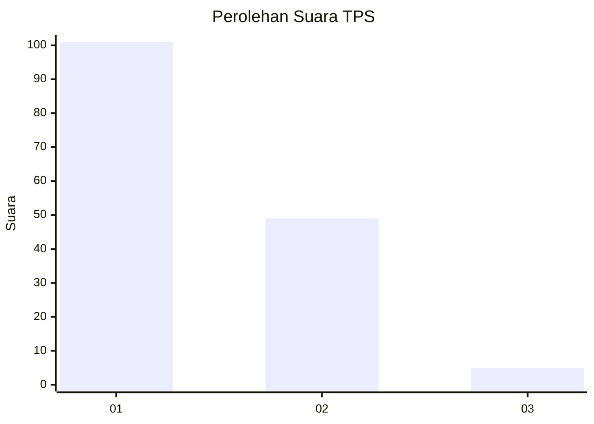
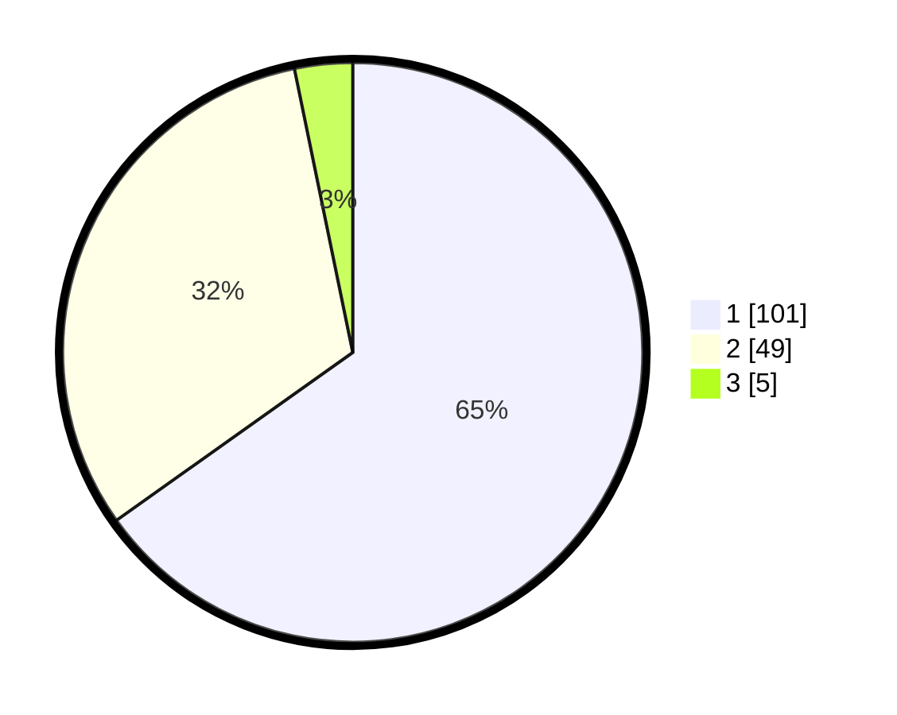

# Hasil

## Grafik

## Tabel

| No. | Nama Paslon    | Suara | Suara (raw) | Persentase |
|:--- |:-------------- | -----:| -----------:| ----------:|
| 1   | ANIES MUHAIMIN | 101   | [101][p-1]  | 65,16      |
| 2   | PRABOWO GIBRAN | 49    | [49][p-2]   | 31,61      |
| 3   | GANJAR MAHFUD  | 5     | [5][p-3]    | 3,23       |

[p-1]: https://github.com/gigit-pemilu/pemilu-2024-12-sumatera-utara/blob/main/pilpres/hitung-suara/sub/12-sumatera-utara/sub/07-deli-serdang/sub/21-patumbak/sub/2005-sigara-gara/sub/035-tps/sub/paslon-1.txt
[p-2]: https://github.com/gigit-pemilu/pemilu-2024-12-sumatera-utara/blob/main/pilpres/hitung-suara/sub/12-sumatera-utara/sub/07-deli-serdang/sub/21-patumbak/sub/2005-sigara-gara/sub/035-tps/sub/paslon-2.txt
[p-3]: https://github.com/gigit-pemilu/pemilu-2024-12-sumatera-utara/blob/main/pilpres/hitung-suara/sub/12-sumatera-utara/sub/07-deli-serdang/sub/21-patumbak/sub/2005-sigara-gara/sub/035-tps/sub/paslon-3.txt

## Foto C Plano

https://sirekap-obj-formc.kpu.go.id/acd7/pemilu/ppwp/12/07/21/20/05/1207212005035-20240215-013329--d6ad9b49-9ca3-4199-84dc-3f48be3c02dd.jpg

https://sirekap-obj-formc.kpu.go.id/acd7/pemilu/ppwp/12/07/21/20/05/1207212005035-20240214-162232--ba1b8222-9c8c-4c63-917f-185b56411fb5.jpg

https://sirekap-obj-formc.kpu.go.id/acd7/pemilu/ppwp/12/07/21/20/05/1207212005035-20240214-184914--c5f6200a-62c4-4db3-9371-2f9d77fe24ae.jpg

## Metadata

| Key        | Value               |
| ---------- | ------------------- |
| Time Stamp | 2024-02-25 18:00:00 |

